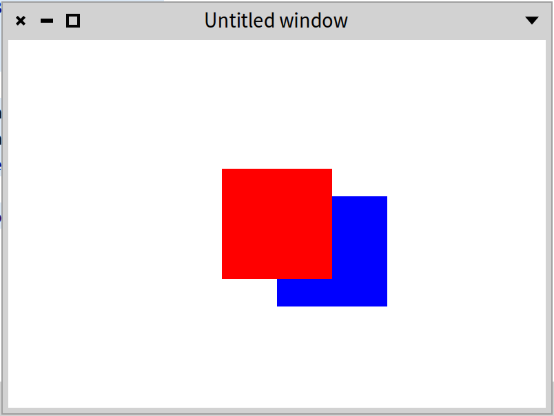

## Using Athens and Roassal in Spec

A part of this chapter was originally written by Renaud de Villemeur. We thank him for his contribution. It shows how you can integrate vector graphic drawing within Spec components. This chapter shows how you can use Athens (a Cairo back-end) to draw using a low-level API on a canvas inside a Spec presenter. It then shows how you can use Roassal (a visualization engine) within a Spec presenter. 

### Introduction

There are two different computer graphics: vector and raster graphics. Raster graphics represent images as a collection of pixels. Vector graphics uses geometric primitives such as points, lines, curves, or polygons to represent images. These primitives are created using mathematical equations.

Both types of computer graphics have advantages and disadvantages. The advantages of vector graphics over raster are:
- smaller size,
- ability to zoom indefinitely,
- moving, scaling, filling, and rotating do not degrade the quality of an image.

Ultimately, pictures on a computer are displayed on a screen with a specific display dimension. However, while raster graphics doesn't scale very well when the resolution differs too much from the picture resolution, vector graphics are rasterized to fit the display they will appear on. Rasterization is taking an image described in a vector graphics format and transforming it into a set of pixels for output on a screen.

Morphic is using a raster approach. It converts the canvas contents into a pixel based structure (the class `Form`). Most graphics in Pharo are raster graphics: `Form` the low-level abstraction is used by Morphic.  Pharo, however, offers a vector graphics alternative. For this, it uses and exposes Cairo to the user.
Two APIs are available: 
- the older one, called Athens, is protecting more the developers from possible mistakes.
- Alexandrie is a new and more low-level API. It has been more aggressively optimized. It is the foundation for Bloc the replacement of Morphic. 

When you integrate Athens with Spec, you'll use its rendering engine to create your picture. It is transformed into a `Form` and displayed on the screen.


### Direct integration of Athens with Spec

We first create a presenter named `AthensExamplePresenter`. This is the presenter that will support the actual rendering using Athens.


```
SpPresenter << #AthensExamplePresenter
	slots: { #athensPresenter };
	package: 'CodeOfSpec20Book'
```

We define a simple layout to place the `athensPresenter`.

```
AthensExamplePresenter >> defaultLayout

	^ SpBoxLayout newTopToBottom
			add: athensPresenter;
			yourself
```

This presenter creates and configures an `SpAthensPresenter` instance as follows:

```
AthensExamplePresenter >> initializePresenters

	athensPresenter := self instantiate: SpAthensPresenter.
	athensPresenter surfaceExtent: 600@400.
	athensPresenter drawBlock: [ :canvas | self render: canvas ]
```

It configures the `AthensPresenter` to draw with the `render:` message.
The `render:` method is a typical sequence of instructions to configure the canvas. 

```
AthensExamplePresenter >> render: canvas
	| surface font |
	surface := canvas surface.
	font := LogicalFont familyName: 'Source Sans Pro' pointSize: 10.
	surface clear.
	canvas 
		setPaint: ((LinearGradientPaint from: 0@0  to: surface extent) 
		colorRamp: {  0 -> Color white. 1 -> Color black }).
	canvas drawShape: (0@0 extent: surface extent).
	canvas setFont: font.
	canvas setPaint: Color pink.
	canvas 
		pathTransform translateX: 20 Y: 20 + (font getPreciseAscent); 
		scaleBy: 2; 
		rotateByDegrees: 25.
	canvas drawString: 'Hello Athens in Pharo/Morphic'
```

Executing `AthensExamplePresenter new open` produces Figure *@athens3@*.


This example is simple because we did not cover the rendering that may have to be invalidated if something changes, but it shows the key aspect of the architecture. The same approach lets you use Alexandrie.

### Roassal Spec integration

In this section, we describe how you can define a Spec presenter that let you draw Roassal visualisations. 

Imagine that you want to draw using Roassal some shapes. Here we draw two boxes. But you can also draw paths and other graphical element. 

```
| c blueBox redBox |
c := RSCanvas new.
blueBox := RSBox new
	size: 80;
	color: #blue.
redBox := RSBox new
	size: 80;	
	color: #red.
c
	add: blueBox;
	add: redBox.
blueBox translateBy: 40 @ 20.
c
```


#### Using `SpRoassalInspectorPresenter`. 
Building a Roassal supporting Spec presenter is as simple as creating an instance of `SpRoassalInspectorPresenter` and passing it the canvas on which we draw the Roassal visualization. 



This is what the following expression is doing `SpRoassalInspectorPresenter new canvas: c; open`

Executing the following snippet should open a Spec window with a presenter inside as shown in Figure *@roassalSpec@*.


```
| c blueBox redBox |
c := RSCanvas new.
blueBox := RSBox new
	size: 80;
	color: #blue.
redBox := RSBox new
	 size: 80;	
	 color: #red.
c
	add: blueBox;
	add: redBox.
blueBox translateBy: 40 @ 20.

SpRoassalInspectorPresenter new canvas: c; open
```


### Hello world in Athens via Morphic
The Pharo is working actively to replace Morphic by Bloc. Still we believe that the following approach is worth documenting. 

We show now how to use Athens directly integrated with Morphic. This is why we create a `Morph` subclass. The expression `AthensHello new openInWindow` will display the same contents as the one of Figure *@athens3@*.

First, we define a class which inherits from `Morph`:

```
Morph << #AthensHello
	slots: { #surface };
	package: 'CodeOfSpec20Book'
```

During the initialization phase, we create an Athens surface:

```
AthensHello >> initialize

	super initialize.
	self extent: self defaultExtent.
	surface := AthensCairoSurface extent: self extent
```

where `defaultExtent` is simply defined as

```
AthensHello >> defaultExtent

	^ 400@400
```

The `drawOn:` method, mandatory in `Morph` subclasses, asks Athens to render its drawing and it will then display it in a Morphic canvas as a `Form` (a bitmap picture)

```
AthensHello >> drawOn: aCanvas

	self renderAthens.
	surface displayOnMorphicCanvas: aCanvas at: bounds origin
```


Our actual Athens code is located in the `renderAthens` method, and the result is stored in the `surface` instance variable.

```
AthensHello >> renderAthens

	| font |
	font := LogicalFont familyName: 'Arial' pointSize: 10.
	surface drawDuring: [ :canvas |
		surface clear.
		canvas setPaint: ((LinearGradientPaint from: 0@0  to: self extent) colorRamp: {  0 -> Color white. 1 -> Color black }).
		canvas drawShape: (0@0 extent: self extent).
		canvas setFont: font.
		canvas setPaint: Color pink.
		canvas pathTransform translateX: 20 Y: 20 + (font getPreciseAscent); scaleBy: 2; rotateByDegrees: 25.
		canvas drawString: 'Hello Athens in Pharo/Morphic' ]
```

Open the morph in a window with:

```
AthensHello new openInWindow
```


### Handling resizing

You can create the window and see a nice gradient with a greeting text. You will notice, however, that when resizing the window, the Athens content is not resized. To fix this, we need one extra method.

```
AthensHello >> extent: aPoint

	| newExtent |
	newExtent := aPoint rounded.
	(bounds extent closeTo: newExtent) ifTrue: [ ^ self ].
	bounds := bounds topLeft extent: newExtent.
	surface := AthensCairoSurface extent: newExtent.
	self layoutChanged.
	self changed
```

Congratulations, you have now created your first morphic window whose contents is rendered using Athens.


### Using the morph with Spec

Now that we have a morph, we can use it in a presenter as follows.

```
SpPresenter << #AthensHelloPresenter
	slots: { #morphPresenter };
	package: 'CodeOfSpec20Book'
```

We define a basic layout so that Spec knows where to place it.

```
AthensHelloPresenter >> defaultLayout

	^ SpBoxLayout newTopToBottom
			add: morphPresenter;
			yourself
```

In `initializePresenters` we wrap the morph in a `SpMorphPresenter`.

```
AthensHelloPresenter >> initializePresenters

	morphPresenter := self instantiate: SpMorphPresenter.
	morphPresenter morph: AthensHello new
```

When we open the presenter it displays the morph:

```
AthensHelloPresenter new open
```


### Conclusion

This chapter illustrated clearly that Spec can take advantage of canvas-related operations such as those proposed by Athens or Roassal to open the door to specific visuals.
