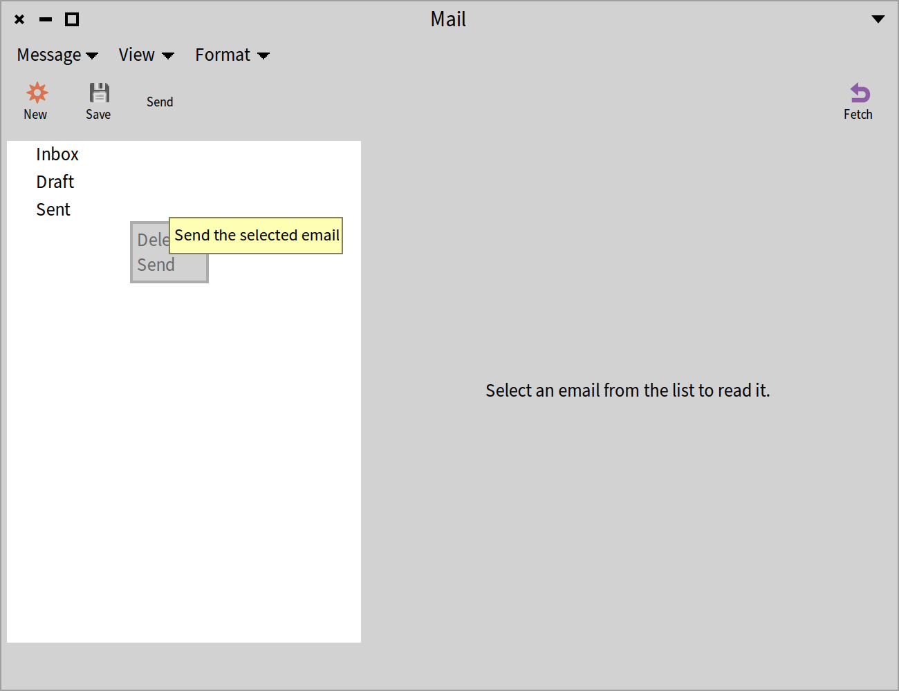
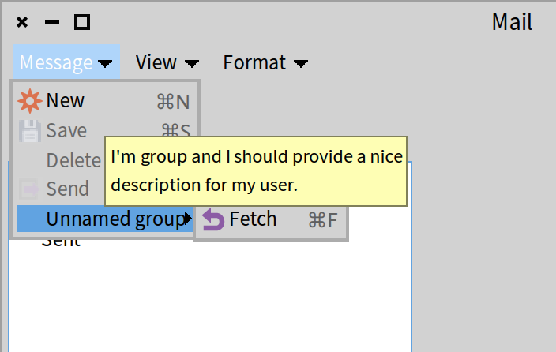
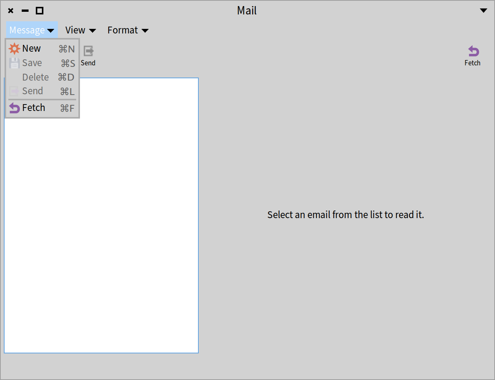
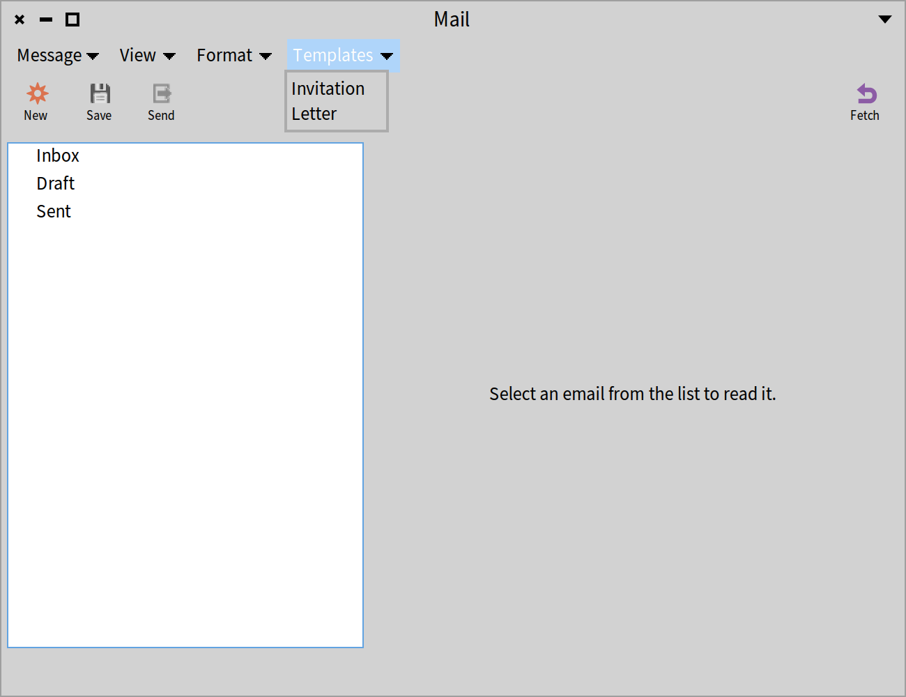
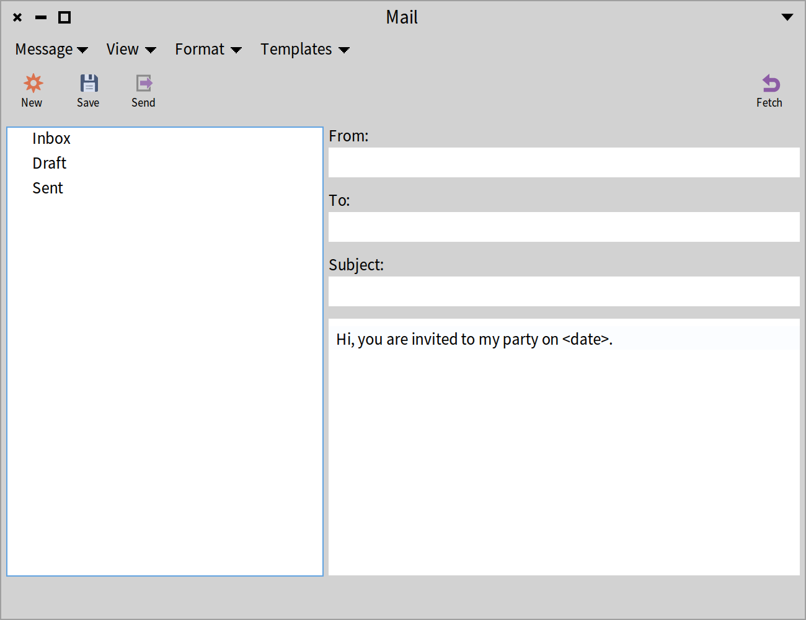
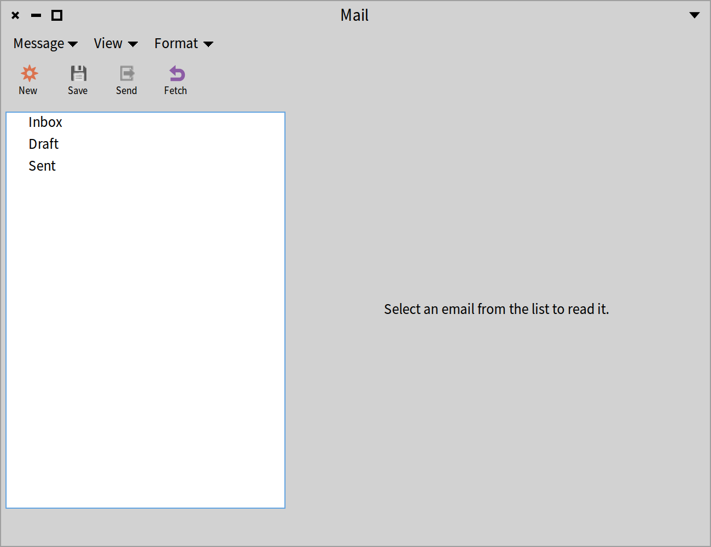
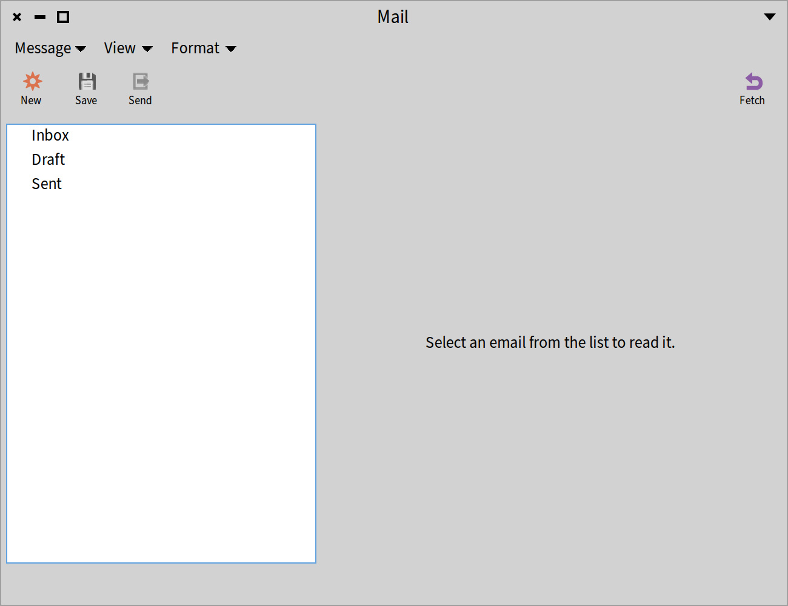

## Commander: A powerful and simple command framework
@cha_commander


Commander was a library originally developed by Denis Kudriashov. Commander 2.0 is the second iteration of that library. It was designed and developed by Julien Delplanque and Stéphane Ducasse. Note that Commander 2.0 is not compatible with Commander but it is really easy to migrate from Commander to Commander 2.0. We describe Commander 2.0 in the context of Spec. From now on, when we mention Commander we refer to Commander 2.0.

To explain the concepts, we will revisit the Mail Application that we introduced in Chapter *@cha_mailapp@* and extended in Chapter *@cha_menus@*. You can load the code as explained in the first chapter of this book.


### Commands


Commander models application actions as first-class objects following the Command design pattern. With Commander, you can express commands and use them to generate menus and toolbars, but also to script applications from the command line.

Every action is implemented as a separate command class \(subclass of `CmCommand`\) with an `execute` method and the state required for execution.


We will show later that for a UI framework, we need more information such as an icon and shortcut description. In addition, we will present how commands can be decorated with extra functionality in an extensible way.

### Defining commands

A command is a simple object. It is an instance of a subclass of the class `CmCommand`. It has a description and a name. The name can be either static or dynamic as we will show later on. In addition, it has a context from which it extracts information to execute itself. In its basic form, there is no more than that.

Let us have a look at examples. We will define some commands for the Mail application and illustrate how they can be turned into menus, a menubar and a toolbar.


### Adding a common superclass for the command classes


For convenience reasons, we define a common superclass of all the commands of the Mail application.

```
CmCommand << #MailClientCommand
	slots: {};
	package: 'CodeOfSpec20Book'
```

We define a simple helper method to make the code more readable:

```
MailClientCommand >> mailClientPresenter

	^ self context
```


### Adding the main commands


We implement subclasses of `MailClientCommand` to define the commands to create a new mail, to save a mail, to send a mail, to delete a mail, and to fetch mails.

#### NewMailCommand

```
MailClientCommand << #NewMailCommand
	slots: {};
	package: 'CodeOfSpec20Book'
```

In the `initialize` method, we set the name and the description.

```
NewMailCommand >> initialize

	super initialize.
	self
		name: 'New';
		description: 'Create a new email'
```

The `execute` method is the most important method of a command as it does the actual execution. We use the helper method `mailClientPresenter` that we defined in the superclass. The method sends the `newMail` message that we defined in Chapter *@cha_mailapp@*.

```
NewMailCommand >> execute

	self mailClientPresenter newMail
```

In general, `execute` methods are simple, because they do not have enough knowledge about the state of the application to know what to do. Therefore they often delegate to the application.

#### SaveMailCommand

```
MailClientCommand << SaveMailCommand
	slots: {};
	package: 'CodeOfSpec20Book'
```

```
SaveMailCommand >> initialize

	super initialize.
	self
		name: 'Save';
		description: 'Save the email'
```

```
SaveMailCommand >> execute

	self mailClientPresenter saveMail
```

```
SaveMailCommand >> canBeExecuted

	^ self mailClientPresenter hasDraft
```

This command definition illustrates how we can control whether a command can be executed. The method `canBeExecuted` allows specifying such a condition.

In the previous command class, we did not implement `NewMailCommand >> canBeExecuted`, because creating a new mail is always possible and by default commands can be executed (`CmCommand >> canBeExecuted` answers `true`).

#### SendMailCommand

```
MailClientCommand << SendMailCommand
	slots: {};
	package: 'CodeOfSpec20Book'
```

```
SendMailCommand >> initialize

	super initialize.
	self
		name: 'Send';
		description: 'Send the selected email'
```

```
SendMailCommand >> execute

	self mailClientPresenter sendMail
```

```
SendMailCommand >> canBeExecuted

	^ self mailClientPresenter hasDraft
```

#### DeleteMailCommand

```
MailClientCommand << DeleteMailCommand
	slots: {};
	package: 'CodeOfSpec20Book'
```

```
DeleteMailCommand >> initialize

	super initialize.
	self
		name: 'Delete';
		description: 'Delete the selected email'
```

```
DeleteMailCommand >> execute

	^ self mailClientPresenter deleteMail
```

```
DeleteMailCommand >> canBeExecuted

	^ self mailClientPresenter hasSelectedEmail
```

#### FetchMailCommand

```
MailClientCommand << FetchMailCommand
	slots: {};
	package: 'CodeOfSpec20Book'
```

```
FetchMailCommand >> initialize

	super initialize.
	self
		name: 'Fetch';
		description: 'Fetch email from the server'
```

```
FetchMailCommand >> execute

	self mailClientPresenter fetchMail
```

### Adding placeholder commands

We also define placeholder commands for functionality that was not implemented by the Mail application in Chapter *@cha_mailapp@*. We will not implement them here either. We only provide a name and a description, which are required for the UI.

#### FormatPlainTextCommand

```
MailClientCommand << FormatPlainTextCommand
	slots: {};
	package: 'CodeOfSpec20Book'
```

```
FormatPlainTextCommand >> initialize

	super initialize.
	self
		name: 'Plain text';
		description: 'Use plain text'
```

#### FormatRichTextCommand

```
MailClientCommand << FormatRichTextCommand
	slots: {};
	package: 'CodeOfSpec20Book'
```

```
FormatRichTextCommand >> initialize

	super initialize.
	self
		name: 'Rich text';
		description: 'Use rich text'
```

#### ShowCcFieldCommand

```
MailClientCommand << ShowCcFieldCommand
	slots: {};
	package: 'CodeOfSpec20Book'
```

```
ShowCcFieldCommand >> initialize

	super initialize.
	self
		name: 'Show CC field';
		description: 'Turn on the CC field'
```

#### ShowBccFieldCommand

```
MailClientCommand << ShowBccFieldCommand
	slots: {};
	package: 'CodeOfSpec20Book'
```

```
ShowCcFieldShowBccFieldCommandommand >> initialize

	super initialize.
	self
		name: 'Show BCC field';
		description: 'Turn on the BCC field'
```


### Turning commands into menu items

Now that we have defined the commands, we would like to turn them into menus. In Spec, commands that are transformed into menu items are structured into a tree of command instances. The class method `buildCommandsGroupWith:forRoot:` of `SpPresenter` is a hook to let presenters define the root of the command instance tree.

The method `buildCommandsGroupWith:forRoot:` registers commands to which the presenter instance is passed as context. Note that here we just add plain commands, but we can also create groups. Later in this chapter we will also specify a menubar and a toolbar in this method. For now, we restrict it to the context menu for the `MailAccountPresenter`.

```
MailClientPresenter class >>
	buildCommandsGroupWith: presenter
	forRoot: rootCommandGroup

	rootCommandGroup
		register: (self buildAccountMenuWith: presenter)
```

The method above delegates to `MailClientPresenter class >> buildAccountMenuWith:`, which adds the delete and the send commands. The method answers a `CmCommandGroup` instance with a name `'AccountMenu'`. The name will not be visible in the UI because we send `beRoot`. A command is transformed into a command for Spec using the message `forSpec`.

```
MailClientPresenter class >> buildAccountMenuWith: presenter

	^ (CmCommandGroup named: 'AccountMenu') asSpecGroup
			beRoot;
			register: (DeleteMailCommand forSpec context: presenter);
			register: (SendMailCommand forSpec context: presenter);
			yourself
```

In Chapter *@cha_mailapp@*, we defined the method `MailClientPresenter >> accountMenu` to return the context menu for the `MailAccountPresenter`. When using commands, we implement it differently. We create a new menu and fill it with the commands defined in the method above. A presenter has access to the root of the command tree through the message `rootCommandsGroup`. Subtrees can be accessed by sending the `/` message. By using commands, building up the context menu is almost trivial:


```
MailClientPresenter >> accountMenu

	^ self newMenu
			fillWith: (self rootCommandsGroup / 'AccountMenu');
			yourself
```

When reopening the interface with:

```
(MailClientPresenter on: MailAccount new) open
```

you should see the menu items as shown in Figure *@ContextMenu@*. As we will show later, we could even replace a menu item with another one, changing its name, or icon in place.




### Managing icons and shortcuts


By default a command does not know about Spec-specific behavior, because a command does not have to be linked to UI. Obviously you want to have icons and shortcut bindings when you are designing an interactive application.

Commander supports the addition of icons and shortcut keys to commands. Let's see how it works from a user perspective. The framework offers two methods to set an icon and a shortcut key: `iconName:` and `shortcutKey:`. We can specialize the method `asSpecCommand` as follows:

```
NewMailCommand >> asSpecCommand

	^ super asSpecCommand
			iconName: #smallNew;
			shortcutKey: $n meta;
			yourself
```

```
SaveMailCommand >> asSpecCommand

	^ super asSpecCommand
			iconName: #smallSave;
			shortcutKey: $s meta;
			yourself
```

```
SendMailCommand >> asSpecCommand

	^ super asSpecCommand
			iconName: #smallExport;
			shortcutKey: $l meta;
			yourself
```

```
DeleteMailCommand >> asSpecCommand

	^ super asSpecCommand
			shortcutKey: $d meta;
			yourself
```

```
FetchMailCommand >> asSpecCommand

	^ super asSpecCommand
			iconName: #refresh;
			shortcutKey: $f meta;
			yourself
```

Remember that commands are created using the message `forSpec`. This message takes care of the calling `asSpecCommand`.


### Managing a menubar

Commander also supports menubar creation. The logic is the same as for contextual menus: we define a group and register it under a given root, and we tell the presenter to use this group as a menubar.

First, we have to define the menubar. We extend the method we defined before:

```
MailClientPresenter class >>
	buildCommandsGroupWith: presenter
	forRoot: rootCommandGroup

	rootCommandGroup
		register: (self buildAccountMenuWith: presenter);
		register: (self buildMenuBarGroupWith: presenter)
```

The method delegates to `MailClientPresenter >> buildMenuBarGroupWith:`:

```
MailClientPresenter class >> buildMenuBarGroupWith: presenter

	^ (CmCommandGroup named: 'MenuBar') asSpecGroup
			beRoot;
			register: (self buildMessageMenuWith: presenter);
			register: (self buildViewMenuWith: presenter);
			register: (self buildFormatMenuWith: presenter);
			yourself
```

In its turn, this method delegates to three other methods:

```
MailClientPresenter class >> buildMessageMenuWith: presenter

	^ (CmCommandGroup named: 'Message') asSpecGroup
		register: (NewMailCommand forSpec context: presenter);
		register: (SaveMailCommand forSpec context: presenter);
		register: (DeleteMailCommand forSpec context: presenter);
		register: (SendMailCommand forSpec context: presenter);
		register: (FetchMailCommand forSpec context: presenter);
		yourself
```

```
MailClientPresenter class >> buildViewMenuWith: presenter

	^ (CmCommandGroup named: 'View') asSpecGroup
		register: (ShowCcFieldCommand forSpec context: presenter);
		register: (ShowBccFieldCommand forSpec context: presenter);
		yourself
```

```
MailClientPresenter >> buildFormatMenuWith: presenter

	^ (CmCommandGroup named: 'Format') asSpecGroup
		register: (FormatPlainTextCommand forSpec context: presenter);
		register: (FormatRichTextCommand forSpec context: presenter);
		yourself
```

Now that the command tree for the menubar is defined, we can use it. In Chapter *@cha_mailapp@*, we defined `MailClientPresenter >> #initializeMenuBar`. We can replace it by:

```
MailClientPresenter >> initializeMenuBar

	menuBar := self newMenuBar.
	menuBar fillWith: self rootCommandsGroup / 'MenuBar'
```

Figure *@WithMenuBar@* shows the result of adding the menubar based on commands.


### Introducing groups

As you can see in Figure *@WithMenuBar@*, the first menu in the menubar shows a plain list of menu items. That was not the case when we implemented the first version of the Mail Application. In Chapter *@cha_menus@*, Figure *@MailClientWithMenuBar@* shows a menu with two groups. The first four menu items where separated from the fifth menu item with a separator line.

We can achieve the same grouping with commands. Commands can be managed in groups and such groups can be turned into corresponding menu item sections.

Let's make the required changes to the method `MailClientPresenter class >> #buildMessageMenuWith:` that we introduced before.

```
MailClientPresenter class >> buildMessageMenuWith: presenter

	| fetchGroup |
	fetchGroup := CmCommandGroup new asSpecGroup
		register: (FetchMailCommand forSpec context: presenter);
		beDisplayedAsGroup;
		yourself.
	^ (CmCommandGroup named: 'Message') asSpecGroup
		register: (NewMailCommand forSpec context: presenter);
		register: (SaveMailCommand forSpec context: presenter);
		register: (DeleteMailCommand forSpec context: presenter);
		register: (SendMailCommand forSpec context: presenter);
		register: fetchGroup;
		yourself
```

We already used groups for the different menus in the menubar. In this method, we had a group named "Message". The name was also the label of the menu in the menubar. Instead of registering the `FetchMailCommand` as the last command in the menu, we register a new group, which is defined at the beginning of the method. The new group has no name, because we do not need one, and holds only one command, the `FetchMailCommand`.

An important message is `beDisplayedAsGroup`. It indicates that in a menu, the new group should be separated from the other menu items, instead of being added as a menu item with a nested menu. Figure *@WithNestedMenu@* shows what the menu would look like if `beDisplayedAsGroup` is not sent. In situations where nested menus are desired, that would be fine, but giving the group a nice name would be preferable, as "Unnamed group" is the default name.



In our case, we do not want a nested menu. We want a separate section in the menu. With the implementation of `MailClientPresenter class >> #buildMessageMenuWith:` above, we see a menu as shown in Figure *@MenuWithGroup@*. As in Chapter *@cha_menus@*, now there are two groups of commands, separated by a line.




### Extending menus


Building menus is nice, but sometimes we need to add a menu to an existing one. Commander supports this via a dedicated pragma, called `<extensionCommands>` that identifies extensions.


Imagine that we want to add new functionality to the Mail Application and that this behavior is packaged in another package, for instance  `CodeOfSpec20Book-Extensions`. As an example, we will add the ability to create new mails from a template. To reduce the additional code for such functionality, we will keep things simple. It is not our intention to introduce a full-fledged templating system. We will restrict the feature to a template for the body of a mail.

First, we will define a new command and second, we will show how we can extend the existing menubar with an extra menu. Adding menu items to existing menus and adding toolbar buttons to an existing toolbar can be done in a similar way.

```
MailClientCommand << #NewMailTemplateCommand
	slots: { #bodyTemplate };
	package: 'CodeOfSpec20Book-Extensions'
```

Note that we put the new command class in an extension package, while all the code so far resides in package "CodeOfSpec20Book".

One could imagine having template values for all attributes of a mail. As mentioned before, we keep thing simple. Only the body is a template. That is why there is only one instance variable. We will need a write accessor method to set the body template, so let's define it.

```
NewMailTemplateCommand >> bodyTemplate: aString

	bodyTemplate := aString
```

Later, the name of a template will be set as the name of the command, but we set a default in the `initialize` method:

```
NewMailTemplateCommand >> initialize

	super initialize.
	self
		name: 'New template';
		description: 'Create a new email from a template'
```

The `execute` method delegates the creation of a new mail to the `MailClientPresenter`, similar to how we implemented `execute` methods of other command classes.

```
NewMailTemplateCommand >> execute

	self mailClientPresenter newFromTemplate: bodyTemplate
```

The implementation above requires the addition of an extension method to the `MailClientPresenter` class. The method below resides in the package "CodeOfSpec20Book-Extensions". The implementation of the method is similar to `MailClientPresenter >> newMail`. The only difference is setting the given template by sending the `body:` message to the new mail.

```
NewMailTemplateCommand >> newFromTemplate: aString

	editedEmail := Email new.
	editedEmail beDraft.
	editedEmail body: aString.
	reader updateLayoutForEmail: editedEmail.
	self modelChanged
```

The last missing piece is the declaration of the extension of the commands with the pragma `<extensionCommands>` on the class side of the `MailClientPresenter` class as follows:

```
MailClientPresenter class >>
	buildTemplateCommandsGroupWith: presenter
	forRoot: rootCommandGroup

	<extensionCommands>

	(rootCommandGroup / 'MenuBar')
		register: (self buildTemplateMenuWith: presenter)
```

This method resides in the package "CodeOfSpec20Book-Extensions". As we did before, this method uses another method to create the command tree for the new menu. That method resides in the package "CodeOfSpec20Book-Extensions" too. For our example, this method creates only two commands. In an extended implementation, one could imagine that the templates are objects and that they come from elsewhere.

Note the difference with the way we created commands before. Here, we do not send `forSpec` to the command class. Actually, we can't, because the commands have to be initialized with the body template. Therefore we create and initialize the commands, and send `asSpecCommand` to them. When registering them, we set the context.

```
MailClientPresenter class >> buildTemplateMenuWith: presenter

	| letterTemplateCommand invitationTemplateCommand |
	invitationTemplateCommand := NewMailTemplateCommand new
		name: 'Invitation';
		bodyTemplate: 'Hi, you are invited to my party on <date>.';
		asSpecCommand.
	letterTemplateCommand := NewMailTemplateCommand new
		name: 'Letter';
		bodyTemplate: 'Dear <name>, I write you to inform you about <something>.';
		asSpecCommand.
	^ (CmCommandGroup named: 'Templates') asSpecGroup
		register: (invitationTemplateCommand context: presenter);
		register: (letterTemplateCommand context: presenter);
		yourself
```

It is time to open the Mail Application again. Figure *@WithMenuBarExtension@* shows the result with the "Templates" menu open. After selecting "Invitation" from the "Templates" menu, the new mail appears in the UI, as shown in Figure *@WithTemplate@*.






### Managing a toolbar

We described how to use commands for context menus and for menubars. We can also use commands for toolbars. The big difference between menus and toolbars is that menu items are displayed only on demand. They show up after opening a menu. Toolbar buttons, on the other hand, are always visible. The constant visibility has an impact on the way button enablement has to be applied. For menu items, their enabled or disabled state is determined at the time of displaying them. For toolbar buttons, we will have to enable and disable them at the time the state of the application changes. We will discuss that soon. Let's first put a toolbar together based on commands. We know the pattern for menus. It is the same for toolbars.

The first step is to define the commands that will be available in the toolbar. We will adapt this method for the last time:

```
MailClientPresenter class >>
	buildCommandsGroupWith: presenter
	forRoot: rootCommandGroup

	rootCommandGroup
		register: (self buildAccountMenuWith: presenter);
		register: (self buildMenuBarGroupWith: presenter);
		register: (self buildToolBarGroupWith: presenter)
```

The last registration adds the commands for the toolbar. This is the implementation:

```
MailClientPresenter class >> buildToolBarGroupWith: presenter

	^ (CmCommandGroup named: 'ToolBar') asSpecGroup
		beRoot;
		register: (NewMailCommand forSpec context: presenter);
		register: (SaveMailCommand forSpec context: presenter);
		register: (SendMailCommand forSpec context: presenter);
		register: (FetchMailCommand forSpec context: presenter);
		yourself
```

This is very similar to how we defined the commands for the menus. Here we add the four commands that we like to include in the toolbar.

The next step is to fill the toolbar with these commands. To achieve that, we can change the method that we implemented before:

```
initializeToolBar

	toolBar := self newToolbar.
	toolBar fillWith: self rootCommandsGroup / 'ToolBar'
```

As you can see, we use the same pattern as `MailClientPresenter >> accountMenu` and `MailClientPresenter >> initializeMenuBar`. We create a new toolbar, and then send the message `fillWith:` to populate the toolbar with the commands coming from the command tree.

When we open the `MailClientPresenter` again, we see the toolbar as shown in Figure *@WithInitialToolBar@*. All the toolbar buttons are positioned at the left side of the toolbar. That is different from the toolbar shown in Figure *@MailClientWithToolBar@* in Chapter *@cha_menus@*, where the button to fetch mail is positioned at the right side of the toolbar.



To position the button to fetch mail on the right side, we need an additional change in `FetchMailCommand >> asSpecCommand`. We send `beDisplayedOnRightSide`.

```
FetchMailCommand >> asSpecCommand

	^ super asSpecCommand
			iconName: #refresh;
			shortcutKey: $f meta;
			beDisplayedOnRightSide;
			yourself
```

When we open the presenter again, we see a toolbar as shown in Figure *@WithToolBar@*. The button to fetch mail is positioned on the right side.



#### Toolbar button enablement

In the beginning of this section, we explained why enablement of toolbar buttons has to be handled differently from enablement of menu items. In the current state of the Mail Application, the toolbar buttons are always enabled. That is not desired, because clicking a toolbar button may lead to errors in the code.

The enablement state of the toolbar buttons should be updated every time the state of the application changes. For instance, sending a mail is possible only if a mail has been selected. In Chapter *@cha_menus@*, we already introduced a method `MailClientPresenter >> updateToolBarButtons` to update the toolbar buttons. We can adapt it to update the enablement state of the toolbar buttons. However, Spec does not provide a method to refresh the toolbar buttons. The only way is to refill the toolbar. We can send the message `SpToolbarPresenter >> fillWith:` to achieve that, because that method empties the toolbar before filling it again.

```
MailClientPresenter >> updateToolBarButtons

	toolBar fillWith: self rootCommandsGroup / 'ToolBar'
```

And now that we have this method, we can remove the duplication in `MailClientPresenter >> initializeToolBar`.

```
MailClientPresenter >> initializeToolBar

	toolBar := self newToolbar.
	self updateToolBarButtons
```

### Conclusion

In this chapter, we saw how you can define a command tree and populate it with subtrees for commands for particular contexts. Based on those subtrees, context menus, menubars and toolbars can be created with only a few lines of code. You learned how commands can be reused and customized. We presented groups of commands as a way to structure menus.
