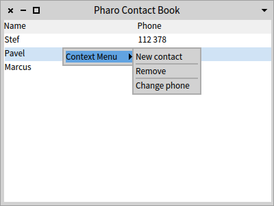
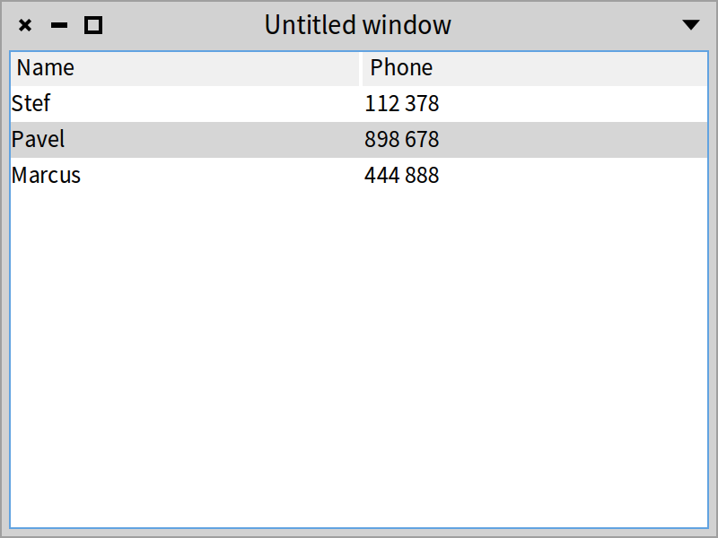
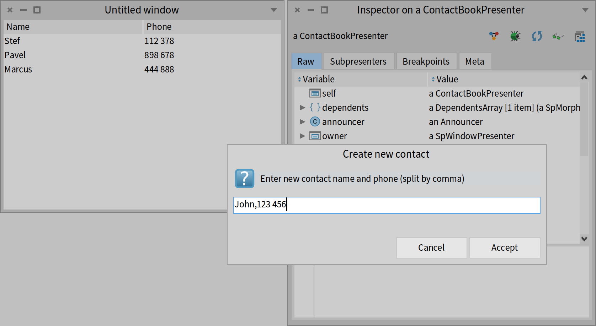

## A simple contact book


In this chapter, we develop a simple model for a contact book. Then we define a user interface. This example will be used later in the book as an example to explain concepts such as commands, applications, and windows.

It is more of a replay of the concepts previously mentioned. We start by implementing classes modeling the domain and then we will add a basic graphical user interface to obtain a little application as shown in Figure *@overview@*.




### Contact book model

The model for the domain of our example is composed of two classes: Contact and ContactBook as shown in Figure *@contactmodel@*.


#### Contact

The class modeling a contact is defined as follows.

```
Object << #Contact
	slots: {#name . #phone};
	package: 'CodeOfSpec20Book'
```


It just defines a `printOn:` method and some accessors.

```
Contact >> printOn: aStream

	super printOn: aStream.
	aStream nextPut: $(.
	aStream nextPutAll: name.
	aStream nextPut: $)
```

```
Contact >> name

	^ name
```

```
Contact >> name: aString

	name := aString
```

```
Contact >> phone

	^ phone
```

```
Contact >> phone: aString

	phone := aString
```

```
Contact >> hasMatchingText: aString

	^ name includesSubstring: aString caseSensitive: false
```


```
Contact class >> name: aNameString phone: aPhoneString

	^ self new
		name: aNameString;
		phone: aPhoneString;
		yourself
```


#### ContactBook

Now we define the class modeling the contact book. As for the contact class, it is straightforward.

```
Object << #ContactBook
	slots: { #contacts };
	package: 'CodeOfSpec20Book'
```

```
ContactBook >> initialize

	super initialize.
	contacts := OrderedCollection new
```

We add the possibility to add and remove a contact

```
ContactBook >> addContact: aContact

	contacts add: aContact
```


```
ContactBook >> removeContact: aContact

	contacts remove: aContact
```


```
ContactBook >> addContact: newContact after: contactAfter

	contacts add: newContact after: contactAfter
```


We add a simple testing method in case one wants to write some tests (which we urge you to do).

```
ContactBook >> includesContact: aContact

	^ contacts includes: aContact
```


And now we add a method to create a contact and add it to the contact book.

```
ContactBook >> add: contactName phone: phone

	| contact |
	contact := Contact name: contactName phone: phone.
	self addContact: contact.
	^ contact
```


Finally, some facilities to query the contact book.

```
ContactBook >> findContactsWithText: aText

	^ contacts select: [ :each | each hasMatchingText: aText ]
```


```
ContactBook >> size

	^ contacts size
```


```
ContactBook >> contents

	^ contacts
```

#### Pre-filling up the contact book


Since we want to have some contacts and we want to keep them without resorting to a database or file, we set some class instance variables.

We define a class instance variable `coworkers` and define a class accessor method as follows:

```
ContactBook class >> coworkers

	^ coworkers ifNil: [
			coworkers := self new
				add: 'Stef' phone: '112 378';
				add: 'Pavel' phone: '898 678';
				add: 'Marcus' phone: '444 888';
				yourself ]
```


We add one method to reset the coworkers if necessary.
The `<script>` pragma tells the system browser to add a small button to execute the `reset` method easily.

```
ContactBook class >> reset

	<script>
	coworkers := nil
```


### A simple graphical user interface


Now we define the graphical user interface (GUI) to expose the model to the user. The targeted GUI is shown in Figure *@firstFullUI@*.


We define the class `ContactBookPresenter`. It holds a reference to a contact book and it is structured around a table.

```
SpPresenter << #ContactBookPresenter
	slots: { #table . #contactBook };
	tag: 'Chapter18';
	package: 'CodeOfSpec20Book'
```

#### Initializing the model


We specialize the method `setModelBeforeInitialization:` that is invoked by the framework to assign the `contactBook` instance variable to the object passed during the execution of the expression `(ContactBookPresenter on: ContactBook coworkers) open`.

```
ContactBookPresenter >> setModelBeforeInitialization: aContactBook

	super setModelBeforeInitialization: aContactBook.
	contactBook := aContactBook
```


#### Layout


```
ContactBookPresenter >> defaultLayout

	^ SpBoxLayout newVertical
			add: #table;
			yourself
```


#### Widget initialization


We initialize the table to display two columns for the name and the phone. The respective accessor messages will be sent to the elements to fill up the columns. Finally, the table content is set using the contact book contents.

```
ContactBookPresenter >> initializePresenters

	table := self newTable
		addColumn: (SpStringTableColumn title: 'Name' evaluated: #name);
		addColumn: (SpStringTableColumn title: 'Phone' evaluated: #phone);
		items: contactBook contents;
		yourself
```


Now we can open the UI by executing the snippet

```
(ContactBookPresenter on: ContactBook coworkers) open
```

We define a class method to be able to easily re-execute the setup.

```
ContactBookPresenter class >> coworkersExample

	<example>
	(self on: ContactBook coworkers) open
```

You should obtain the GUI as shown in Figure *@firstVersion@*.



#### Interacting with user


We now implement the method that will open a window to ask the user to create a new contact for the contact book.

```
ContactBookPresenter >> newContact

	| rawData split |
	 rawData := self
		request: 'Enter new contact name and phone (split by comma)'
		initialAnswer: ''
		title: 'Create new contact'.
	split := rawData splitOn: $,.
	(split size = 2 and: [ split allSatisfy: [ :each | each isNotEmpty ]])
		ifFalse: [ SpInvalidUserInputError signal: 'Please enter contact name and phone (split by comma)' ].

	^ Contact name: split first phone: split second
```


To test it, you can get access to the presenter with:

```
(ContactBookPresenter on: ContactBook coworkers)
	open presenter inspect
```


and you can send `self newContact` message to open the dialog shown in Figure *@inspector@*.




#### Some extra methods


We will also define the methods `isContactSelected` and `selectedContact` to know if a contact is currently selected and to return it. It will help us later to add a contact just after the currently selected contact.

```
ContactBookPresenter >> isContactSelected

	^ table selectedItems isNotEmpty
```


```
ContactBookPresenter >> selectedContact

	^ table selection selectedItem
```


### Conclusion


Now we have a little contact book manager that we can use to explain other topics.
