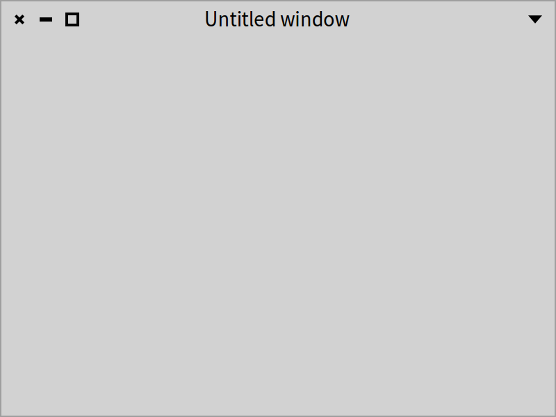
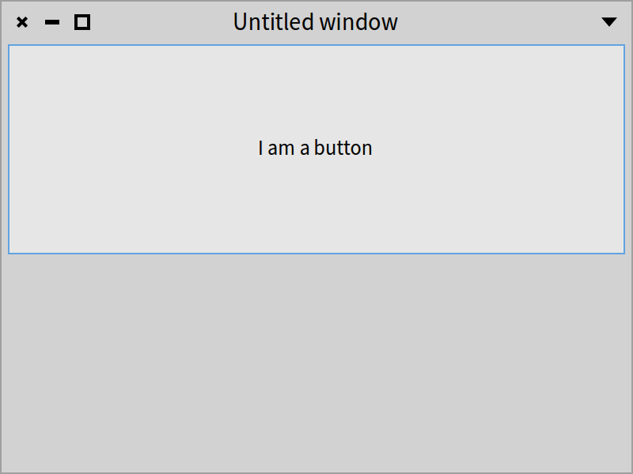
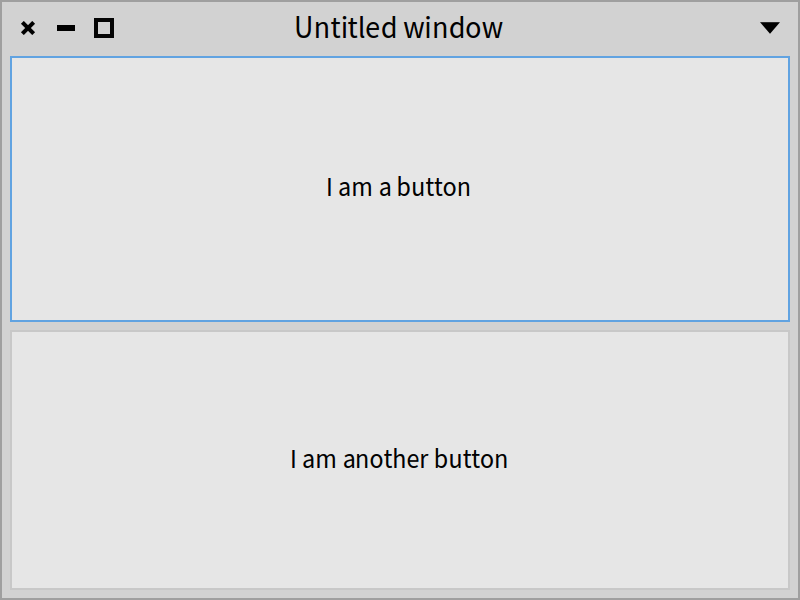
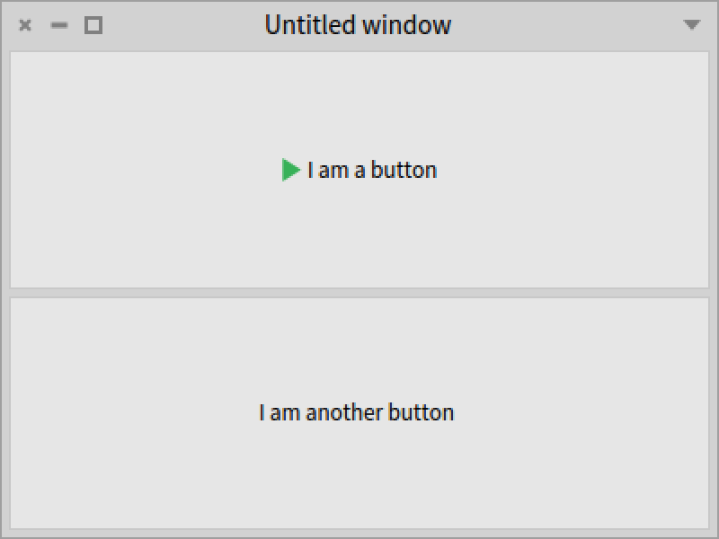
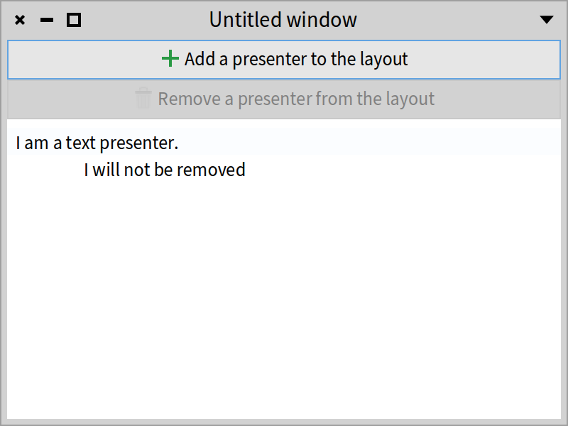
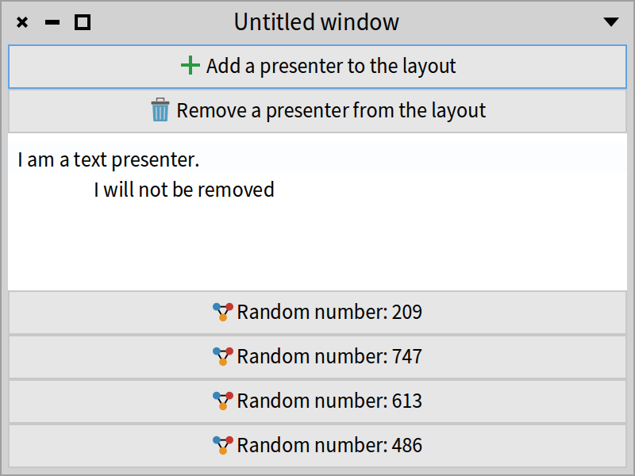
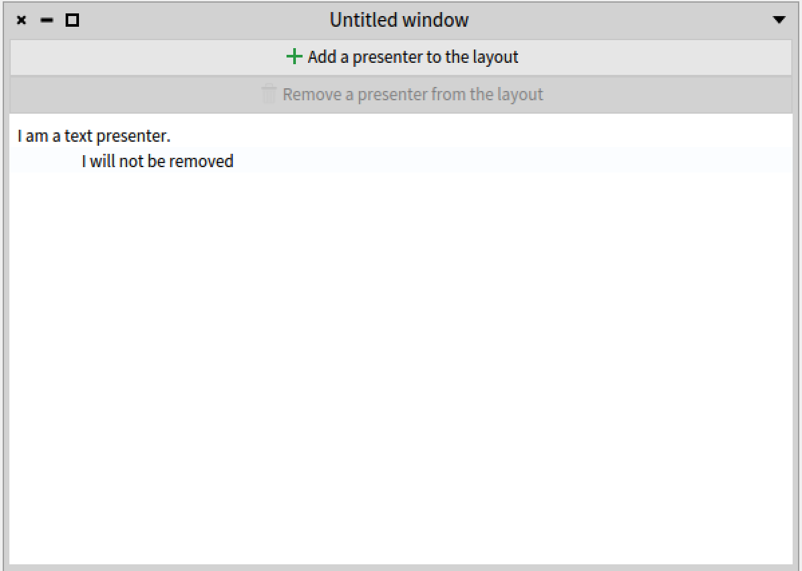
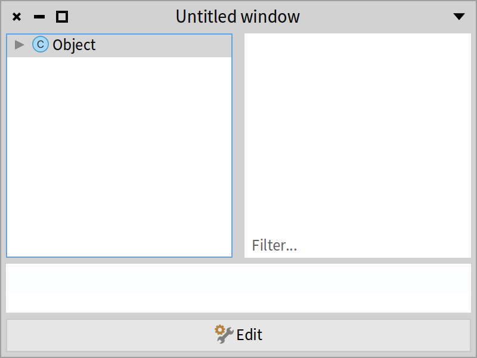
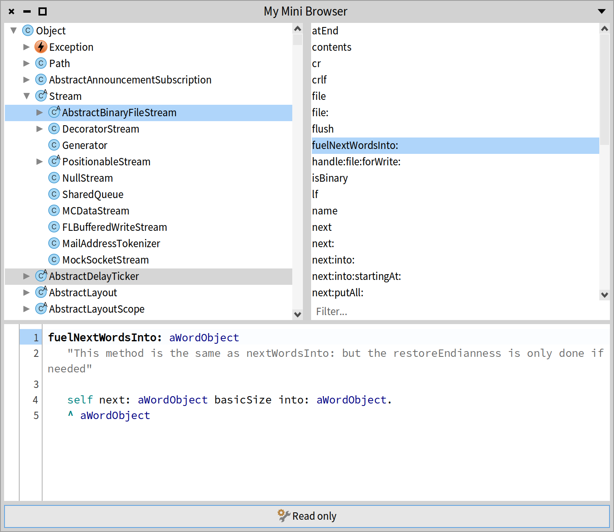

## Dynamic presenters
@cha_dynamic_presenter

Contrary to Spec 1.0, in Spec 2.0 all the layouts are dynamic. It means that you can change the displayed elements on the fly. It is a radical improvement from Spec 1.0 where most of the layouts were static and building dynamic widgets was cumbersome.

In this chapter, we  show that presenters can be dynamically composed using layouts. We show a little interactive session. Then we build a little browser with dynamic aspects.

### Layouts as simple as objects

Building dynamic applications using Spec is simple. In fact, any layout in Spec is dynamic and composable. Let's explore how that works. We start with the following code snippet:

```
presenter := SpPresenter new.
presenter application: SpApplication new.
```

For this presenter, we use the `SpPanedLayout` which can receive two presenters \(or layouts\) and place them in one half of the window. If you want to see all the available layouts in Spec, you can check the package `Spec2-Layout`.

```
presenter layout: SpPanedLayout newTopToBottom.
presenter open.
```


Of course, as shown in Figure *@layout1@*, we are going to see an empty window because we did not put anything in the layout.




Now, without closing the window, we can dynamically edit the layout of the main presenter. We will add a button presenter by executing the following lines:

```
button1 := presenter newButton.
button1 label: 'I am a button'.
presenter layout add: button1.
```





Now we can add another button. There is no need to close and reopen the window. Everything updates dynamically and without the need of rebuilding the window. As we have instantiated the layout with `newTopToBottom`, the presenters will be laid out vertically. See Figure *@layout3@*.

```
button2 := presenter newButton.
button2 label: 'I am another button'.
presenter layout add: button2.
```




We can put an icon in the first button. See Figure *@layout4@*.

```
button1 icon: (button1 iconNamed: #smallDoIt).
```




Or we can delete one of the buttons from the layout, as shown in Figure *@layout5@*.

```
presenter layout remove: button2.
```


What you see here is that all the changes happen simply by creating a new instance of a given layout and sending messages to it.  It means that programs can define complex logic for the dynamic behavior of a presenter.

### Dynamic button adder

Now we will create a presenter that dynamically adds buttons with random numbers: we will add and remove buttons dynamically (as shown in Figures *@layout6@* and *@layout7@*). 
Let us get started. We create a new class called `DynamicButtons`.



```
SpPresenter << #DynamicButtons
	slots: { #addButton . #removeButton . #text };
	package: 'CodeOfSpec20Book'
```

In the method `initializePresenters`, we add a button. When we click on it, it adds a new button to the layout. We also want a button that will remove the last button that was added, if any. Finally, we add a read-only text presenter that cannot be removed.

```
DynamicButtons >> initializePresenters

	addButton := self newButton.
	addButton
		action: [ self addToLayout ];
		label: 'Add a presenter to the layout';
		icon: (self iconNamed: #smallAdd).

	removeButton := self newButton.
	removeButton
		action: [ self removeFromLayout ];
		label: 'Remove a presenter from the layout';
		icon: (self iconNamed: #smallDelete);
		disable.

	text := self newText.
	text
		text: 'I am a text presenter.
		I will not be removed';
		beNotEditable
```

### Defining add/remove buttons

Now we have to implement the methods `addToLayout` and `removeFromLayout` used in the action blocks of the buttons. Those methods, as their names indicate, add and remove presenters dynamically.

Let's start with the `addToLayout` method. We will add a new button to the layout. The label of the new button is a random number. We enable the remove button so that the newly added button can be removed.

```
DynamicButtons >> addToLayout

	| randomButtonName newButton |
	removeButton enable.
	randomButtonName := 'Random number: ', 1000 atRandom asString.
	newButton := self newButton
		label: randomButtonName;
		icon: (self iconNamed: #smallObjects);
		yourself.
	self layout add: newButton expand: false
```

For removing a button from the layout, we  first check if there is a button that we can remove. If yes, we just remove the last button. Then, if there are no more buttons left to remove, we disable the remove button.

```
DynamicButtons >> removeFromLayout

	self layout remove: self layout presenters last.
	self layout presenters last = text ifTrue: [ removeButton disable ]
```

The only thing that is still missing is the default layout.

```
DynamicButtons >> defaultLayout

	^ SpBoxLayout newTopToBottom
			add: addButton expand: false;
			add: removeButton expand: false;
			add: text;
			yourself
```

After opening the window with the following code snippet, we see the window shown in Figure *@layout6@*.

```
DynamicButtons new open
```

Figure *@layout7@* shows what the window looks like after clicking the add button four times.




### Building a little dynamic browser


With all of the knowledge gained so far, we are going to build a new mini version of the System Browser as shown in Figure *@layout8@*. We want to have:

- A tree that shows all the system classes.
- A list that shows all methods of the selected class.
- A text presenter that shows the code of a selected method.
- A button.


Initially, the code of the method will be in “Read-only” mode. When we press the button, we are switching to “Edit” mode.





Let's get started.

```
SpPresenter << #MyMiniBrowser
	slots: { #classTree . #code . #methodList . #button };
	package: 'CodeOfSpec20Book'
```

The `initializePresenters` method instantiates the tree presenter class. We want the tree presenter to show all the classes that are present in the Pharo image. We know that (almost) all subclasses inherit from `Object`, so that is going to be the only root of the tree. To get the children of a tree node, we can send the message `subclasses` to a class. We want each of the tree nodes to have a nice icon. We can fetch the icon of a class with the message `systemIconName`. Finally, we want to “activate” the presenter with only one click instead of two.

```
MyMiniBrowser >> initializePresenters

	classTree := self newTree
		activateOnSingleClick;
		roots: { Object };
		children: [ :each | each subclasses ];
		displayIcon: [ :each | self iconNamed: each systemIconName ];
		yourself.
```


For the methods, we want to use a filtering list, so that we can search for method selectors. Also, we want to display only the selector of the method and sort the methods in an ascending way.

```
	methodList := self newFilteringList 
			display: [ :method | method selector ].
	methodList listPresenter 
		sortingBlock: [ :method | method selector ] ascending.
```


We said that, initially, the code is going to be in “Read-only” mode. The label of the button is going to be “Edit” to say that if we click on the button, we will change to “Edit” mode. We also want to have a nice icon.

```
	button := self newButton
		label: 'Edit';
		icon: (self iconNamed: #smallConfiguration);
		yourself.
```


As the initial behavior will be read-only mode, the code will be a text presenter that is not editable.

```
	code := self newText.
	code beNotEditable
```

Here is the complete code of the method:

```
MyMiniBrowser >> initializePresenters

	classTree := self newTree
		activateOnSingleClick;
		roots: { Object };
		children: [ :each | each subclasses ];
		displayIcon: [ :each | self iconNamed: each systemIconName ];
		yourself.
	methodList := self newFilteringList 
		display: [ :method | method selector ].
	methodList listPresenter 
		sortingBlock: [ :method | method selector ] ascending.
	button := self newButton
		label: 'Edit';
		icon: (self iconNamed: #smallConfiguration);
		yourself.
	code := self newText.
	code beNotEditable
```


### Placing elements visually

We initialized our presenters, but we did not indicate how they needed to be displayed.

We want the upper part of the layout to have the classes and the methods shown horizontally, like in the System Browser. To achieve that, we will create another left-to-right layout, with a spacing of 10 pixels between the classes and the methods.

We add that layout to our main layout, which is a top-to-bottom layout. We add the code and the button under the classes and the methods. We do not want the code to expand. In addition, we want a separation of 5 pixels for this layout.

```
MyMiniBrowser >> defaultLayout

	| classesAndMethodsLayout |
	classesAndMethodsLayout := SpBoxLayout newLeftToRight.
	classesAndMethodsLayout
		spacing: 10;
		add: classTree;
		add: methodList.
	^ SpBoxLayout newTopToBottom
		spacing: 5;
		add: classesAndMethodsLayout;
		add: code;
		add: button expand: false;
		yourself
```

Opening the presenter with the code below, opens the window shown in Figure *@layout9@*.

```
MyMiniBrowser new open
```




### Connecting the flow

So far so good, but we did not add any behavior to the presenters. We have to implement the `connectPresenters` method.

When we click on a class in the tree, we want to update the items of the method list with the methods of the selected class. When we click on a method, we want to update the text of the code with the source code of the method.

```
MyMiniBrowserPresenter >> connectPresenters

	classTree whenActivatedDo: [ :selection |
		methodList items: selection selectedItem methods ].
	 methodList listPresenter
		whenSelectedDo: [ :selectedMethod |
			code text: selectedMethod ast formattedCode ].
	button action: [ self buttonAction ]
```


For now, we define the method `buttonAction` to do nothing.

```
MyMiniBrowserPresenter >> buttonAction
```


### Toggling Edit/Read-only mode

When we click on the button we want several things. That is why it is better to create a separate method.

1. We want to change the label of the button to alternate between “Edit” and “Read only”.
2. We want to change the presenter of the code. If the Mini Browser is in read-only mode, we want to have a text presenter that is not editable. If the Mini Browser is in edit mode, we want to have a code presenter that applies syntax coloring to the code and shows the line numbers. But always the code is going to have the same text \(the code of the selected method\).


```
MyMiniBrowserPresenter >> buttonAction

	| newCode |
	button label = 'Edit'
		ifTrue: [
			button label: 'Read only'.
			newCode := self newCode
				beForMethod: methodList selectedItem;
				text: methodList selectedItem ast formattedCode;
			yourself ]
		ifFalse: [
			button label: 'Edit'.
			newCode := self newText
				text: methodList selectedItem ast formattedCode;
				beNotEditable;
				yourself ].

	self layout replace: code with: newCode.
	code := newCode
```


As a last detail, because we love details, we do not want “Untitled window” as the window title and we want a default extent. We define the `initializeWindow:` method.

```
MyMiniBrowserPresenter >> initializeWindow: aWindowPresenter

	aWindowPresenter
		title: 'My Mini Browser';
		initialExtent: 750@650
```


Voilà! We have a new minimal version version of the System Browser with a read-only mode. When we run `MyMiniBrowser new open`, and we select a class and a method, and we press the 'Edit' button, we see the window in Figure *@layout10@*.



### About layout recalculation

Pay attention to layout recalculation because it can have a performance penalty.

Consider a presenter having a layout with many subpresenters, and let's assume that the subpresenters have layouts with subpresenters too. Layouts allow adding and removing presenters. Those operations do not come for free. Every change to a layout triggers a recalculation because any addition or removal impacts how the presenters in the layout are displayed on the screen. So when a presenter changes multiple individual presenters of a layout, multiple recalculations may happen.

It is preferable to perform layout changes in one go. When building an initial layout, it is better to build the nested layouts bottom-up and to set the overall layout once. When updating an existing layout, it is better to build the new layout completely and set it, instead of chirurgically adding and/or removing presenters.

### Conclusion

With Spec we can build applications ranging from very simple to very sophisticated. The dynamic layouts allow changing layouts on the fly. Layouts can be configured in multiple ways, so have a look at their classes and the available examples. Spec has lots of presenters that are ready to be used. Start digging into the code to see which presenters are available, and to learn their API.
