## Layouts
@cha_layout

In Spec, layouts are represented by instances of layout classes. The layout classes encode different positioning of elements such as box, paned, or grid.
This chapter presents the available layouts, their definition, and how layouts can be reused when a presenter reuses other presenters.

### Basic principle reminder

Spec expects that layout objects, instances of the layout classes, are associated with a presenter. Each presenter should describe the positioning of its subpresenters.

Contrary to Spec 1.0, where layouts were only defined at the class level, in Spec 2.0, to define the layout of a presenter you can:
- Define the `defaultLayout` method on the instance side
- Use the message `layout:` in your `initializePresenters` method to set an instance of layout in the current presenter.

The message `defaultLayout` returns a layout and `layout:` sets a layout, for example, an instance of `SpBoxLayout` or `SpPanedLayout`. These two methods are the preferred way to define layouts.

Note that the possibility of defining a class-side accessor e.g. `defaultLayout` remains for those who prefer it.

This new design reflects the dynamic nature of layouts in Spec, and the fact that you can compose them using presenter instances directly, not forcing you to declare subpresenters in instance variables upfront, and then use their names as it was done in Spec 1.0. It is, however, possible that there are cases where you want a layout "template"... so you can still do it.


### A running example

To be able to play with the layouts defined in this chapter, we define a simple presenter named `TwoButtons`.

```
SpPresenter << #TwoButtons
	slots: { #button1 . #button2 };
	package: 'CodeOfSpec20Book'
```

We define a simple `initializePresenters` method as follows:

```
TwoButtons >> initializePresenters

	button1 := self newButton.
	button2 := self newButton.
	button1 label: '1'.
	button2 label: '2'
```

### BoxLayout (SpBoxLayout and SpBoxConstraints)

The class `SpBoxLayout` displays presenters in an ordered sequence of boxes. A box layout can be horizontal or vertical and presenters are ordered left to right and top to bottom respectively. A box layout can be composed of other layouts.


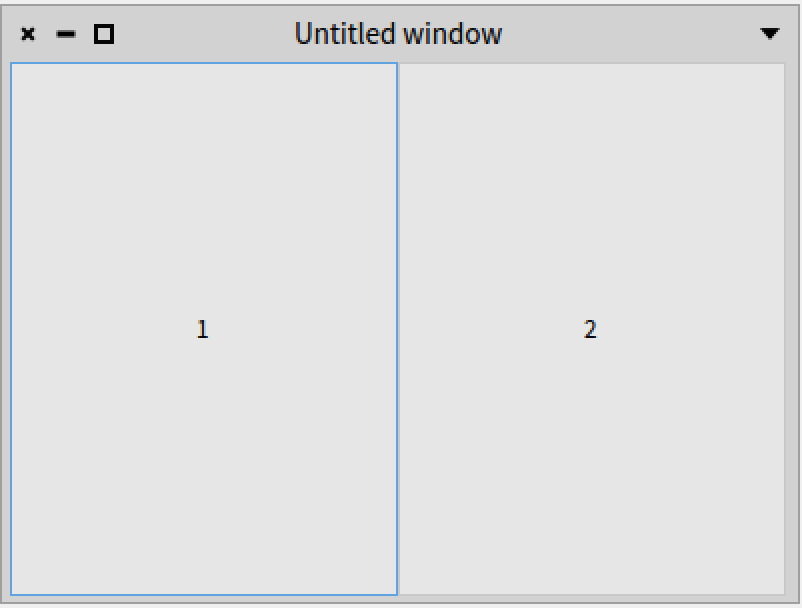

Let us define a first simple layout as follows and whose result is displayed in Figure *@TwoButtonsLeftToRight@*.

```
TwoButtons >> defaultLayout

	^ SpBoxLayout newLeftToRight
		add: button1;
		add: button2;
		yourself
```

What we see is that by default a subpresenter expands its size to fit the space of its container.

An element in a vertical box will use all available horizontal space, and fill
vertical space according to the rules. This is inversed in a horizontal box.

We can refine this layout to indicate that the subpresenters should not expand to their container using the message `add:expand:`. The result is shown in Figure *@TwoButtonsLeftToRightExpanded@*.

```
TwoButtons >> defaultLayout

	^ SpBoxLayout newLeftToRight
		add: button1 expand: false;
		add: button2 expand: false;
		yourself
```

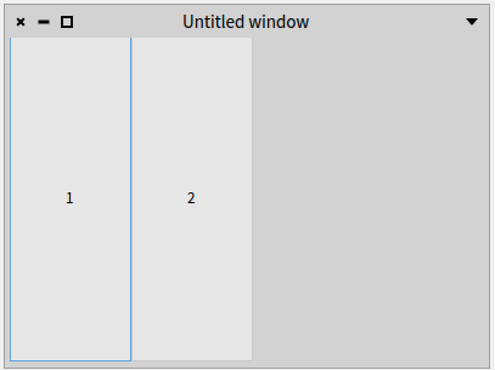

The full message to add presenters is: `add:expand:fill:padding:`
- `expand:` argument - when true, the new child is to be given extra space allocated to the box. The extra space is divided evenly between all children that use this option.
- `fill:` argument - when true, the space given to a child by the expand option is actually allocated to the child, rather than just padding it. This parameter has no effect if `expand` is set to `false`.
- `padding:` argument  - extra space in pixels to put between this child and its neighbors, over and above the global amount specified by the `spacing` property. If a child is a widget at one of the reference ends of the box, then padding pixels are also put between the child and the reference edge of the box.


To illustrate this API a bit, we change the `defaultLayout` method as follows. The result is shown in Fig *@TwoButtonsTopToBottom@*. We want to stress, however, that it is better not to use a fixed height or padding.

```
TwoButtons >> defaultLayout

	^ SpBoxLayout newTopToBottom
		spacing: 15;
		add: button1 expand: false fill: true padding: 5;
		add: button2 withConstraints: [ :constraints |
			constraints height: 80; padding: 5 ];
		yourself
```


The annotations in the figure indicate the padding in red, the height of `button2` in blue, and the spacing in green. Note that the padding of `button2` is included in the height of the button.

The `defaultLayout` method sends the message `withConstraints: [ :constraints | constraints height: 80; padding: 5 ]`. This message allows setting constraints when the often used messages `add:`, `add:expand:`, and `add:expand:fill:padding:` do not cover your particular use case. The `constraints` argument of the block is an instance of the `SpBoxConstraints` class.


### Box layout alignment

A box layout can be configured with horizontal and vertical alignment of the children. These are the horizontal alignment options, which are messages that can be sent to a `SpBoxLayout` instance:

* hAlignStart
* hAlignCenter
* hAlignEnd

These are the vertical layout options:

* vAlignStart
* vAlignCenter
* vAlignEnd

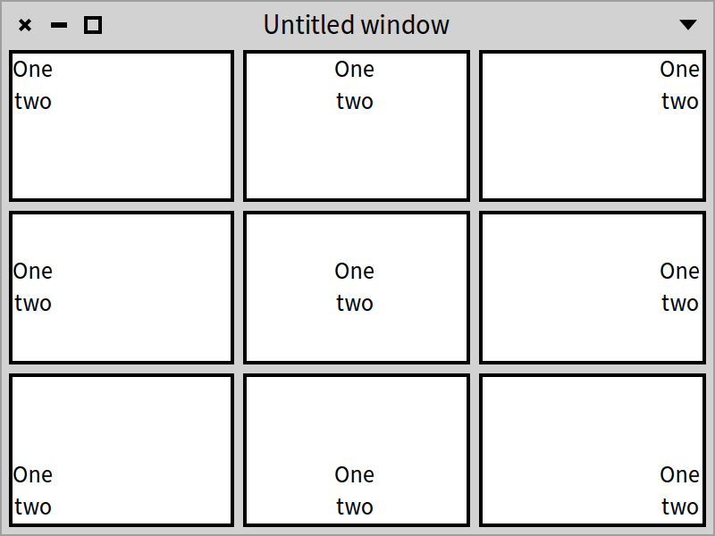


Let's see how this works in a small example as shown in Figure *@AlignmentExampleWithVerticalTiles@*. We will create a presenter with 9 subpresenters, which we call "tiles", laid out in 3 rows with 3 columns. Each subpresenter displays two label presenters with the labels 'One' and 'Two'. The presenter class defines nine instance variables. The names refer to the position of the content inside each tile.

```
SpPresenter << #AlignmentExample
	slots: {
			 #northWest .
			 #north .
			 #northEast .
			 #west .
			 #center .
			 #east .
			 #southWest .
			 #south .
			 #southEast };
	package: 'CodeOfSpec20Book'
```

As always, `initializePresenters` binds the instance variables that hold the subpresenters. It uses a helper method `newTile:` to create the tiles.

```
AlignmentExample >> initializePresenters

	northWest := self newTile: [ :tileLayout |
		tileLayout vAlignStart; hAlignStart ].
	north := self newTile: [ :tileLayout |
		tileLayout vAlignStart; hAlignCenter ].
	northEast := self newTile: [ :tileLayout |
		tileLayout vAlignStart; hAlignEnd ].
	west := self newTile: [ :tileLayout |
		tileLayout vAlignCenter; hAlignStart ].
	center := self newTile: [ :tileLayout |
		tileLayout vAlignCenter; hAlignCenter ].
	east := self newTile: [ :tileLayout |
		tileLayout vAlignCenter; hAlignEnd ].
	southWest := self newTile: [ :tileLayout |
		tileLayout vAlignEnd; hAlignStart ].
	south := self newTile: [ :tileLayout |
		tileLayout vAlignEnd; hAlignCenter ].
	southEast := self newTile: [ :tileLayout |
		tileLayout vAlignEnd; hAlignEnd ]
```

Note that the block argument of the `newTile:` message has a `titleLayout` argument, which is bound to an instance of `SpBoxLayout`. Inside the nine blocks, the alignment messages that we saw earlier are sent to configure the alignment inside the tiles. For instance, for the top-left tile called "northWest", `vAlignStart` is sent to align to the top side of the tile, and `hAlignStart` is sent to align to the left side of the tile.

```
AlignmentExample >> newTile: alignmentBlock

	| tileLayout |
	tileLayout := SpBoxLayout newTopToBottom
		add: self newLabelOne;
		add: self newLabelTwo;
		yourself.
	alignmentBlock value: tileLayout.
	^ SpPresenter new
		layout: tileLayout;
		addStyle: 'tile';
		yourself
```

The method `newTile:` uses two other helper methods:

```
AlignmentExample >> newLabelOne

	^ self newLabel
		label: 'One';
		yourself
```

```
AlignmentExample >> newLabelTwo

	^ self newLabel
		label: 'two';
		yourself
```

The layout of the window is defined with:

```
AlignmentExample >> defaultLayout

	^ SpBoxLayout newTopToBottom
		spacing: 5;
		add: (self rowWithAll: { northWest . north . northEast });
		add: (self rowWithAll: { west . center . east });
		add: (self rowWithAll: { southWest . south . southEast });
		yourself
```

It answers a vertical box layout with three rows. It applies a spacing of 5 pixels between the rows. It sends `rowWithAll:` three times to create horizontal box layouts with three subpresenters each. `rowWithAll:` applies the same spacing of 5 pixels between the tiles in a row.

```
AlignmentExample >> rowWithAll: tiles

	| row |
	row := SpBoxLayout newLeftToRight
		spacing: 5;
		yourself.
	tiles do: [ :tile | row add: tile ].
	^ row
```

For demonstration purposes, we apply a stylesheet to display tiles with a white background and a black border.

```
AlignmentExample >> application

	^ SpApplication new
		addStyleSheetFromString: '.application [
			.tile [
				Container { #borderWidth: 2, #borderColor: #black },
				Draw { #backgroundColor: #white } ]
		]';
		yourself
```

Now we have all the code we need to open the window with:

```
AlignmentExample new open
```

The result is shown in Figure *@AlignmentExampleWithVerticalTiles@*. Each tile displays the label presenters at another location. The label presenters are positioned vertically.

### Alignment in horizontal box layout

Let's see what happens when we put the label presenters in a horizontal box layout.

```
AlignmentExample >> newTile: alignmentBlock

	| tileLayout |
	tileLayout := SpBoxLayout newLeftToRight
		add: self newLabelOne;
		add: self newLabelTwo;
		yourself.
	alignmentBlock value: tileLayout.
	^ SpPresenter new
		layout: tileLayout;
		addStyle: 'tile';
		yourself
```

Figure *@AlignmentExampleWithHorizontalTiles@* shows the result of opening the window again. Now the labels are positioned horizontally.

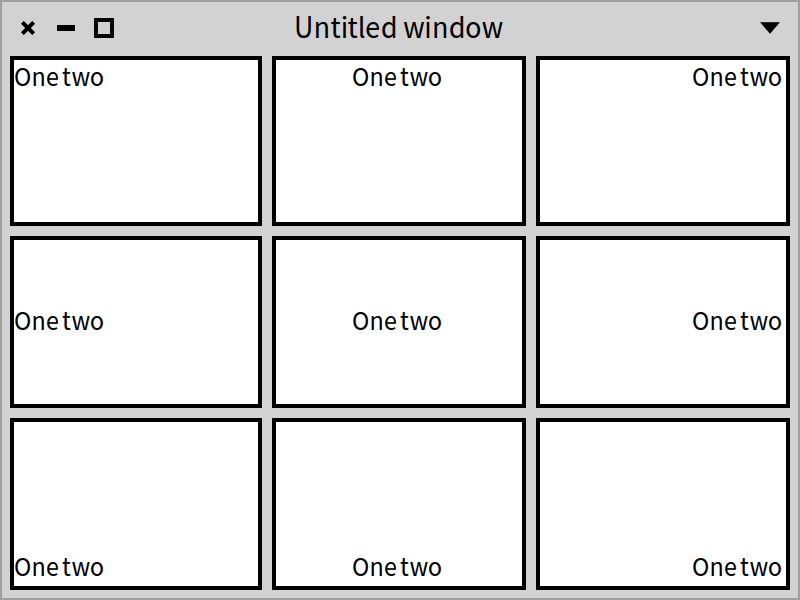


### A more advanced layout

Now that we know how to align nested presenters, let's have a look at a common use case. Suppose we like to arrange three buttons in a row of which two are positioned on the left side of the window, and one is positioned on the right side. That setup is very handy for button bars with buttons on the left side and on the right side, such as in the Repositories browser of Iceberg, as you can see in Figure *@Repositories@*. The bar has one button on the left side and two buttons on the right side.

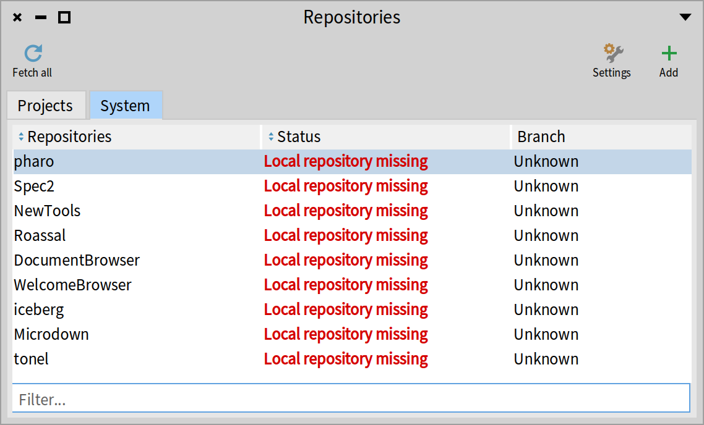

Let's create a new presenter class called `ButtonBar`:

```
SpPresenter << #ButtonBar
	slots: { #button1 . #button2 . #button3 };
	package: 'CodeOfSpec20Book'
```

We initialize the three buttons:

```
ButtonBar >> initializePresenters

	button1 := self newButton.
	button2 := self newButton.
	button3 := self newButton.
	button1 label: '1'.
	button2 label: '2'.
	button3 label: '3'
```

We use a layout that has two sublayouts, one for two buttons on the left, and one for the third button on the right. We apply a 15 pixel spacing between the buttons on the left.

```
ButtonBar >> defaultLayout

	| left right |
	left := SpBoxLayout newLeftToRight
		spacing: 15;
		add: button1 expand: false;
		add: button2 expand: false;
		yourself.
	right := SpBoxLayout newLeftToRight
		add: button3 expand: false;
		yourself.
	^ SpBoxLayout newLeftToRight
		add: left;
		add: right;
		yourself
```

When opening this presenter with `ButtonBar new open`, we see the window shown in Figure *@ThreeButtonsLeftAndRightWithoutAlignment@*.

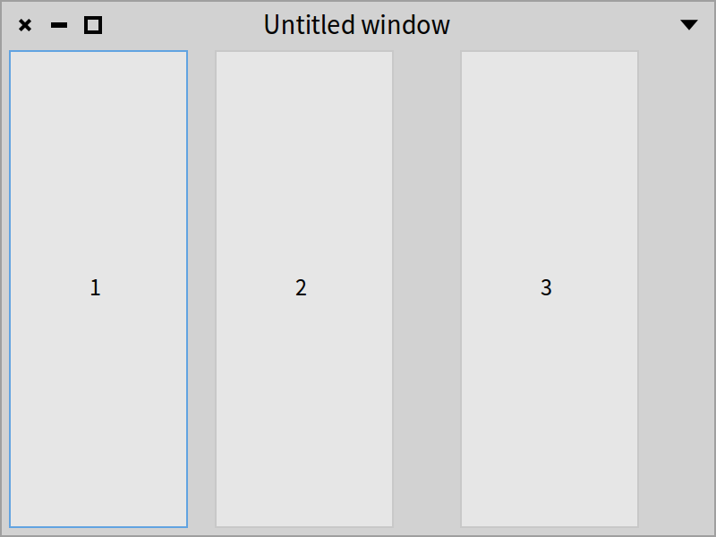

The layout is not exactly what we had in mind. The third button is not positioned on the right side. That is where the alignment from the pevious section comes in. Let's change the `defaultLayout` method to align the button with the end of the right box layout. We add the message `hAlignEnd`:


```
ButtonBar >> defaultLayout

	| left right |
	left := SpBoxLayout newLeftToRight
		spacing: 15;
		add: button1 expand: false;
		add: button2 expand: false;
		yourself.
	right := SpBoxLayout newLeftToRight
		hAlignEnd;
		add: button3 expand: false;
		yourself.
	^ SpBoxLayout newLeftToRight
		add: left;
		add: right;
		yourself
```

When we open the presenter again, we see the window shown in Figure *@ThreeButtonsLeftAndRightWithAlignment@*. That is the layout we had in mind.

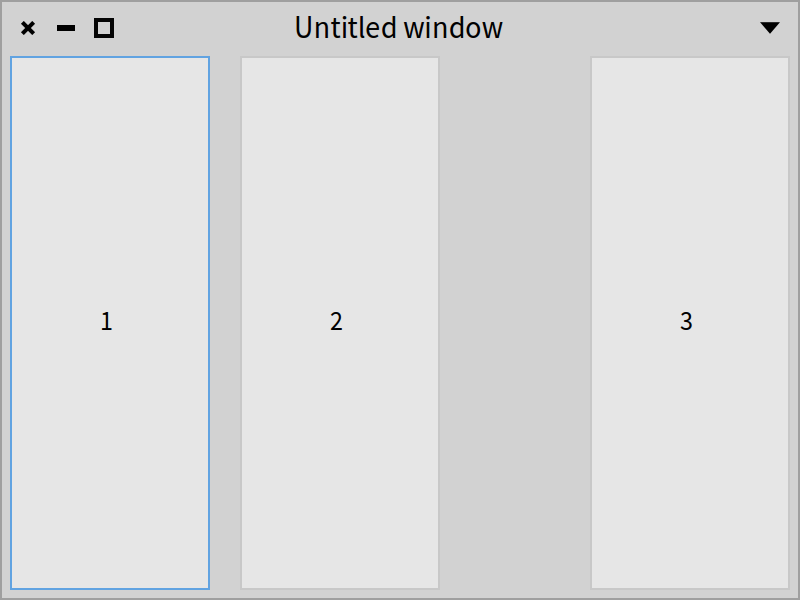

This example shows that advanced layout requires nesting layouts to achieve the desired result.

### Example setup for layout reuse

Before presenting some of the other layouts, we show an important aspect of Spec presenter composition: a composite can declare that it wants to reuse a presenter using a specific layout of a presenter.

Consider our artificial example of a two-button UI. Let us use two layouts as follows. We define two class methods returning different layouts. Note that we could define such methods on the instance side to. We define them on the class side to be able to get the layouts without an instance of the class.

```
TwoButtons class >> buttonRow

	^ SpBoxLayout newLeftToRight
		add: #button1;
		add: #button2;
		yourself
```

```
TwoButtons class >> buttonColumn

	^ SpBoxLayout newTopToBottom
		add: #button1;
		add: #button2;
		yourself
```

Note that when we define the layout at the class level, we use a symbol whose name is the corresponding instance variable. Hence we use `#button2` to refer to the presenter stored in the instance variable `button2`.


### Opening with a layout

The message `openWithLayout:` lets you specify the layout you want to use when opening a presenter.
Here are some examples:
- `TwoButtons new openWithLayout: TwoButtons buttonRow` places the buttons in a row.
- `TwoButtons new openWithLayout: TwoButtons buttonColumn` places them in a column.


We define a `defaultLayout` method which invokes one of the previously defined methods so that the presenter can be opened without giving a layout.
```
TwoButtons >> defaultLayout

	^ self class buttonRow
```


### Better design

We can do better and define two instance level methods to encapsulate the layout configuration.

```
TwoButtons >> beColumn

	self layout: self class buttonColumn
```

```
TwoButtons >> beRow

	self layout: self class buttonRow
```

Then we can write the following script:

```
TwoButtons new
	beColumn;
	open
```


### Specifying a layout when reusing a presenter

Having multiple layouts for a presenter implies that there is a way to specify the layout to use when a presenter is reused. This is simple. We use the method `layout:`. Here is an example. We create a new presenter named `ButtonAndListH`.

```
SpPresenter << #ButtonAndListH
	slots: { #buttons . #list };
	package: 'CodeOfSpec20Book'
```


```
ButtonAndListH >> initializePresenters

	buttons := self instantiate: TwoButtons.
	list := self newList.
	list items: (1 to: 10)
```

```
ButtonAndListH >> initializeWindow: aWindowPresenter

	aWindowPresenter title: 'SuperWidget'
```

```
ButtonAndListH >> defaultLayout

	^ SpBoxLayout newLeftToRight
		add: buttons;
		add: list;
		yourself
```


This `ButtonAndListH` class results in a SuperWidget window as shown in Figure *@ButtonAndListH@*. It reuses the `TwoButtons` presenter and places all three presenters in a horizontal order because the `TwoButtons` presenter  uses the `buttonRow` layout method by default.

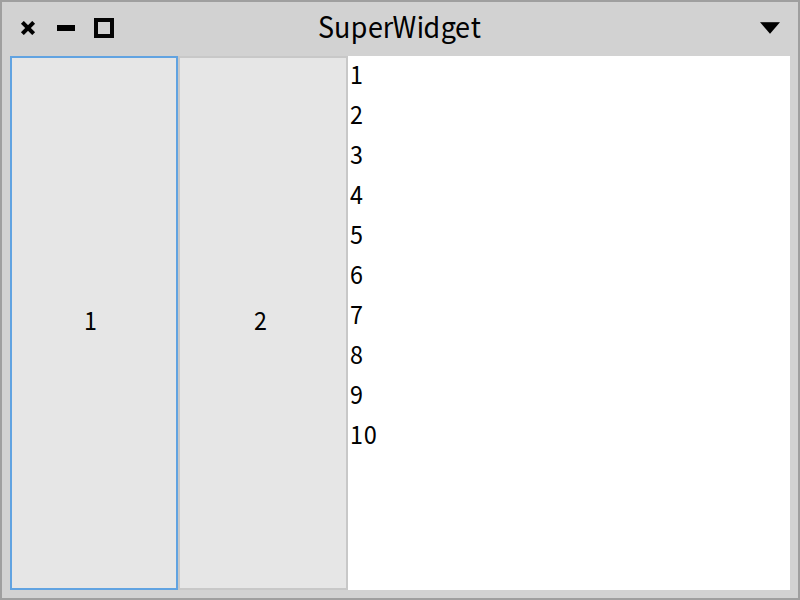

Alternatively, we can create `ButtonAndListV` class as a subclass of `ButtonAndListH` and only change the `initializePresenters` method as below. It specifies that the reused `buttons` widget should use the `buttonColumn` layout method, and hence results in the window shown in Figure *@ButtonAndListV@*.

```
ButtonAndListH << #ButtonAndListV
	slots: {};
	package: 'CodeOfSpec20Book'
```

```
ButtonAndListV >> initializePresenters

	super initializePresenters.
	buttons beColumn
```

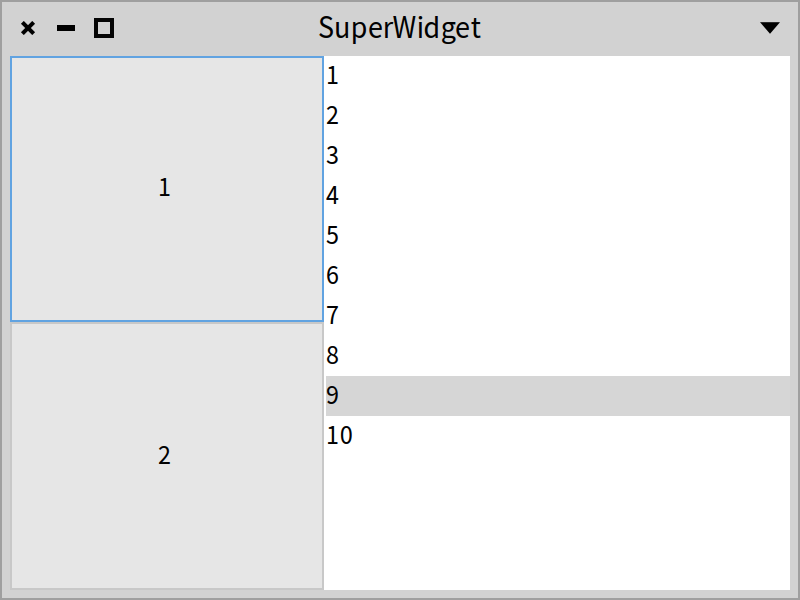


### Alternative to declare subcomponent layout choice

The alternative is to define a new method `defaultLayout` and to use the `add:layout:` message. We define a different presenter.

```
ButtonAndListH << #ButtonAndListV2
	slots: {};
	package: 'CodeOfSpec20Book'
```

We define a new `defaultLayout` method as follows:

```
ButtonAndListV2 >> defaultLayout

	^ SpBoxLayout newTopToBottom
		add: buttons layout: #buttonColumn;
		add: list;
		yourself
```

Note the use of the message `add:layout:` with the selector of the method returning the layout configuration: `#buttonColumn`. This is normal since we cannot access the state of a subcomponent at this moment. Let's open a window with:

```
ButtonAndListV2 new open
```

That opens the window shown in Figure *@ButtonAndListV2@*.

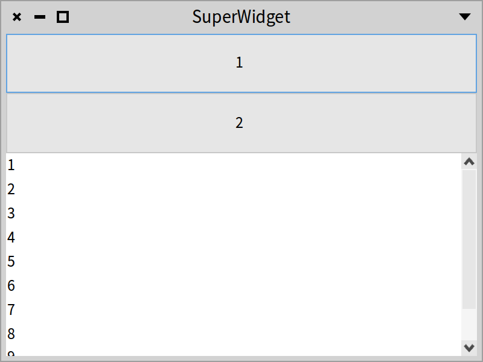

### Dynamically changing a layout

It is possible to change the layout of a presenter dynamically, for example from an inspector. Open the presenter with:

```
ButtonAndListV new inspect open
```

That opens an inspector on the presenter, and a window with the buttons placed vertically as shown in Figure *@ButtonAndListV@*.

Then select the 'buttons' instance variable in the inspector and do `self beRow`. The result is shown Figure *@InteractiveTweaking@*.

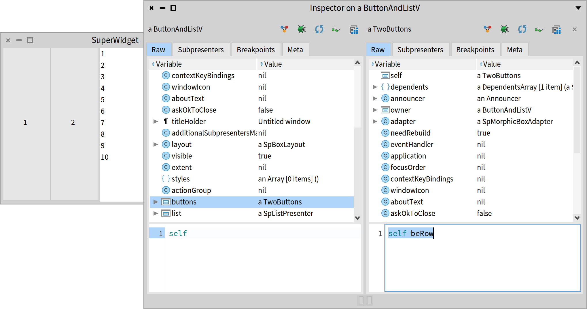


### Grid layout (SpGridLayout)

The class `SpGridLayout` arranges subpresenters in a grid according to certain layout properties such as:
- A position that is mandatory (`columnNumber@rowNumber`) and
- A span that can be added if desired (`columnExtension@rowExtension`)

The following example opens a window with a grid layout with several widgets, as shown in Figure *@GridExample@*.

```
SpPresenter << #GridExample
	slots: { #promptLabel . #nameText . #suggestionsText . #submitButton };
	package: 'CodeOfSpec20Book'
```

```
GridExample >> initializePresenters

	promptLabel := self newLabel
		label: 'Please enter your name and your suggestions.';
		yourself.
	nameText := self newTextInput.
	suggestionsText := self newText.
	submitButton := self newButton
		label: 'Submit';
		yourself
```


```
GridExample >> defaultLayout

	^ SpGridLayout new
		add: #promptLabel at: 1@1 span: 3@1;
		add: 'Name:' at: 1@2;
		add: #nameText at: 2@2 span: 2@1;
		add: 'Suggestions:' at: 1@3;
		add: #suggestionsText at: 2@3 span: 2@1;
		add: #submitButton at: 2@4 span: 1@1;
		yourself
```

The layout defines a grid with three columns. The prompt 'Please enter your name and your suggestions.' spans the three columns. The labels of the two fields are put in the first column. The fields span the second and the third column. The button is put in the second column. The second field is a multi-line text field. That is why it is higher than the first field, which is a single-line text field.

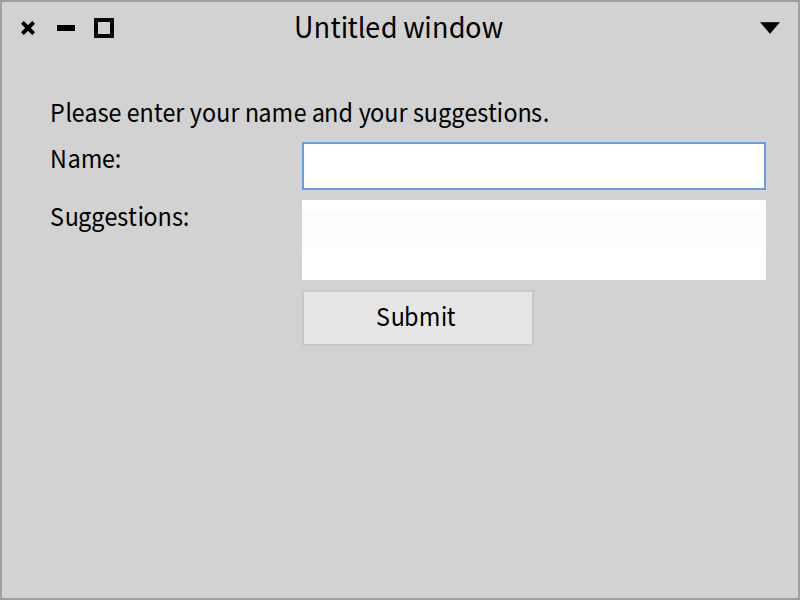

Here is a list of options:
- `columnHomogeneous`: Whether presenters in a column will have the same size.
- `rowHomogeneous`: Whether presenters a row will have the same size.
- `colSpacing:`: The horizontal space between cells.
- `rowSpacing:`: The vertical space between cells.

The `defaultLayout` method of the example maybe hard to read, especially when the grid contains a lot of presenters. The reader has to compute the positions and the spans of the subpresenters. We can use a `SpGridLayoutBuilder` to make grid building easier. The class is not to be used directly. Instead send `build:` to a `SpGridLayout`. Below is an alternative `defaultlayout` method that produces the same result as before. By putting all presenters of one row on one line, it is clear that there are four rows, and it is clear which subpresenters are part of the same row.

```
GridExample >> defaultLayout

	^ SpGridLayout build: [ :builder |
		builder
			add: #promptLabel span: 3@1; nextRow;
			add: 'Name:'; add: #nameText span: 2@1; nextRow;
			add: 'Suggestions:'; add: #suggestionsText span: 2@1; nextRow;
			nextColumn; add: #submitButton ]
```


### Paned layout (SpPanedLayout)

A paned layout is like a box layout, but restricted to two children, which are the "panes". It places children in a vertical or horizontal fashion and adds a splitter in between, that the user can drag to resize the panes. The message `positionOfSlider:` indicates the original position of the splitter. It can be nil (then it defaults to 50\%), or it can be a percentage (e.g. 70 percent), a `Float` (e.g. 0.7), or a `Fraction` (e.g. 7/10). We prefer simplicity and use floats because there are cheap and simple.

Let's look at this simple example:

```
SpPresenter << #PanedLayoutExample
	slots: { #leftList . #rightList };
	package: 'CodeOfSpec20Book'
```

```
PanedLayoutExample >> initializePresenters

	leftList := self newList
		items: (1 to: 10);
		yourself.
	rightList := self newList
		items: ($a to: $z);
		yourself
```

```
PanedLayoutExample >> defaultLayout

	^ SpPanedLayout newLeftToRight
		positionOfSlider: 0.7;
		add: #leftList;
		add: #rightList;
		yourself
```

Let's open the presenter with:

```
PanedLayoutExample new open
```

Figure *@PanedLayoutExample@* shows the result. The left list takes 70\% of the width of the window and the right list takes 30%.

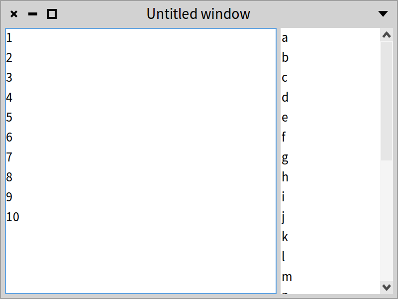

### Overlay layout (SpOverlayLayout)

An overlay layout allows overlaying one presenter by other presenters.

As an example, we will create a presenter that shows a button labeled 'Inbox', with a red indicator overlayed in the top-right corner (See Figure *@OverlayLayoutExample@*). A use case could be indicating that there are unread messages in the inbox.

```
SpPresenter << #OverlayLayoutExample
	slots: { #button . #indicator };
	package: 'CodeOfSpec20Book'
```

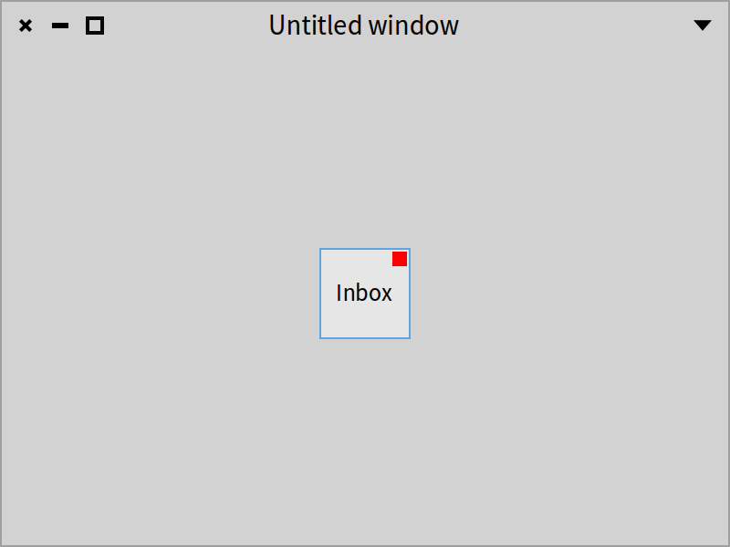

The method `initializePresenters` creates the button and the indicator. The latter is a `SpRoassalPresenter`. We use a helper method to answer the shape that should be shown.

```
OverlayLayoutExample >> initializePresenters

	button := self newButton
		label: 'Inbox';
		yourself.
	indicator := (self instantiate: SpRoassalPresenter)
		script: [ :view | view addShape: self indicatorShape ];
		yourself
```

```
OverlayLayoutExample >> indicatorShape

	^ RSBox new
			extent: 10@10;
			color: Color red;
			yourself
```

To make the structure of the layout clear, we have three methods. The `defaultLayout` is the layout of the window. For demonstration purposes, we put the button in the middle of the window. The button's dimensions are 50 by 50 pixels.

```
OverlayLayoutExample >> defaultLayout

	| buttonVBox |
	buttonVBox := SpBoxLayout newTopToBottom
			vAlignCenter;
			add: self buttonLayout height: 50;
			yourself.
	^ SpBoxLayout newLeftToRight
			hAlignCenter;
			add: buttonVBox width: 50;
			yourself
```

The `defaultLayout` method sends the message `buttonLayout` to fetch the overlay layout for the button and the indicator.
Let us define the method `buttonLayout` as follows: 

```
OverlayLayoutExample >> buttonLayout

	^ SpOverlayLayout new
			child: button;
			addOverlay: self indicatorLayout
				withConstraints: [ :constraints |
					constraints vAlignStart; hAlignEnd ];
			yourself
```

 The `child` is the presenter that we want to overlay with the indicator. It is possible to add multiple overlays. In this example, we have only one, which is defined by `indicatorLayout`. Note that `addOverlay:withConstraints:` is used to configure where the overlay presenter should be displayed. We display it in the top-right corner, by sending `vAlignStart` (top) and `hAlignEnd` (right).

Now we define the method as follows:

```
OverlayLayoutExample >> indicatorLayout

	| counterVBox |
	counterVBox := SpBoxLayout newTopToBottom
			add: indicator withConstraints: [ :constraints |
				constraints height: 12; padding: 2 ];
			yourself.
	^ SpBoxLayout newLeftToRight
			add: counterVBox withConstraints: [ :constraints |
				constraints width: 12; padding: 2 ];
			yourself
```

The `indicatorLayout` method defines the layout for the indicator. To apply a vertical and a horizontal padding, we have to wrap a vertical box layout with a horizontal box layout. We could have wrapped a horizontal box layout with a vertical box layout to achieve the same result. We apply a padding of 2 pixels so that the indicator does not overlap the border of the button.


With all these methods in place, we can open the presenter.

```
OverlayLayoutExample new open.
```

That opens the window shown in Figure *@OverlayLayoutExample@*.


### Conclusion

Spec offers several predefined layouts. Probably new ones will be added but in a compatible way. An important closing point is that layouts can be dynamically composed. It means that you are able to design applications that can adapt to specific conditions.
