## Lists, tables and trees

An important part of user interfaces is displaying lists of data. Such lists can be structured as tables, plain lists, but also trees supporting the nesting of data.

Spec provides three main presenters: `SpListPresenter`, `SpTreePresenter`, and `SpTablePresenter`. In addition, it offers `SpComponentListPresenter` which allows one to embed any presenter in a list. In this chapter, we present some of the functionality of these presenters.

### Lists

Creating a list is as simple as instantiating a `SpListPresenter` and specifying a list of items that the list should display.
The following script illustrates this and the result is shown in Figure *@figSimpleList@*.

```
SpListPresenter new
	items: Collection withAllSubclasses;
	open
```

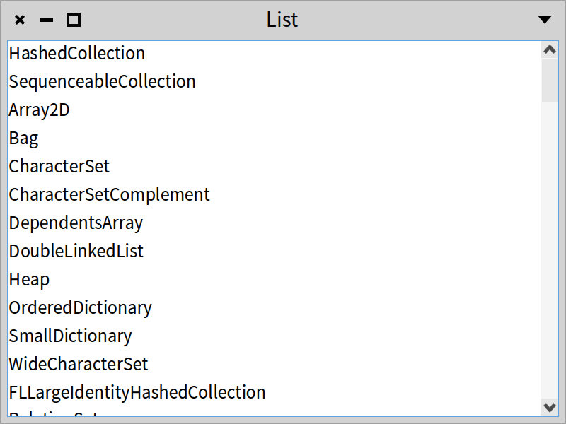

We can change the header title of the list using the message `headerTitle:`. The header title can be hidden using the message `hideHeaderTitle`.


### Controlling item display

By default a list item is displayed using the result of the `asStringOrText` message sent to the item.
We can configure a list to apply a block to control the display of each item using the message `display:`.
The following script configures a list presenter to display the name of the methods of the class `Point` instead of showing the result of `asStringOrText`. See Figure *@figSimpleList2@*.

```
SpListPresenter new
	items: Point methods;
	display: [ :item | item selector ];
	open
```


We can sort the items using the message `sortingBlock:`.

```
SpListPresenter new
	items: Point methods;
	display: [ :item | item selector ];
	sortingBlock: [ :a :b | a selector < b selector ];
	open
```

### Decorating elements

We can configure the way items are displayed in a more fine-grained way. The following example illustrates it. We can control the icon associated with the item using the message `displayIcon:`, and the item color using the message `displayColor:`. The format (bold, italic, underline) can be controlled by the corresponding messages `displayItalic:`, `displayBold:` and `displayUnderline:`. See Figure *@figSimpleListDecorated@*.


```
| presenter |
presenter := SpListPresenter new.
presenter
	items: Collection withAllSubclasses;
	displayIcon: [ :aClass | self iconNamed: aClass systemIconName ];
	displayColor: [ :aClass |
		(aClass name endsWith: 'Set')
			ifTrue: [ Color green ]
			ifFalse: [ presenter theme textColor ] ];
	displayItalic: [ :aClass | aClass isAbstract ];
	displayBold: [ :aClass | aClass hasSubclasses ];
	displayUnderline: [ :aClass | aClass numberOfMethods > 10 ];
	open
```

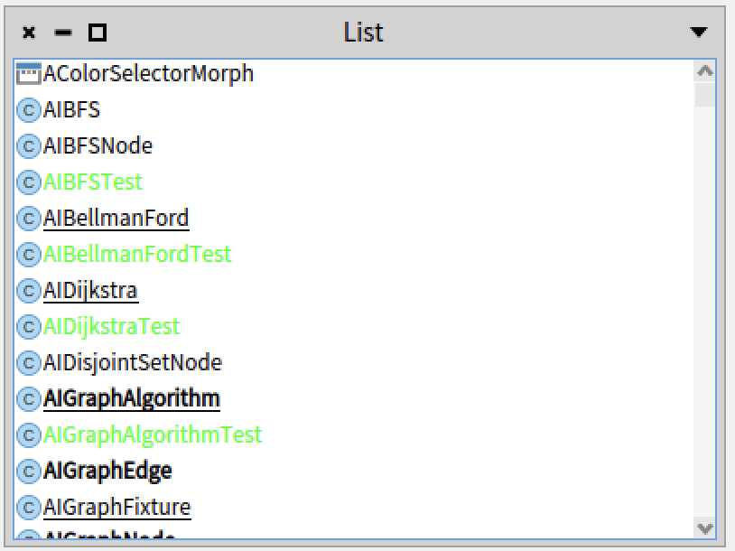


### About single/multiple selection

Lists support multiple selections. The message `beMultipleSelection` controls that aspect.

```
SpListPresenter new
	items: Collection withAllSubclasses;
	beMultipleSelection;
	open
```

Since selection can hold multiple items, there is an impact on the protocol to react to selection changes. Indeed, lists, filtering lists, trees, and tables offer the `whenSelectionChangedDo:` API and not `whenSelectedItemDo:`. The argument of the block is an instance of `SpSingleSelectionMode`, `SpMultipleSelectionMode`, `SpTreeMultipleSelectionMode` or `SpTreeSingleSelectionMode`.


Here is a typical use case of the method `whenSelectionChangedDo:`.

```
connectPresenters

	changesTree whenSelectionChangedDo: [ :selection | | diff |
		diff := selection selectedItem
			ifNil: [ '' ]
			ifNotNil: [ :item | self buildDiffFor: item ].
		textArea text: diff ]
```


### Drag and drop

Lists and other container structures support drag and drop.
The following script shows how to configure two lists to support dragging from one and dropping in another.

```
| list1 list2 |
list1 := SpListPresenter new.
list1
	items: #( 'abc' 'def' 'xyz' );
	dragEnabled: true.

list2 := SpListPresenter new.
list2 dropEnabled: true;
	wantsDrop: [ :transfer | transfer passenger
		allSatisfy: [:each | each isString ] ];
	acceptDrop: [ :transfer | list2 items: list2 items , transfer passenger ].

SpPresenter new
	layout: (SpBoxLayout newLeftToRight
		add: list1;
		add: list2;
		yourself);
	open
```

The following script illustrates the API.
- `dragEnabled:` configures the receiver to allow dragging of its items.
- `dropEnabled:` configures the receiver to accept dropped items.
- `wantsDrop: [ :transfer | transfer passenger allSatisfy: [:each | each isString ]`. With the message `wantsDrop:` we can specify a predicate to accept dropped elements.
- `acceptDrop: [ :transfer | list2 items: list2 items , transfer passenger ]`. The message `acceptDrop:` specifies the treatment performed once the dropped items are accepted.

### Activation clicks

An element on a list can be _activated_, meaning it will trigger an event to execute an action on it. Note that an activation is different than a selection: one can _select_ an element without activating it. The message `activateOnDoubleClick` configures the list to react to double click, while its counterpart is `activateOnSingleClick`.


### Filtering lists

Lists can also be filtered as shown in Figure *@figFiltering@*. The following script shows the use of the `SpFilteringListPresenter`.

```
SpFilteringListPresenter new
	items: Collection withAllSubclasses;
	open;
	withWindowDo: [ :window |
		window title: 'SpFilteringListPresenter example' ]
```

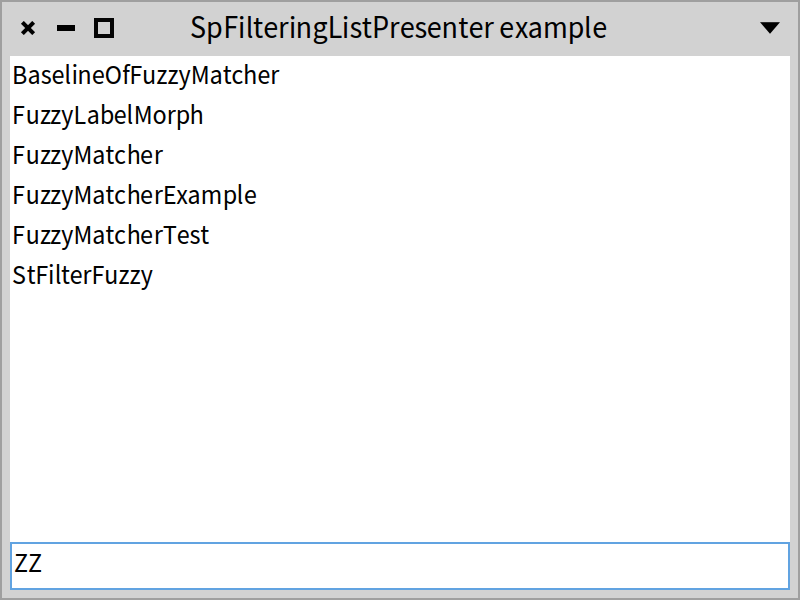

The following script shows that the filter can be placed at the top.

```
SpFilteringListPresenter new
	items: Collection withAllSubclasses;
	openWithLayout: SpFilteringListPresenter topLayout;
	withWindowDo: [ :window |
		window title: 'SpFilteringListPresenter example' ]
```

Note that a filter can be declared upfront using the message `applyFilter:`.

```
SpFilteringListPresenter new
	items: Collection withAllSubclasses;
	openWithLayout: SpFilteringListPresenter topLayout;
	applyFilter: 'set';
	withWindowDo: [ :window |
		window title: 'SpFilteringListPresenter prefiltered example' ]
```

### Selectable filtering lists

Often lists are used to select items. This is what the class `SpFilteringSelectableListPresenter` offers. In addition to being able to filter items, it lets the user select items by ticking them as shown by Figure *@figSelectable@*.

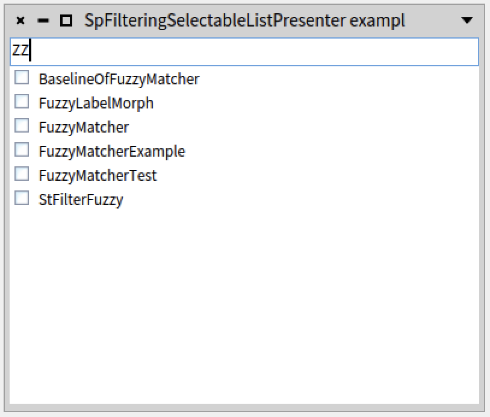

The following script illustrates such a selectable list with filter.

```
(SpFilteringSelectableListPresenter new
	items: Collection withAllSubclasses;
	layout: SpFilteringListPresenter topLayout;
	applyFilter: 'set';
	asWindow)
		title: 'SpFilteringSelectableListPresenter example';
		open
```


### Component lists

While the lists we saw until now are homogeneous in the sense that they all display strings, Spec offers the possibility to display a list of presenters. It means that elements in the list do not have the same size and can contain other presenters.

This lets developers produce advanced user interfaces such as the one of the report builder of the ModMoose tool suite shown in Figure *@figModMoose@*.

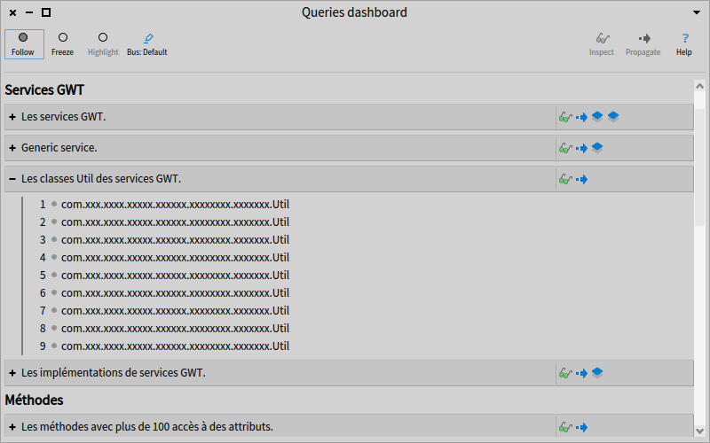

The following script shows how to define a `SpComponentListPresenter` as shown in Figure *@figCompo@*.

```
| list |
list := {
	(SpLabelPresenter new
		label: 'Test 1';
		yourself).
	(SpImagePresenter new
		image: (self iconNamed: #smallOk);
		yourself).
	(SpButtonPresenter new
		label: 'A button';
		yourself).
	(SpImagePresenter new
		image: PolymorphSystemSettings pharoLogo asForm;
		yourself) }.

SpComponentListPresenter new
	presenters: list;
	open
```

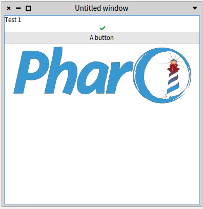


### Trees

Spec offers also trees. The following script shows how to list all the classes of Pharo using inheritance as shown by Figure *@figTreeExpanded@*.


```
SpTreePresenter new
	roots: { Object };
	children: [ :aClass | aClass subclasses ];
	displayIcon: [ :aClass | self iconNamed: aClass systemIconName ];
	display: [ :aClass | aClass name ];
	expandPath: #( 1 1 3 );
	open
```

The message `expandPath:` shows that we can expand a specific item by a path.

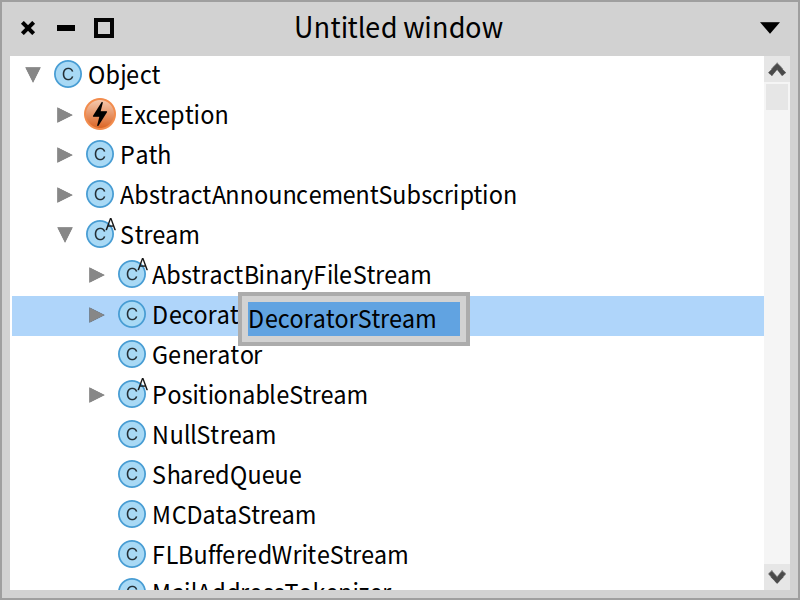

The following script shows how to use a dynamic context menu. This is a dynamic menu because its content is recalculated.
The dynamic aspect is expressed by a block. Figure *@figTreemenu@* shows the result.


```
| tree |
tree := SpTreePresenter new.
tree roots: { Object };
	children: [ :aClass | aClass subclasses ];
	displayIcon: [ :aClass | self iconNamed: aClass systemIconName ];
	display: [ :aClass | aClass name ];
	contextMenu: [
		SpMenuPresenter new
			addGroup: [ :group |
				group addItem: [ :item | item name: tree selectedItem asString ] ] ];
	open
```


The following script shows the use of the message `selectPathByItems:scrollToSelection:`, which allows selecting elements by specifying a list of items (a path from the root to the selected item) and asking the tree to scroll to the selection. Figure *@figTreeselect@* shows the result.


```
| pathToSpPresenter |
pathToSpPresenter := SpTreePresenter withAllSuperclasses reversed allButFirst.
SpTreePresenter new
	roots: { Object };
	children: [ :aClass | aClass subclasses ];
	displayIcon: [ :aClass | self iconNamed: aClass systemIconName ];
	display: [ :aClass | aClass name ];
	open;
	selectPathByItems: pathToSpPresenter scrollToSelection: true
```

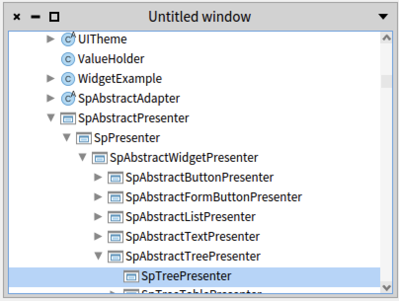

### Tables

Spec offers tables. A table can have multiple columns and a column can be composed of elementary elements. Tables have different kinds of columns that can be added to a table:

- `SpStringTableColumn` offers cell items that are strings.
- `SpCheckBoxTableColumn` lets us have cells with a checkbox.
- `SpIndexTableColumn` displays the index of the current item.
- `SpDropListTableColumn` lets us have a drop list in cells.
- `SpImageTableColumn` offers cell items with forms (icons, graphics, ...).
- `SpCompositeTableColumn` offers the possibility to compose a column out of different kinds of columns. For instance, it allows one to compose an icon (`SpImageTableColumn`) with a name (`SpStringTableColumn`).


### First table

The following script shows how to define a simple table with two columns as shown in Figure *@figSimpleTable@*. The message `showColumnHeaders` will display the headers.

```
SpTablePresenter new
	addColumn: (SpStringTableColumn title: 'Number' evaluated: #yourself);
	addColumn: (SpStringTableColumn title: 'Hex' evaluated: #hex);
	showColumnHeaders;
	items: (1 to: 10);
	open
```

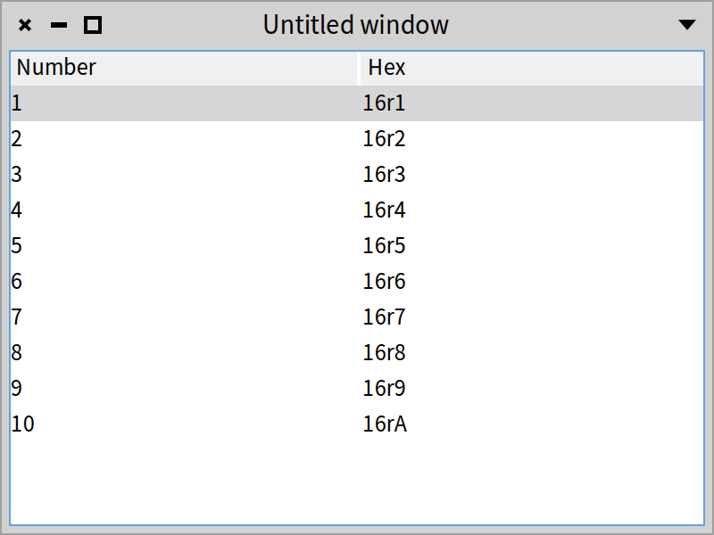

Add `SpIndexTableColumn title: 'My index'` to the previous table to see the index column in action.

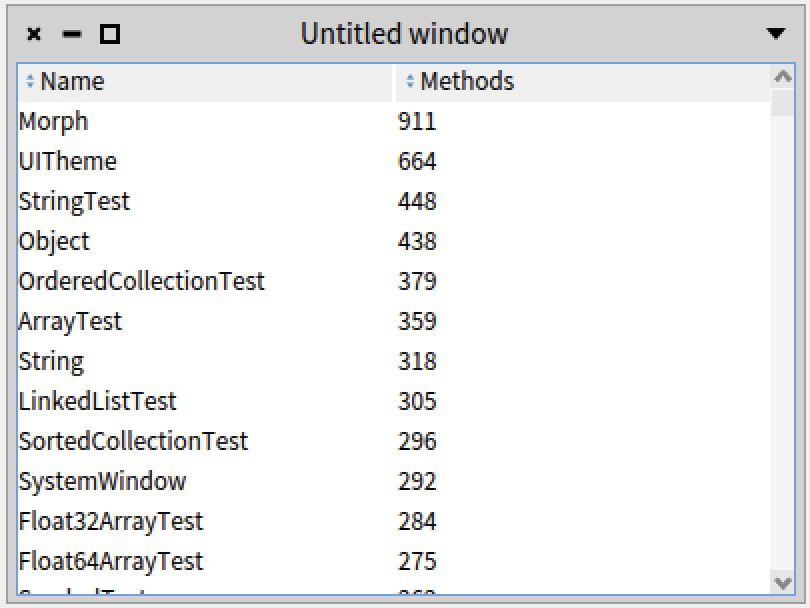

### Sorting headers

The following script presents how to define a table with two sortable columns. Figure *@figTableSorting@* shows the result after sorting the second column in descending order.

```
| classNameCompare methodCountSorter |
classNameCompare := [ :c1 :c2 | c1 name < c2 name ].
methodCountSorter := [ :c1 :c2 |
	c1 methodDictionary size threeWayCompareTo: c2 methodDictionary size ].

SpTablePresenter new
	addColumn: ((SpStringTableColumn title: 'Name' evaluated: #name)
			compareFunction: classNameCompare);
	addColumn: ((SpStringTableColumn
			title: 'Methods'
			evaluated: [ :c | c methodDictionary size ]) sortFunction: methodCountSorter);
	items: Collection withAllSubclasses;
	open
```


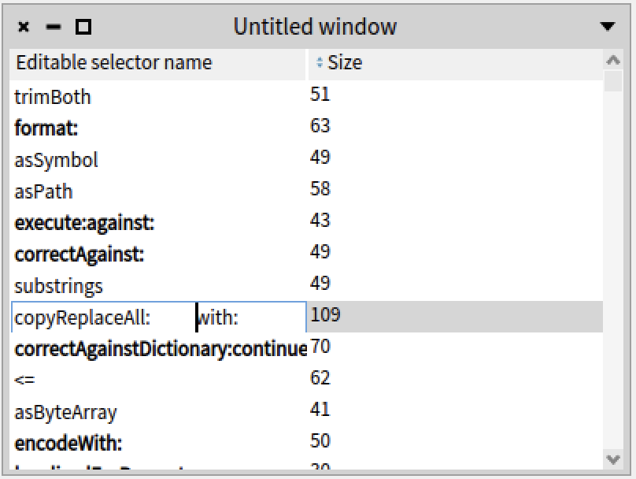

### Editable tables

The following script shows that table cells can be editable using the messages `beEditable` and `onAcceptEdition:`. The resulting table is shown in Figure *@figEditableTable@*.


```
| items |
items := String methods.
SpTablePresenter new
	addColumn:
		(SpStringTableColumn new
			title: 'Editable selector name';
			evaluated: [ :m | m selector ];
			displayBold: [ :m | m selector isKeyword ];
			beEditable;
			onAcceptEdition: [ :m :t |
				Transcript
					nextPutAll: t;
					cr;
					endEntry ];
			 yourself);
	addColumn:
		(SpStringTableColumn title: 'Size' evaluated: #size)
			beSortable;
			showColumnHeaders;
			items: items;
	open
```


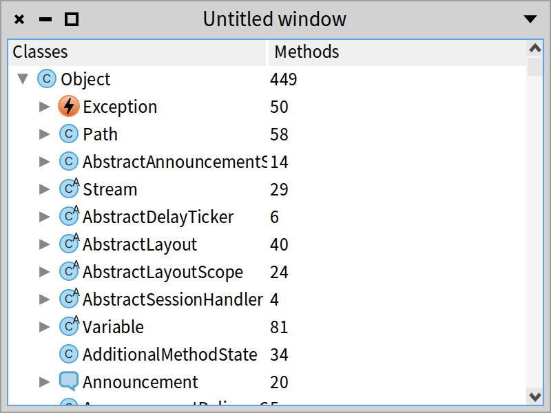
### Tree tables

Spec offers a way to have a tree with extra columns. The class `SpTreeTablePresenter` encapsulates this behavior. Note that the first column is interpreted as a tree.

The following script shows that the first column will be a tree whose element is composed of an icon and a name: `SpCompositeTableColumn`. Figure *@figTreeTable@* shows the window after expanding the root of the tree.


```
SpTreeTablePresenter new
	beResizable;
	addColumn:
		(SpCompositeTableColumn new
			title: 'Classes';
			addColumn:
				(SpImageTableColumn evaluated: [ :aClass |
					self iconNamed: aClass systemIconName ]);
			addColumn:
				(SpStringTableColumn evaluated: [ :each | each name ] );
			yourself);
	addColumn:
		(SpStringTableColumn new
			title: 'Methods';
			evaluated: [ :class | class methodDictionary size asString ]);
	roots: { Object };
	children: [ :aClass | aClass subclasses ];
	open
```


Sending the messages `width:` and `beExpandable` to the `SpCompositeTableColumn` instance fixes the size of the column.

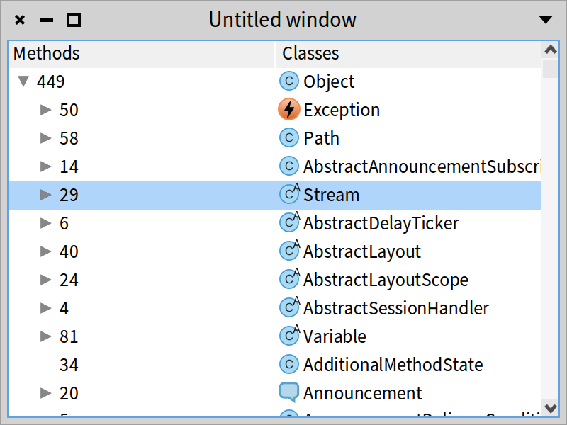

```
SpCompositeTableColumn new
	title: 'Classes';
	addColumn:
		(SpImageTableColumn evaluated: [ :aClass |
			self iconNamed: aClass systemIconName ]);
	addColumn: (SpStringTableColumn evaluated: #name);
	width: 250;
	beExpandable;
	yourself
```

You can try the following silly example which results in Figure *@figTreeTableSilly@*.

```
| compositeColumn |
compositeColumn := SpCompositeTableColumn new title: 'Classes';
	addColumn: (SpImageTableColumn evaluated: [ :aClass |
			self iconNamed: aClass systemIconName ]);
	addColumn: (SpStringTableColumn evaluated: [ :each | each name ] );
	yourself.
SpTreeTablePresenter new
	beResizable;
	addColumn: (SpStringTableColumn new
			title: 'Methods';
			evaluated: [ :class | class methodDictionary size asString ]);
	addColumn: compositeColumn;
	roots: { Object };
	children: [ :aClass | aClass subclasses ];
	open
```


### Conclusion

In this chapter, we presented important containers: list, component list, and table presenters.
