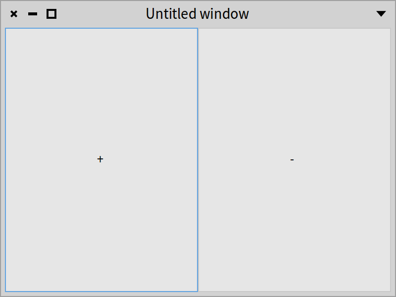
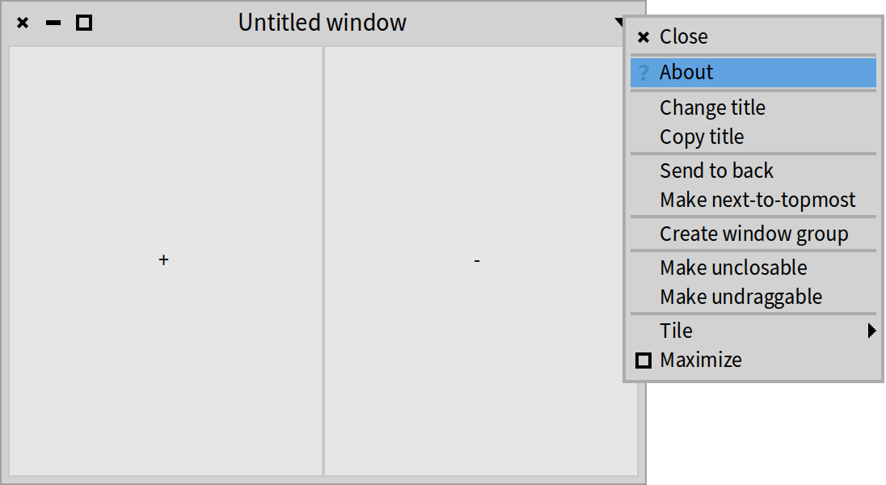
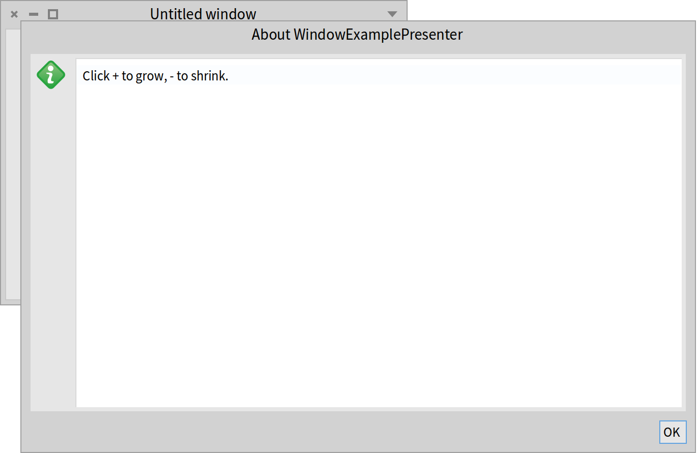

## Managing windows
@cha_managing_windows


So far we have described the reuse of `SpPresenter`s, discussed the fundamental functioning of Spec, and presented how to layout the widgets of a user interface. Yet what is still missing for a working user interface is showing all these widgets inside of a window. In our examples until now we have only shown a few of the features of Spec for managing windows, basically restricting ourselves to opening a window.

In this chapter, we provide a more complete overview of how Spec allows for the management of windows. We will show opening and closing, the built-in dialog box facility, the sizing of windows, and all kinds of window decoration.


### A working example

To illustrate the window configuration options that are available, we use a simple `WindowExamplePresenter` class that has two buttons placed side by side. These buttons do not have any behavior associated yet. The behavior will be added in an example further down this chapter.




```
SpPresenter << #WindowExamplePresenter
	slots: { #minusButton . #plusButton };
	package: 'CodeOfSpec20Book'
```

```
WindowExamplePresenter >> initializePresenters

	plusButton := self newButton.
	minusButton := self newButton.
	plusButton label: '+'.
	minusButton label: '-'
```

```
WindowExamplePresenter >> defaultLayout

	^ SpBoxLayout newLeftToRight
		add: #plusButton;
		add: #minusButton;
		yourself
```

### Opening a window or a dialog box

A user interface can be opened as a normal window or opened as a dialog box, i.e. without decoration and with 'Ok' and 'Cancel' buttons. We will show how this is done, including the configuration options specific to dialog boxes. See also Section *@sec_win_size_decoration@* for more information about window decoration.

#### Opening a window

As we have shown in previous chapters, to open a user interface you have to instantiate the `SpPresenter` for that interface and send the `open` message to the instance. That results in the creation of an instance of `SpWindowPresenter` which points to the window containing the user interface, and showing it in a window on the screen.

We have also seen the `openWithLayout:` method that takes a layout (instance of SpLayout subclasses) as an argument. Instead of using the default layout, the opened UI will use the layout passed as an argument.

Below we show the two ways we can open a window for our `WindowExamplePresenter`. The code snippet opens two identical windows as shown in Figure *@windowExample1@*.

```
| presenter |
presenter := WindowExamplePresenter new.
presenter open.
presenter openWithLayout: presenter defaultLayout
```

#### Opening a dialog box


Spec provides an easy way to open a UI as a simple dialog box with 'Ok' and 'Cancel' buttons. A dialog box does not have icons for resizing and closing, nor a window menu. To open a dialog box, send the message `openDialog`:

```
| presenter dialog |
presenter := WindowExamplePresenter new.
dialog := presenter openDialog
```


The answer of sending `openDialog`, assigned to the `dialog` variable above, is an instance of the `SpDialogWindowPresenter` class (a subclass of `SpWindowPresenter`). Figure *@windowDialog@* shows the dialog.


The `SpDialogWindowPresenter` instance can be configured in multiple ways. To execute code when the user clicks on a button, send it the `okAction:` or `cancelAction:` message with a zero-argument block.

```
| presenter dialog |
presenter := WindowExamplePresenter new.
dialog := presenter openDialog
	okAction: [ 'okAction' crTrace ];
	cancelAction: [ 'cancelAction' crTrace ]
```

The message `canceled` sent to `dialog` will return `true` if the dialog is closed by clicking on the 'Cancel' button.

### Preventing window close

Spec provides a way to check if a window can effectively be closed when the user clicks on the close box. `SpWindowPresenter>>whenWillCloseDo:` takes a block that decides whether the window can be closed. We can change our  `WindowExamplePresenter` as follows:

```
WindowExamplePresenter >> initializeWindow: aWindowPresenter

	aWindowPresenter whenWillCloseDo: [ :announcement |
		announcement denyClose ]
```

The block has an `announcement` argument. It will be bound to an instance of `SpWindowWillClose`. That class has two interesting methods: `allowClose` and `denyClose`. The code snippet above sends `denyClose` to the announcement. By doing so, we have effectively created an unclosable window!

To be able to close this window, we have to change the implementation of the above method. By default a window can be closed, so the block should only send `denyClose` in case the window cannot be closed. Let's adapt the block to ask whether the user is sure about closing the window.

```
WindowExamplePresenter >> initializeWindow: aWindowPresenter

	aWindowPresenter whenWillCloseDo: [ :announcement |
		(self confirm: 'Are you sure that you want to close the window?')
			ifFalse: [ announcement denyClose ] ]
```

Of course, the example method above is extremely simplistic and not very useful. Instead, it should use application-dependent logic of what to check on window close.


### Acting on window close

It is also possible to perform an action whenever a window is closed, both with a plain window or a dialog window.

#### With a window

When you want to be notified that a window is closed, you should redefine the `initializeWindow:` method in the class of your presenter as follows:

```
WindowExamplePresenter >> initializeWindow: aWindowPresenter

	aWindowPresenter whenClosedDo: [ self inform: 'When closed' ]
```

The following snippet programmatically opens and closes a window and you should see the notification triggered on close.

```
| presenter window |
presenter := WindowExamplePresenter new.
window := presenter open.
window close
```


#### With a dialog window


When you want the same behavior with a dialog window you can either use the mechanism as described previously (i.e. declare your interest in window closing in the method `initializeWindow:`) or configure the dialog presenter returned by the message `openDialog`.

```
| presenter dialog |
presenter := WindowExamplePresenter new.
dialog := presenter openDialog.
dialog
	okAction: [ 'okAction' crTrace ];
	cancelAction: [ 'cancelAction' crTrace ];
	whenClosedDo: [ self inform: 'Bye bye!' ]
```


#### Action with Window

The message `withWindowDo:` makes sure that the presenter that scheduled the window still exists or is in a state that makes sense.

```
withWindowDo: [ :window | window title: 'MyTitle' ]
```


### Window size and decoration
@sec_win_size_decoration

Now we focus on sizing a window before and after opening it, and then describe removing the different control widgets that decorate the window.

#### Setting initial size and changing size


To set the initial size of a window when it opens, send the `initialExtent:` message to the corresponding `SpWindowPresenter` before opening, for example like this:

```
| windowPresenter |
 windowPresenter := WindowExamplePresenter new asWindow.
 windowPresenter initialExtent: 300@80.
 windowPresenter open
```

The common way to specify the initial size of the window is to use the message `initialExtent:` as follows:

```
WindowExamplePresenter >> initializeWindow: aWindowPresenter

  aWindowPresenter initialExtent: 80@100
```

Note that you can also set an initial position using the message `initialPosition:`.

After a window is opened, it can also be resized by sending the `resize:` message to the window of the UI. For example, we can change our example's `initializePresenters` method so that the window resizes itself depending on which button is clicked.

```
WindowExamplePresenter >> initializePresenters

	plusButton := self newButton.
	minusButton := self newButton.
	plusButton label: '+'.
	minusButton label: '-'.
	plusButton action: [ self window resize: 500@200].
	minusButton action: [ self window resize: 200@100]
```

You have also `centered`, `centeredRelativeTo:` and `centeredRelativeToTopWindow` to help you place the windows relative to world/other windows.


#### Fixed size

The size of a window can be fixed, so that the user cannot resize it by dragging the sides or corners as follows:

```
| presenter |
presenter := WindowExamplePresenter new open.
presenter window beUnresizeable
```

#### Removing window decoration


Sometimes it makes sense to have a window without decoration, i.e. without control widgets. Currently, this configuration cannot be performed on the `SpWindowPresenter` of that window, but the underlying widget library may allow it. Below we show how to get the `SpWindow` of our example and instruct it to remove the different control widgets:

```
| presenter |
presenter := WindowExamplePresenter new open.
presenter window
   removeCollapseBox;
   removeExpandBox;
   removeCloseBox;
   removeMenuBox
```


!!note This window is still closable using the halo menus or by calling `close` on the `SpWindowPresenter` instance (`presenter` in the example above).


#### Setting and changing the title


By default, the title of a new window is 'Untitled window'. Of course, this can be changed. The first way is to specialize the method `initializeWindow:`
to send the message `title:` to the `windowPresenter` as follows:

```
WindowExamplePresenter >> initializeWindow: aWindowPresenter

	aWindowPresenter title: 'Click to grow or shrink.'
```


In addition, you can set the title of any UI after it has been opened (even if it specifies a `title` method) by sending the `title:` message with the new title as an argument to the window of the UI. An example is:

```
| presenter |
presenter := WindowExamplePresenter new.
presenter open.
presenter window title: 'I am different!'
```

#### Setting the about text

The about text of a window can be used by application developers to give a description of the application, and to list its contributors. The about text can be opened by selecting 'About' from the pop-up menu in the top-right corner of a window, as shown in Figure *@about@*.



To set the about text of a window, either override the `aboutText` method of the corresponding `SpPresenter` so that it returns the new about text, or send the instance the `aboutText:` message before opening, for example as below.

```
| windowPresenter |
 windowPresenter := WindowExamplePresenter new asWindow.
 windowPresenter aboutText: 'Click + to grow, - to shrink.'.
 windowPresenter open
```

After opening the window with the code snippet above, and after choosing 'About' from the window menu, the about window opens with the configured about text, as shown in Figure *@abouttext@*.



### Getting values from a dialog window

Sending the message `openDialog` to a presenter will return the dialog window itself so that you can easily send it the message `isOk`. When `isOk` answers `true`, the dialog is in a state to provide the data it has collected from the user.

Let's look at an example. We will open a dialog to select some colors.

Configuring the UI makes up for the largest part of the code below, but the interesting part is at the end. The canceled state is the default state of a dialog so we have to tell the dialog that it is not canceled. We do that in the `okAction` block, where the dialog receives the message `beOk`.

Then in the `whenClosedDo:` block, we send `isOk` to the dialog. If that message answers `true`, it makes sense to process the selection of colors. For the sake of simplicity of this example, we just inspect the selected colors.

```
| selectedColors presenter colorTable dialogPresenter |
selectedColors := Set new.
presenter := SpPresenter new.
colorTable := presenter newTable
	items: (Color red wheel: 10);
	addColumn: (SpCheckBoxTableColumn new
		evaluated: [ :color | selectedColors includes: color ];
		onActivation: [ :color | selectedColors add: color];
		onDeactivation: [ :color | selectedColors remove: color];
		width: 20;
		yourself);
	addColumn: (SpStringTableColumn new
		evaluated: [ :color | '' ];
		displayBackgroundColor: [ :color | color ];
		yourself);
	hideColumnHeaders;
	yourself.
presenter layout: (SpBoxLayout newTopToBottom
	add: colorTable;
	yourself).
dialogPresenter := presenter openDialog.
dialogPresenter
	title: 'Select colors';
	okAction: [ :dialog | dialog beOk ];
	whenClosedDo: [ dialogPresenter isOk
		ifTrue: [ selectedColors inspect ] ]
```

### Little modal dialog presenters

A modal dialog is a window that takes control of the entire Pharo user interface, making it impossible for the user to select another window while it is open.

Spec provides some little predefined dialogs to inform or request information from the users. Most of them inherit from `SpDialogPresenter`. They offer a builder API to configure them.

The simplest dialog is an alert.

```
SpAlertDialog new
	title: 'Inform example';
	label: 'You are seeing an inform dialog!';
	acceptLabel: 'Close this!';
	openModal
```

Confirm dialogs are created as follows:

```
SpConfirmDialog new
	title: 'Confirm example';
	label: 'Are you sure?';
	acceptLabel: 'Sure!';
	cancelLabel: 'No, forget it';
	onAccept: [ :dialog| dialog alert: 'Yes!' ];
	onCancel: [ :dialog| dialog alert: 'No!' ];
	openModal
```

The idiomatic way to use them is to access them via the application of your presenter class:

```
self application newAlert
	title: 'Inform example';
	label: 'You are seeing an inform dialog!';
	acceptLabel: 'Close this!';
	openModal
```

`SpApplication` offers the following API: `newConfirm`, `newAlert`, `newJobList`, `newRequest`, `newSelect`, `newRequestText`.


### Placing a presenter inside a dialog window

Any presenter can be placed in a dialog window by specializing the method `SpAbstractPresenter>>initializeDialogWindow:`, which is implemented like this:


```
WindowExamplePresenter >> initializeDialogWindow: aDialogWindowPresenter
	"Used to initialize the model in the case of the use into a dialog window.
	 Override this to set buttons other than the default (Ok, Cancel)."

	aDialogWindowPresenter
		addButton: 'Cancel' do: [ :presenter |
			presenter triggerCancelAction.
			presenter close ];
		addDefaultButton: 'Ok' do: [ :presenter |
			presenter triggerOkAction.
			presenter close ]
```

Override this method to define how your presenter will behave when it is open in a dialog window.


### Setting keyboard focus

Some widgets can take keyboard focus. All text editing widgets come to mind, but lists can also take keyboard focus. Buttons too. In principle, when a presenter responds to keyboard events, it is able to take keyboard focus.

Widgets indicate that they have keyboard focus, typically by displaying a lightblue border around them. Figure *@windowExample1@* shows that the plus button on the left has the keyboard focus. A widget takes keyboard focus when the user clicks the widget with the mouse, or by pressing the tab key.

By pressing the tab key, the user makes the keyboard focus move forward from widget to widget according to the keyboard focus order of the widgets. By pressing shift-tab, the focus moves backward according to the focus order. By default, the focus order is the same as the order in which widgets are added to a user interface. Sometimes that order is not the desired order. In that case, the focus order has to be configured explicitly. A presenter can do that in the method `initializePresenters` by sending `focusOrder:` or by adding presenters to the answer of sending `focusOrder`. Let's try that in the `WindowExamplePresenter`.

```
WindowExamplePresenter >> initializePresenters

	plusButton := self newButton.
	minusButton := self newButton.
	plusButton label: '+'.
	minusButton label: '-'.
	self focusOrder
		add: minusButton;
		add: plusButton
```

Figure *@WindowExampleKeyboardFocus@* shows the result after opening the window. The minus button has the keyboard focus.


### Acting on window opening

Some state of presenters or their subpresenters can only be set after the window has been opened. That is the case when setting the state is delegated to the backend widgets. Those widgets are only available when the window is open. In Chapter *@cha_menus@*, we will see that keyboard bindings for menu items in the menubar can only be assigned after opening the window. Here we will describe another use case, related to the previous section.

While defining the keyboard focus order does not require the window to be open, setting the initially focussed presenter does. Setting the initially focussed presenter is needed when the default keyboard focus order is not appropriate. That typically happens when using nested presenters that define a focus order, either implicitly or explicitly.

To demonstrate this, we will revert the method `initializePresenters` of `WindowExamplePresenter` from the previous section, and we will adapt `initializeWindow:`.

```
WindowExamplePresenter >> initializePresenters

	plusButton := self newButton.
	minusButton := self newButton.
	plusButton label: '+'.
	minusButton label: '-'
```

To set the initial keyboard focus on the minus button, we send `takeKeyboardFocus` to the presenter in the `whenOpenedDo:` block, which will be evaluated after opening the window.

```
WindowExamplePresenter >> initializeWindow: aWindowPresenter

	aWindowPresenter whenOpenedDo: [ minusButton takeKeyboardFocus ]
```

After opening the window, we see the keyboard focus on the minus button, as shown in *@WindowExampleKeyboardFocus@*.

We can go one step further. When opening an instance of `WindowExamplePresenter` in a dialog with `WindowExamplePresenter new openDialog`, the plus button has the keyboard focus because it is the first presenter in the default keyboard focus order. See Figure *@windowDialog@*.

In case of a dialog, the initial keyboard focus on the plus button may not be desired. Probably it is more logical to put the keyboard focus on the Ok button of the dialog, so that the user can press the Enter key or the Space key to confirm the dialog immediately if no other interaction with the dialog is necessary. Let's do that. Instead of changing the method `initializeWindow:`, we change the method `initializeDialogWindow:`.

```
WindowExamplePresenter >> initializeDialogWindow: aDialogWindowPresenter

	super initializeDialogWindow: aDialogWindowPresenter.
	aDialogWindowPresenter whenOpenedDo: [ aDialogWindowPresenter defaultButton takeKeyboardFocus ]
```

`aDialogWindowPresenter`, which is bound to an instance of `SpDialogWindowPresenter`, understands the message `defaultButton`, which answers the Ok button. We send the message `takeKeyboardFocus` to the button. After opening the dialog with `WindowExamplePresenter new openDialog`, we see a dialog as shown in Figure *@DialogWithFocusOnOkButton@*, with the keyboard focus on the Ok button.


### Conclusion


In this chapter, we treated the features of Spec that have to do with windows. First we described opening and closing windows as well as how to open a window as a dialog box. That was followed by configuring the window's size and its decorating widgets. After highlighting small yet important details of the window like its title and the about text, the chapter ended with handling dialogs.