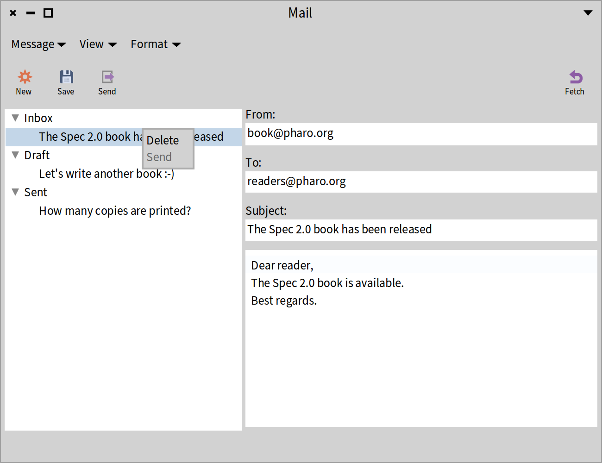
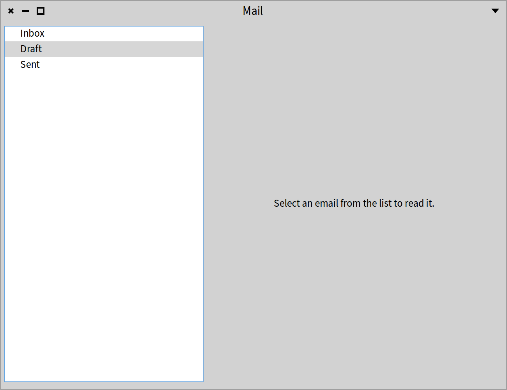
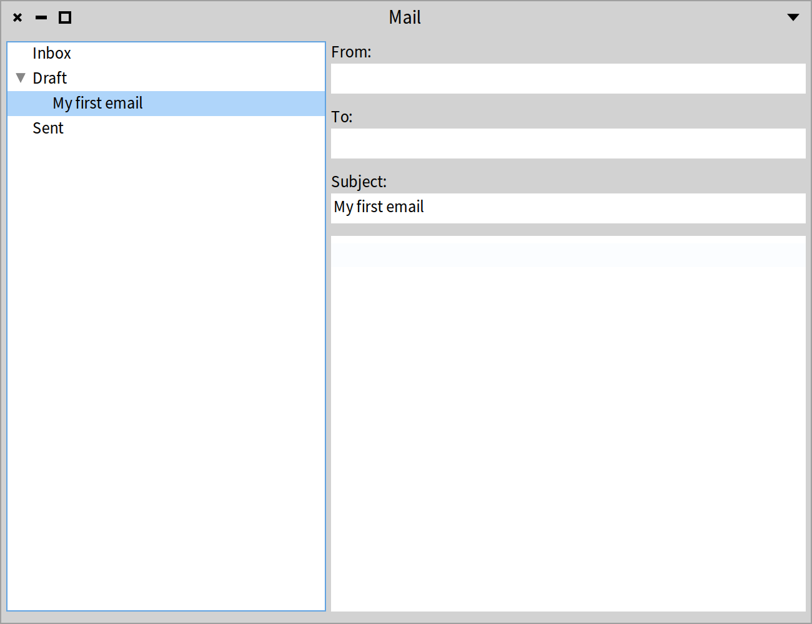

## Menubar, Toolbar, Status Bar and Context Menus

Often application windows have a menubar that includes all commands provided by the application. Application windows may also have a toolbar, with buttons for commands that are used frequently. Some applications only have a toolbar. Apart from supporting a menubar and toolbar, Spec supports a status bar at the bottom of a window. Some widgets are equipped with context menus, such as a text fields, tables, and lists. All these aspects are the subject of this chapter.

We will build a small email client application. Apart from adding a menubar, a toolbar, a status bar, and a context menu, the example brings together a lot of what we have seen in the previos chapters. Figure *@MailClient@* shows the target application.



The example is elaborate, with a lot of classes and methods. We will implement the application bottom-up. We start with the models. Afterwards, we will implement the presenters that compose the application. Finally, we will add a menubar, a toolbar, a status bar, and a context menu. Let's dive in.


### The models

To build the mail client, we need three models:

* `Email` represents an email.
* `MailFolder` represents a folder that holds emails, like "Inbox", "Draft", and "Sent".
* `MailAccount` represents a mail account. It holds all the emails.

#### Email

In Figure *@MailClient@*, we see that the application shows four fields for an email. "From" holds sender. "To" holds the addressee. "Subject" holds the subject of an email. The nameless text field at the bottom-right holds the body of an email. Let's define an `Email` class to cover these fields.

```
Object << #Email
	slots: { #from . #to . #subject . #body . #status };
	package: 'CodeOfSpec20Book'
```

We will not include the accessors for `from`, `to`, `subject`, and `status` here. They are trivial.

Note that there is a fifth instance variable called `status`. This instance variable will be used to keep track of the status of an email, either "received", "draft", or "sent". These statuses map onto the mail folders in the application, respectively "Inbox", "Draft", and "Sent". We define the following methods to change the status of an email. They will come in handy when we receive, create, or send emails.

```
Email >> beReceived

	status := #received
```

```
Email >> beDraft

	status := #draft
```

```
Email >> beSent

	status := #sent
```

To know what the status of an email is, we define three more messages.

```
Email >> isReceived

	^ status = #received
```

```
Email >> isDraft

	^ status = #draft
```

```
Email >> isSent

	^ status = #sent
```

We will not define accessors for the `status` instance variable. The six methods above keep the status nicely encapsulated.

Now we can define the `initialize` method. It states that a new email is in draft status by default.

```
Email >> initialize

	super initialize.
	self beDraft
```

We define two final methods. They are related to including emails in a tree presenter. The first method answers the string that should be displayed in the list of emails.

```
Email >> displayName

	^ subject
```

The second method answers what should be displayed as children in a tree presenter. While a folder has children, i.e. its emails, an email does not have any children, so this method returns an empty array. We do not use tree-related terminology, as it would not be appropriate. Therefore we use `content`, as in "the content of a folder".

```
Email >> content

	^ Array new
```

#### MailFolder

The list on the right side of the window does not only displays emails. It also displays mail folders, which group emails according to their state. We will define the `MailFolder` model very simplisticly. It has a name and it holds emails.

```
Object << #MailFolder
	slots: { #emails . #name };
	package: 'CodeOfSpec20Book'
```

At initialization time, a `MailFolder` does not have any emails, and its name is `nil`.

```
MailFolder >> initialize

	super initialize.
	emails := OrderedCollection new
```

That defines the default state of a `MailFolder` instance, but an instance creation method is handy:

```
MailFolder class >> named: aString emails: aCollection

	^ self new
		name: aString;
		emails: aCollection;
		yourself
```

This method needs these accessor methods:

```
MailFolder >> emails: aCollection

	emails := aCollection
```

```
MailFolder >> name: aString

	name := aString
```

Similarly to the `Email` class, we need some tree-related methods:

```
MailFolder >> displayName

	^ name
```

```
MailFolder >> content

	^ emails
```

From this implementation, you can see that a `MailFolder` is just a named container object for emails, which can be used to structure the display of emails in a tree presenter.


#### MailAccount

A `MailAccount` holds all emails, so the definition of the class is simple:

```
Model << #MailAccount
	slots: { #emails };
	package: 'CodeOfSpec20Book'
```

Note that this is the first email client model class that inherits from `Model`. To keep things simple, the email client application will depend only on a `MailAccount` instance, not on `Email` and `MailFolder` instances.

Initialization is trivial:

```
MailAccount >> initialize

	super initialize.
	emails := OrderedCollection new
```

We know that emails have a status and that the status is used to split emails in separate folders. That is where the following methods come in:

```
MailAccount >> receivedEmails

	^ emails select: [ :each | each isReceived ]
```

```
MailAccount >> draftEmails

	^ emails select: [ :each | each isDraft ]
```

```
MailAccount >> sentEmails

	^ emails select: [ :each | each isSent ]
```

Given that `MailAccount` is the main model of the application, it defines some actions.

First of all, emails can be fetched. In a real application, emails come from a server. We do not want to go that far. Therefore, we put one email in the account.

```
MailAccount >> fetchMail

	| email |
	email := Email new
		from: 'book@pharo.org';
		to: 'readers@pharo.org';
		subject: 'The Spec 2.0 book has been released';
		body: 'Dear reader,
The Spec 2.0 book is available.
Best regards.';
		beReceived;
		yourself.
	(emails includes: email) ifFalse: [ emails add: email ].
	self changed
```

This method creates a new email, and gives it the "received" status. Then it adds the email to the emails it already holds. Adding is done conditionallt because we do not want the same email appearing twice after fetching multiple times.

Note `self changed` at the end. It notifies dependents that a `MailAccount` instance changed in a general way. Again, we like to keep things simple. More specific change messages are possible, but we do not need them in this example application.

The user of the application can create new emails and save them. When they are saved, they are draft emails, as this method defines:

```
MailAccount >> saveAsDraft: anEmail

	anEmail beDraft.
	(emails includes: anEmail) ifFalse: [ emails add: anEmail ].
	self changed
```

Saving a method as draft is implemented as changing the status to "draft" and adding it to the emails, if it is not present yet. The conditional adding allows saving an email multiple times without adding it multiple times.

The method to send an email is similar to the method to save an email:

```
MailAccount >> send: anEmail

	anEmail beSent.
	(emails includes: anEmail) ifFalse: [ emails add: anEmail ].
	self changed
```

Finally, an email can be deleted. The implementation is simple. Remove the email from the account and let dependent know.

```
MailAccount >> delete: anEmail

	emails remove: anEmail.
	self changed
```

That concludes our models. Now we can dig into the presenters.

### The presenters

Many presenters are composed of smaller presenters. That is also the case here. We need a presenter to display an email. We also need a presenter to display the list of emails. When no email is selected in the list, we like to display an informational message. That is also a presenter. And the overall application, that ties everything together, is also a presenter. So we have four presenters:

* `EmailPresenter` displays an `Email`, either editable or read-only. The fields are editable when the email is draft. The fields are read-only when the email is received or sent.
* `NoEmailPresenter` displays an informative message to tell that no email has been selected.
* `MailReaderPresenter` is responsible to show an email or the informational message. It uses the two presenters above to achieve that.
* `MailAccountPresenter` displays the list of folders and emails.
* `MailClientPresenter` is the main presenter. It combines a `MailAccountPresenter` and a `MailReaderPresenter` to implement the email client functionality.


#### The `EmailPresenter`

This presenter is fairly easy. It is a view on an `Email`. Therefore it defines instance variables for all aspects of an `Email`, except the `status`.

```
SpPresenterWithModel << #EmailPresenter
	slots: { #from . #to . #subject . #body };
	package: 'CodeOfSpec20Book'
```

Note that the presenter class inherits from `SpPresenterWithModel`, which means that `model` accessors are available. An instance of `EmailPresenter` cannot function without an email, as expressed by the `initialize` method. It sets the model to an empty `Email`. Remember that a new `Email` is in draft status by default.

```
EmailPresenter >> initialize

	self model: Email new.
	super initialize
```

As always, we have to define some crucial methods.

```
EmailPresenter >> initializePresenters

	from := self newTextInput.
	to := self newTextInput.
	subject := self newTextInput.
	body := self newText
```

```
EmailPresenter >> defaultLayout

	| toLine subjectLine fromLine |
	fromLine := SpBoxLayout newTopToBottom
		add: 'From:' expand: false;
		add: from expand: false;
		yourself.
	toLine := SpBoxLayout newTopToBottom
		add: 'To:' expand: false;
		add: to expand: false;
		yourself.
	subjectLine := SpBoxLayout newTopToBottom
		add: 'Subject:' expand: false;
		add: subject expand: false;
		yourself.
	^ SpBoxLayout newTopToBottom
		spacing: 10;
		add: fromLine expand: false;
		add: toLine expand: false;
		add: subjectLine expand: false;
		add: body;
		yourself
```

The `from`, `to`, and `subject` fields and their associated labels have their own layout. Note that `body` does not have an associated label. It is clear from the context that the field holds the body of an email. The overall layout is a vertical box layout with 10 pixels white space between the fields.

`connectPresenters` states that changes to fields should be stored in the email, which is held in the `model` of the `EmailPresenter`.

```
EmailPresenter >> connectPresenters

	from whenTextChangedDo: [ :text | self model from: text ].
	to whenTextChangedDo: [ :text | self model to: text ].
	subject whenTextChangedDo: [ :text | self model subject: text ].
	body whenTextChangedDo: [ :text | self model body: text ]
```

For convenience later on, we define two extra methods to make the fields editable or read-only.

```
EmailPresenter >> beEditable

	from editable: true.
	to editable: true.
	subject editable: true.
	body editable: true
```

```
beReadOnly

	from editable: false.
	to editable: false.
	subject editable: false.
	body editable: false
```


#### The `NoEmailPresenter`

This presenter will be used when there is no selection in the list of folders and emails. It is very simple, as it does not have any functionality.

```
SpPresenter << #NoEmailPresenter
	slots: { #message };
	package: 'CodeOfSpec20Book'
```

```
NoEmailPresenter >> initializePresenters

	message := self newLabel
		label: 'Select an email from the list to read it.';
		yourself
```

We put the message in the center of the presenter by using `hAlignCenter` and `vAlignCenter`.

```
NoEmailPresenter >> defaultLayout

	^ SpBoxLayout newTopToBottom
		hAlignCenter;
		vAlignCenter;
		add: message;
		yourself
```

That's all there is to it.


#### The `MailReaderPresenter`

It is time to combine the two previous presenters. That is the responsibility of the `MailReaderPresenter`.

```
SpPresenter << #MailReaderPresenter
	slots: { #content . #noContent };
	package: 'CodeOfSpec20Book'
```

As you can see, there are two slots to hold instances of the two previous presenter classes. Note that the presenter class inherits from `SpPresenter`, not `SpPresenterWithModel`, which means that a `MailReaderPresenter` does not have a model. We assume that instances of `MailReaderPresenter` will be told to update themselves.

```
MailReaderPresenter >> initializePresenters

	content := EmailPresenter new.
	noContent := NoEmailPresenter new
```

The presenter has two states. Either there is a model (an `Email`), or either there isn't. We have a layout for each state. When there is a model, we will use the `emailLayout`:

```
MailReaderPresenter >> emailLayout

	^ SpBoxLayout newLeftToRight
		add: content;
		yourself
```

When there is no model, we will use the `noEmailLayout`:

```
MailReaderPresenter >> noEmailLayout

	^ SpBoxLayout newLeftToRight
		add: noContent;
		yourself
```

By default, we assume there is no model. After all, there is no method that initializes the model. So the `defaultLayout` is the `noEmailLayout`.

```
MailReaderPresenter >> defaultLayout

	^ self noEmailLayout
```

As mentioned before, we assume that instances of `MailReaderPresenter` will be told to update themselves. There are two messages to tell them.

```
MailReaderPresenter >> updateLayoutForEmail: email

	content model: email.
	self layout: self emailLayout.
	email isDraft ifTrue: [ content beEditable ] ifFalse: [ content beReadOnly ]
```

```
MailReaderPresenter >> updateLayoutForNoEmail

	self layout: self noEmailLayout
```

These methods simply switch the layout. Note that the first one tells the `EmailPresenter` to be editable or read-only based on the draft status of an `Email`.


#### The `MailAccountPresenter`

Now we define a crucial part of the functionality of the mail client application. The `MailAccountPresenter` holds a tree of folders and emails.

```
SpPresenterWithModel << #MailAccountPresenter
	slots: { #foldersAndEmails };
	package: 'CodeOfSpec20Book'
```

Note that the presenter class inherits from `SpPresenterWithModel` because it will hold a `MailAccount` instance, which holds the emails to show in the tree. `initializePresenters` defines the tree.

```
MailAccountPresenter >> initializePresenters

	foldersAndEmails := self newTree
		roots: Array new;
		display: [ :node | node displayName ];
		children: [ :node | node content ];
		expandRoots
```

Let's disect the method.

* By default, the tree has no roots.
* The tree presenter uses the `display:` block to fetch a string representation of each tree node. In the block, we send `displayName` that we defined on the model classes `Email` and `Folder`.
* The tree presenter uses the `children` block to fetch the children of a tree node. Folders have children, Emails do not. In the block, we send `content`. Remember that a `Folder` instance will answer its emails, and an `Email` instance answers an empty array, which means that emails are the leaves of the tree.
* We send `expandRoots` to expand the whole tree.

The layout is a simple box layout with the tree presenter:

```
MailAccountPresenter >> defaultLayout

	^ SpBoxLayout newTopToBottom
		add: foldersAndEmails;
		yourself.
```

By default, the tree is empty. When the model changes, the tree should be updated. Since `MailAccountPresenter` inherits from `SpPresenterWithModel`, we have this method at our disposal:

```
MailAccountPresenter >> modelChanged

	| inbox draft sent |
	inbox := MailFolder named: 'Inbox' emails: self model receivedEmails.
	draft := MailFolder named: 'Draft' emails: self model draftEmails.
	sent := MailFolder named: 'Sent' emails: self model sentEmails.
	foldersAndEmails
		roots: { inbox . draft . sent };
		expandRoots
```

The model is a `MailAccount` instance. The method filters the emails of that instance based on their status, and creates folders, each holding emails with the same status. The method sends `receivedEmails`, `draftEmails`, and `sentEmails`. The corresponding methds where defined when we defined the `MailAccount` class. The three folder become the roots of the tree, and the roots are expanded with the `expandRoots` message so that the user sees the whole tree.

When implementing a presenter with a list, or any widget that has a selection, it is always a good idea to define a method that allows reacting to selection changes. We will need the method later to connect the `MailAccountPresenter` to the `MailReader`.

```
MailAccountPresenter >> whenSelectionChangedDo: aBlock

	foldersAndEmails whenSelectionChangedDo: aBlock
```

The method simply delegates to the tree presenter held by `foldersAndEmails`.

We define two extra methods related to selection that will come in handy later on. The first method returns a boolean that indicates whether an email is selected. We only have two levels in the tree, so if the path to the selection has two elements, we know that an email has been selected. The second method simply returns the selected item in the tree.

```
MailAccountPresenter >> hasSelectedEmail

	^ foldersAndEmails selection selectedPath size = 2
```

```
MailAccountPresenter >> selectedItem

	^ foldersAndEmails selectedItem
```

Apart from making selections, the `MailAccountPresenter` does not provide any functionality. Not yet. We will introduce it later when we need it.

We are almost there. One presenter to go.


#### The `MailClientPresenter`

This presenter combines all presenters that we have introduced so far. We start with an initial version of the presenter class. In subsequent sections, we will elaborate the class.

```
SpPresenterWithModel << #MailClientPresenter
	slots: { #account . #reader . #editedEmail };
	package: 'CodeOfSpec20Book'
```

The class inherits from `SpPresenterWithModel`. The model is a `MailAccount` instance. There are three instance variables. The first two hold presenters. The third holds the email that is being edited.

```
MailClientPresenter >> initializePresenters

	account := MailAccountPresenter on: self model.
	reader := MailReaderPresenter new
```

We use a paned layout, with 40% of the space allocated to the `MailAccountPresenter`:

```
MailClientPresenter >> defaultLayout

	^ SpPanedLayout newLeftToRight
		positionOfSlider: 40 percent;
		add: account;
		add: reader;
		yourself
```

Let's connect the two presenters, so that a selection in the tree on the left results in showing details of the selection on the right. We send several messages that we defined earlier.

```
MailClientPresenter >> connectPresenters

	account whenSelectionChangedDo: [
		| selectedEmail |
		account hasSelectedEmail
			ifTrue: [
				selectedEmail := account selectedItem.
				selectedEmail isDraft
					ifTrue: [ editedEmail := selectedEmail].
				reader updateLayoutForEmail: selectedEmail ]
		ifFalse: [ reader updateLayoutForNoEmail ] ]
```

The method states that the content of the `MailReaderPresenter` held by `reader` depends on the selection in the tree. If an email is selected, the reader shows its fields. If there is no selection, or a folder is selected, the reader shows the informational message. When a draft email is selected, we put it in the `editedMail` instance variable, which will be handy when we start performing actions on the selected email.

Let's also define this method, so that the window has a title and it is big enough for reading emails easily.

```
MailClientPresenter >> initializeWindow: aWindowPresenter

	aWindowPresenter
		title: 'Mail';
		initialExtent: 650@500
```

After typing all the code, it is time to open the mail client.

```
(MailClientPresenter on: MailAccount new) open
```

Figure *@BasicClient@* shows the result. There is nothing much to see. Only three empty folders. Selecting one will still show the informational message on the right.



We can do better. Let's add a draft email with the `saveAsDraft:` message that we defined in `MailAccount`.

```
account := MailAccount new.
email := Email new subject: 'My first email'.
account saveAsDraft: email.
(MailClientPresenter on: account) open
```

That opens a window with a draft email. After selecting it, it looks as shown in Figure *@BasicClientWithDraftEmail@*.




### Adding a menubar to a window

With all the models and presenters in place, we can finally dive into the subject of this chapter. We start by adding a menubar with commands to manipulate emails.

A menubar is part of a window presenter. Therefore it is configured in the `initializeWindow:` method. A `SpWindowPresenter` instance understands the message `menu:` to set the menubar.

```
MailClientPresenter >> initializeWindow: aWindowPresenter

	aWindowPresenter
		title: 'Mail';
		initialExtent: 650@500;
		menu: menuBar
```

The instance variable `menuBar` is not defined yet, so let's do that first. We add it to the class definition.

```
SpPresenterWithModel << #MailClientPresenter
	slots: { #account . #reader . #editedEmail . #menuBar };
	package: 'CodeOfSpec20Book'
```

Then we have to bind it. We elaborate the `initializePresenters` method to initialize the `menuBar` instance. The method delegates that responsibility to the method `initializeMenuBar`.

```
MailClientPresenter >> initializePresenters

	account := MailAccountPresenter on: self model.
	reader := MailReaderPresenter new.
	self initializeMenuBar
```

```
MailClientPresenter >> initializeMenuBar

	menuBar := self newMenuBar
		addItem: [ :item |
			item
				name: 'Message';
				subMenu: self messageMenu;
				yourself ];
		addItem: [ :item |
			item
				name: 'View';
				subMenu: self viewMenu;
				yourself ];
		addItem: [ :item |
			item
				name: 'Format';
				subMenu: self formatMenu;
				yourself ];
		yourself
```

`self newMenuBar` creates a new `SpMenuBarPresenter` instance. We add three items to it. These items are the main menu items of the menubar. We configure each one with their name and their submenu.

In this chapter, we will implement the commands of the "Message" menu. The two other menus are included only to show you multiple menus in the menubar. Let's define the three methods for the three menus. We start with the menus that we will not implement. They are short.

```
MailClientPresenter >> viewMenu

	^ self newMenu
		addItem: [ :item | item name: 'Show CC field' ];
		addItem: [ :item | item name: 'Show BCC field' ];
		yourself
```

```
MailClientPresenter >> formatMenu

	^ self newMenu
		addItem: [ :item | item name: 'Plain text' ];
		addItem: [ :item | item name: 'Rich text' ];
		yourself
```

We will implement all commands of the "Message" menu. That requires some code:

```
MailClientPresenter >> messageMenu

	^ self newMenu
		addGroup: [ :group |
			group
				addItem: [ :item |
					item
						name: 'New';
						shortcut: $n meta;
						action: [ self newMail ] ];
				addItem: [ :item |
					item
						name: 'Save';
						shortcut: $s meta;
						enabled: [ self hasDraft ];
						action: [ self saveMail ] ];
				addItem: [ :item |
					item
						name: 'Delete';
						shortcut: $d meta;
						enabled: [ account hasSelectedEmail ];
						action: [ self deleteMail ] ];
				addItem: [ :item |
					item
						name: 'Send';
						shortcut: $l meta;
						enabled: [ self hasDraft ];
						action: [ self sendMail ] ] ];
		addGroup: [ :group |
			group
				addItem: [ :item |
					item
						name: 'Fetch';
						shortcut: $f meta;
						action: [ self fetchMail ] ];
				yourself ]
```

While the first two menus included two commands, this menu includes several commands in two groups. With the `addGroup` message, we add the groups and we nest the menu items in the groups by sending `addItem:` to the groups. As you can see, the menu items have a name, a keyboard shortcut, and an action block. A few items have a block that defines whether they are enabled. The block argument of the `enabled:` message is evaluated each time the menu item is displayed, so that the menu item can be enabled or disabled dynamically. Note that block arguments of the `enabled:` messages send the message `hasDraft`. We did not define the corresponding method yet, so let's do that now. The implementation is straightforward, as the mail client presenter keeps track of the edited email.

```
MailClientPresenter >> hasDraft

	^ editedEmail isNotNil
```

Look at the shortcuts in the `messageMenu` method. `$n meta` means that the character "n" can be pressed together with the meta key (Command on macOS, Control on Windows and Linux) to trigger the command.

TODO: that does not work without extra configuration of the key binding!!!

We keep the action blocks simple by sending a message. We have to implement them of course, so let's do that. Based on the models that we defined earlier in this chapter, the implementation of the actions is fairly straightforward.

```
MailClientPresenter >> newMail

	editedEmail := Email new.
	editedEmail beDraft.
	reader updateLayoutForEmail: editedEmail.
	self modelChanged
```

```
MailClientPresenter >> saveMail

	account saveAsDraft: editedEmail.
	editedEmail := nil.
	self modelChanged
```

```
MailClientPresenter >> deleteMail

	account deleteMail.
	self modelChanged
```

```
MailClientPresenter >> sendMail

	account sendMail: editedEmail.
	editedEmail := nil.
	self modelChanged
```

```
MailClientPresenter >> fetchMail

	account fetchMail.
	self modelChanged
```

It is time to try it out. To see the menubar in action, let's open a window with:

```
(MailClientPresenter on: MailAccount new) open
```

Figure *@MailClientWithMenuBar@* shows the window. The menubar includes the three menus we defined. The figure shows the open "Message" menu. It has two groups of menu items, separated by a horizontal line. Two menu items are enabled. Three menu items are disabled because they are actions on an email but no email is selected.


### Adding a toolbar to a window

Some actions are so common that it is useful to have them one click away. That is where the toolbar comes in. A toolbar allows putting actions as buttons in the user interface.

Not surprisingly, like the menubar, the toolbar is part of a window presenter. So we have to revisit the `initializeWindow:` method. A `SpWindowPresenter` instance understands the message `toolbar:` to set the toolbar.

```
MailClientPresenter >> initializeWindow: aWindowPresenter

	aWindowPresenter
		title: 'Mail';
		initialExtent: 650@500;
		menu: menuBar;
		toolbar: toolBar
```

`toolbar` is an instance variable, so we have to elaborate the class definition:

```
SpPresenterWithModel << #MailClientPresenter
	slots: { #account . #reader . #editedEmail . #menuBar . #toolBar };
	package: 'CodeOfSpec20Book'
```

Similar to what we did for the menubar, we define a method `initializeToolBar` and use it in `initializePresenters`.

```
MailClientPresenter >> initializePresenters

	account := MailAccountPresenter on: self model.
	account contextMenu: [ self accountMenu ].
	reader := MailReaderPresenter new.
	self initializeMenuBar.
	self initializeToolBar
```

```
MailClientPresenter >> initializeToolBar

	| newButton fetchButton |
	newButton := self newToolbarButton
		label: 'New';
		icon: (self iconNamed: #smallNew);
		help: 'New email';
		action: [ self newMail ];
		yourself.
	saveButton := self newToolbarButton
		label: 'Save';
		icon: (self iconNamed: #smallSave);
		help: 'Save email';
		action: [ self saveMail ];
		yourself.
	sendButton := self newToolbarButton
		label: 'Send';
		icon: (self iconNamed: #smallExport);
		help: 'Send email';
		action: [ self sendMail ];
		yourself.
	fetchButton := self newToolbarButton
		label: 'Fetch';
		icon: (self iconNamed: #refresh);
		help: 'Fetch emails from server';
		action: [ self fetchMail ];
		yourself.
	toolBar := self newToolbar
		addItem: newButton;
		addItem: saveButton;
		addItem: sendButton;
		addItemRight: fetchButton;
	yourself
```

This method defines four buttons, of which two are held in instance variables. Shortly, it will become clear why. Of course, we have to adapt the class definition again:

```
SpPresenterWithModel << #MailClientPresenter
	slots: { #account . #reader . #editedEmail . #menuBar . #toolBar . #sendButton . #saveButton };
	package: 'CodeOfSpec20Book'
```

The `initializeToolBar` method adds four buttons to the toolbar. A toolbar has two sections. One on the left and one on the right. With the message `addItem:` we add the first three buttons to the left section. With the message `addItemRight:` we add one button to the right section.

Each button has a label, an icon, a help text, and an action. As we did in `initializeMenuBar`, we use simple action blocks that send a message to the mail client presenter. These are the same messages that we used in the action blocks of the menu items in the "Message" menu in the menubar. That means that we are done.

Well, not really. The menu items had a block to determine whether they were enabled or disabled. That is not the case for toolbar buttons, because they are visible all the time. Therefore we have to manage enablement of the buttons explicitly. Every time the state of the mail client changes, we have to update the enablement of the toolbar buttons. We introduce a new method `updateToolBarButtons` to do that. Based on messages that were defined before, we can set the enablement state of the `saveButton` and the `sendButton`. That is why we defined both as instance variables. The two other buttons are always enabled, so it is not needed to hold them in instance variables.

```
MailClientPresenter >> updateToolBarButtons

	| hasSelectedEmail |
	hasSelectedEmail := self hasDraft or: [ account hasSelectedEmail].
	saveButton enabled: hasSelectedEmail.
	sendButton enabled: hasSelectedEmail
```

To finish the toolbar functionality, we have to send `updateToolBarButtons` in the appropriate places. Everywhere the state of the mail client presenter changes, we have to send the message. You may think we have to do that in many places, but we have implemented the presenter class in such a way, that there are only two places where it is required.

First, `MailClientPresenter` inherits from `SpPresenterWithModel`, which means that every time the model of an instance changes, it sends `modelChanged`. So we can update the toolbar buttons in that method.

```
MailClientPresenter >> modelChanged

	self updateToolBarButtons
```

Second, we have to set the initial state of the toolbar buttons when the mail client presenter is initialized. `connectPresenters` is a good place to update the toolbar buttons. We add an extra line to the method that we defined before.

```
MailClientPresenter >> connectPresenters

	account whenSelectionChangedDo: [
		| selectedEmail |
		account hasSelectedEmail
			ifTrue: [
				selectedEmail := account selectedItem.
				selectedEmail isDraft
					ifTrue: [ editedEmail := selectedEmail].
				reader updateLayoutForEmail: selectedEmail ]
		ifFalse: [ reader updateLayoutForNoEmail ].
		self updateToolBarButtons ]
```

As for the menubar, it required a lot of code to setup the toolbar and to wire everything, but we are ready. Let's open the window again.

```
(MailClientPresenter on: MailAccount new) open
```


Figure *@MailClientWithToolBar@* shows the window. It has a menubar and a toolbar. Three toolbar buttons are placed on the left side, and one button is placed at the right side. That corresponds to our configuration of the toolbar. The save button and the send button are greyed out because they are disabled.


Let's create a new email by pressing the toolbar button labeled "New" and see how the enablement state of the toolbar buttons changes. Figure *@MailClientWithToolBarForEmail@* shows that all the buttons are enabled.


### Adding a status bar to a window

TODO


### Adding a context menu to a presenter

TODO


### Conclusion

TODO