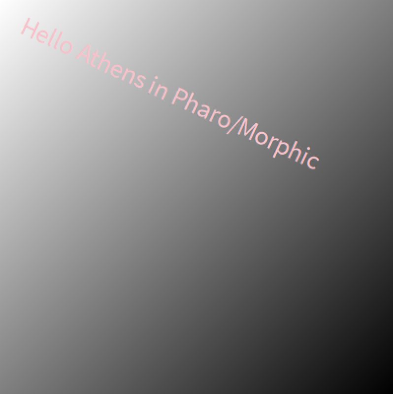
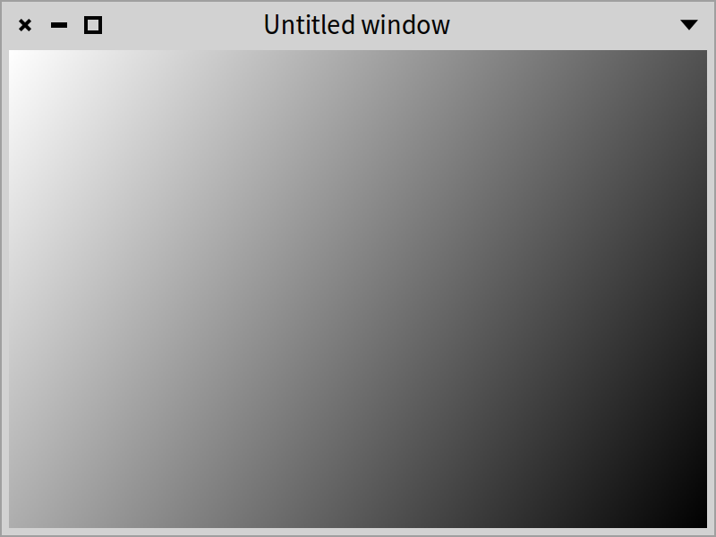

## Integration of Athens in Spec

This chapter was originally written by Renaud de Villemeur. We thank him for his contribution. It shows how you can integrate vector graphic drawing within Spec components.

### Introduction

There are two different computer graphics: vector and raster graphics. Raster graphics represent images as a collection of pixels. Vector graphics is the use of geometric primitives such as points, lines, curves, or polygons to represent images. These primitives are created using mathematical equations.

Both types of computer graphics have advantages and disadvantages. The advantages of vector graphics over raster are:
- smaller size,
- ability to zoom indefinitely,
- moving, scaling, filling, and rotating do not degrade the quality of an image.

Ultimately, pictures on a computer are displayed on a screen with a specific display dimension. However, while raster graphic doesn't scale very well when the resolution differs too much from the picture resolution, vector graphics are rasterized to fit the display they will appear on. Rasterization is the technique of taking an image described in a vector graphics format and transforming it into a set of pixels for output on a screen.

**Note.** You have the same concept when doing 3D programming with an API like OpenGL. You describe your scene with points, vertices, etc, and in the end, you rasterize your scene to display it on your screen.

Morphic is the way to do graphics with Pharo. However, most existing canvases are pixel-based, and not vector-based. This can be an issue with current IT ecosystems, where the resolution can differ from machine to machine (desktop, tablet, phones, etc).

Enter Athens, a vector-based graphic API. Under the hood, it uses the Cairo graphic library for the rasterization phase.

When you integrate Athens with Spec, you'll use its rendering engine to create your picture. It is transformed into a `Form` and displayed on the screen.

### Hello world in Athens

We will see how to use Athens directly integrated with Morphic. This is why we create a `Morph` subclass. Figure *@athens@* shows the display of such a morph. It will be the class we will use for all our experiments.




First, we define a class which inherits from `Morph`:

```
Morph << #AthensHello
	slots: { #surface };
	package: 'CodeOfSpec20Book'
```

During the initialization phase, we create an Athens surface:

```
AthensHello >> initialize

	super initialize.
	self extent: self defaultExtent.
	surface := AthensCairoSurface extent: self extent
```

where `defaultExtent` is simply defined as

```
AthensHello >> defaultExtent

	^ 400@400
```

The `drawOn:` method, mandatory in `Morph` subclasses, asks Athens to render its drawing and it will then display it in a Morphic canvas as a `Form` (a bitmap picture)

```
AthensHello >> drawOn: aCanvas

	self renderAthens.
	surface displayOnMorphicCanvas: aCanvas at: bounds origin
```


Our actual Athens code is located in the `renderAthens` method, and the result is stored in the `surface` instance variable.

```
AthensHello >> renderAthens

	| font |
	font := LogicalFont familyName: 'Arial' pointSize: 10.
	surface drawDuring: [ :canvas |
		surface clear.
		canvas setPaint: ((LinearGradientPaint from: 0@0  to: self extent) colorRamp: {  0 -> Color white. 1 -> Color black }).
		canvas drawShape: (0@0 extent: self extent).
		canvas setFont: font.
		canvas setPaint: Color pink.
		canvas pathTransform translateX: 20 Y: 20 + (font getPreciseAscent); scaleBy: 2; rotateByDegrees: 25.
		canvas drawString: 'Hello Athens in Pharo/Morphic' ]
```

Open the morph in a window with:

```
AthensHello new openInWindow
```


### Handling resizing

You can already create the window and see a nice gradient with a greeting text. However, you will notice that when resizing the window, the Athens content is not resized. To fix this, we need one extra method.

```
AthensHello >> extent: aPoint

	| newExtent |
	newExtent := aPoint rounded.
	(bounds extent closeTo: newExtent) ifTrue: [ ^ self ].
	bounds := bounds topLeft extent: newExtent.
	surface := AthensCairoSurface extent: newExtent.
	self layoutChanged.
	self changed
```


Congratulations, you have now created your first morphic window where content is rendered using Athens.


### Using the morph with Spec

Now that we have a morph, we can use it in a presenter as follows.

```
SpPresenter << #AthensHelloPresenter
	slots: { #morphPresenter };
	package: 'CodeOfSpec20Book'
```

We define a basic layout so that Spec knows where to place it.

```
AthensHelloPresenter >> defaultLayout

	^ SpBoxLayout newTopToBottom
			add: morphPresenter;
			yourself
```

In `initializePresenters` we wrap the morph in a `SpMorphPresenter`.

```
AthensHelloPresenter >> initializePresenters

	morphPresenter := self instantiate: SpMorphPresenter.
	morphPresenter morph: AthensHello new
```

When we open the presenter it displays the morph:

```
AthensHelloPresenter new open
```


### Direct integration of Athens with Spec

We can also achieve a direct integration without relying on a specific Morph creation.

We first create a presenter named `AthensExamplePresenter`. This is the presenter that will support the actual rendering using Athens.


```
SpPresenter << #AthensExamplePresenter
	slots: { #paintPresenter };
	package: 'CodeOfSpec20Book'
```

We define a simple layout to place the `paintPresenter`.

```
AthensExamplePresenter >> defaultLayout

	^ SpBoxLayout newTopToBottom
			add: paintPresenter;
			yourself
```

This presenter wraps an `AthensPresenter` as follows:

```
AthensExamplePresenter >> initializePresenters

	paintPresenter := self instantiate: SpAthensPresenter.
	paintPresenter surfaceExtent: 600@400.
	paintPresenter drawBlock: [ :canvas | self render: canvas ]
```

It configures the `AthensPresenter` to draw with the `render:` message.

```
AthensExamplePresenter >> render: canvas

	canvas
		setPaint:
			(canvas surface
				createLinearGradient: {
					0 -> Color white.
					1 -> Color black }
				start: 0@0
				stop: canvas surface extent).
	canvas drawShape: (0 @ 0 extent: canvas surface extent)
```

Executing `AthensExamplePresenter new open` produces Figure *@athens2@*.



This example is simple because we did not cover the rendering that may have to be invalidated if something changes, but it shows the key aspect of the architecture.

### Conclusion

This chapter illustrated clearly that Spec can take advantage of canvas-related operations such as those proposed by Athens to open the door to specific visuals.
