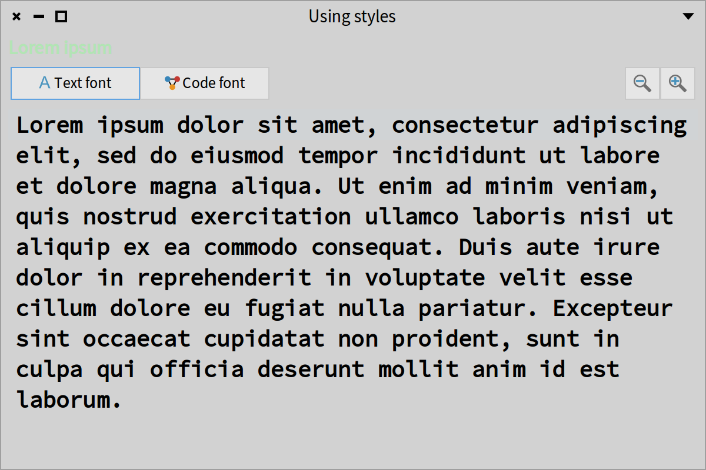
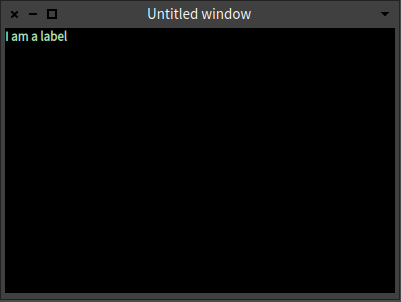
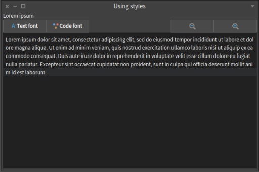

## Styling applications
@cha_style

In this chapter, we describe how to use declare and use styles in Spec applications. First, we present stylesheets and styles and then we build a little editor like the one displayed in Figure *@style1@*. This illustrates how Spec manages styles and lets you adapt the look of a presenter. There are two ways to express stylesheets: one for Morphic expressed using an extended version of STON, and CSS for GTK. In this chapter we focus on the Morphic one for Pharo 12. We give some basis before showing how to effectively use styles to enhance the look and feel of an application.




### In a nutshell


#### An application stylesheet

In Spec, an application has a stylesheet that can be set using the message `styleSheet:`. Each application can then refine its stylesheet.

```
app styleSheet: styleSheet.
```

#### Declaring styles

For the Pharo backend (as opposed to GTK ones), a stylesheet is defined as a special version of STON strings that should be parsed and turned into style elements. The following snippet creates a stylesheet where all the fonts are bold, and three drawing styles `red`, `bgGray`, and `blue` are defined.

```
(SpStyleVariableSTONReader fromString:
'.application [
     Font { #bold: true },
    .red [ Draw { #color: #red } ],
    .bgGray [ Draw { #backgroundColor: #E2E2E2 } ],
    .blue [ Draw { #color: #blue } ]
]' ).
```

#### Applying styles

Each presenter can apply a defined stylesheet using the messages `addStyle:` and `removeStyle:`.
The following example changes the color and background color of the text by applying the `red` and `bgGray` styles.

```
label := presenter newLabel.
label label: 'I am a label'.
label addStyle: 'red'.
label addStyle: 'bgGray'.
```


### How do styles work?

Styles in Spec work like CSS. They are stylesheets in which the properties for displaying a presenter are defined. Properties such as colors, width, height, font, and others. As a general principle, it is better to use styles instead of fixed constraints, because your application will be more responsive.

Notice however that a stylesheet does not cover all aspects of a widget and you may need that are not covered in the version of Spec. When moving to Toplo widgets Spec will revisit its style support and it will improve the coverage.


### Stylesheets


#### Root level
Spec collects the style for a presenter, then collects the styles for its subpresenters. 'application' is the default root level.

A defined stylesheet always has a root element and this root element has to be called `'.application'`.
The following stylesheet declares that the font for the application (i.e., all the presenters if not redefined in another style) are 10 pixels and Source Sans Pro.

```
.application [
    Font { #name: "Source Sans Pro", #size: 10 },
    ...
```

#### Subpresenter
Each style follows a cascading style, starting from `.application`.
The following snippet defines three styles

```
.application.label.header
.application.link
.application.checkBox
```


### Style declaration

Morphic styles are declared using STON. STON is a textual object notation. It is described in a dedicated chapter in the _Enterprise Pharo_ book available at [https://books.pharo.org](https://books.pharo.org).

Spec styles support five properties: Geometry, Draw, Font, Container, and Text as shown by the following example (we explain below how you can find the property configurations):

```
Geometry { #hResizing: true }
Draw { #color:  Color { #red: 1, #green: 0, #blue: 0, #alpha: 1}}
Draw { #color: #blue}
Font { #name: "Lucida Grande", #size: 10, #bold: true }
Container { #borderColor: Color { #rgb: 0, #alpha: 0 }, #borderWidth: 2, #padding: 5 },
```

You can define your style globally at the level of your application, and add it to your specific presenter with the message `addStyle:`.
For example `aPresenter addStyle: 'section'` selects the section style and assigns it to the receiver. 

### Stylesheet examples

Here are two examples of stylesheets.

```
styleSheet
 ^ SpStyleSTONReader fromString: '
.application [
	Font { #name: "Source Sans Pro", #size: 10 },
	Geometry { #height: 25 },
	.label [
		Geometry { #hResizing: true },
	.headerError [Draw { #color:  Color{ #red: 1, #green: 0, #blue: 0, #alpha: 1}}  ],
	.headerSuccess [Draw { #color: Color{ #red: 0, #green: 1, #blue: 0, #alpha: 1}}  ],
	.header [
		Draw { #color: Color{ #rgb: 622413393 }},
		Font { #name: "Lucida Grande", #size: 10, #bold: true } ],
	.shortcut [
		Draw { #color: Color{ #rgb: 622413393 } },
		Font { #name: "Lucida Grande", #size: 10 } ],
	.fixed [
		Geometry { #hResizing: false, #width: 100 } ],
	.dim [
		Draw { #color : Color{ #rgb: 708480675 } } ]
]'
```

The next one extends the default stylesheet (that is returned by the expression `SpStyle defaultStyleSheet`).

```
styleSheet
 ^ SpStyle defaultStyleSheet, (SpStyleSTONReader fromString:
'
.application [
	Draw { #backgroundColor: #lightRed},
	.section [
		Draw { #color: #green, #backgroundColor: #lightYellow},
		Font {  #name: "Verdana", #size: 12, #italic: true, #bold: true}],
	.disabled [ Draw { #backgroundColor: #lightGreen} ],
	.textInputField [ Draw { #backgroundColor: #blue} ],
	.label [
		Font {  #name: "Verdana", #size: 10, #italic: false, #bold: true},
		Draw { #color: #red, #backgroundColor: #lightBlue} ]
]')
```

### Anatomy of a style

The styles in Spec format are similar to CSS.
The styles should be declared in strings using the STON syntax and  we have to parse them to turn them into objects.

Here is an example that we will explain step by step.

```
'.application [
	.lightGreen [ Draw { #color: #B3E6B5 } ],
	.lightBlue [ Draw { #color: #lightBlue } ] ]'
```

Each style element kind uses specific properties defined by its associated classes subclass of `SpPropertyStyle`.
`SpPropertyStyle` has 5 subclasses: `SpContainerStyle`, `SpDrawStyle`, `SpFontStyle`, `SpTextStyle`, and `SpGeometryStyle`. 

These subclasses define the 5 types of properties that exist. 

- Geometry: `SpGeometryStyle` - It is for sizes, like width, height, minimum height, etc.
- Draw: `SpDrawStyle` - It modifies the properties related to the drawing of the presenter, such as the color and the background color.
- Font:  `SpFontStyle` - It manipulates properties related to fonts.
- Container: `SpContainerStyle` - It is for the alignment of the presenters, usually with property is changed on the main presenter, which is the one that contains and arranges the other ones.
- Text: `SpTextStyle` - It controls the properties of the `SpTextInputFieldPresenter`.

#### Example
If you want to be sure that you browse the adequate class just send the class the message `stonName`, it will return the string used on the STON notation. For example `SpDrawStyle stonName` returns `Draw`. 
If we want to change the color of a presenter, we need to create a string and use the `SpDrawStyle` property.
For setting the color, we can use either the hexadecimal code of the color or the sender of `Color` class.

```
'.application [
    .lightGreen [ Draw { #color: #B3E6B5 } ],
    .lightBlue [ Draw { #color: #lightBlue } ] ]'
```

Now we define two styles: `lightGreen` and `lightBlue` that can be applied to any presenter.


### Environmental variables

We can also use environmental variables to get the values of the predefined colors and fonts of the current theme. For example, we can create two styles for changing the font of the text of a presenter:

```
'.application [
    .codeFont [ Font { #name: EnvironmentFont(#code) } ],
    .textFont [ Font { #name: EnvironmentFont(#default) } ]
]'
```

#### Top level changes

We can change the styles for all the presenters by default. For instance, we can display all the text in bold by default.

```
'.application [
	Font { #bold: true }
]'
```


!!todo unclear what is EnvironmentFont vs Font What are the environmental variables


### Defining an application and its style

To use styles we need to associate the main presenter with an application. The class `SpApplication` has already default styles. To not redefine all the properties for all the presenters, we extend the default styles (`SpStyle defaultStyleSheet`).

To parse a string into a STON we use the class `SpStyleVariableSTONReader`.

```
| presenter app styleSheet |
presenter := SpPresenter new.
app := SpApplication new.
presenter application: app.

styleSheet := SpStyle defaultStyleSheet,
    (SpStyleVariableSTONReader fromString:
    '.application [
         Font { #bold: true },
            .red [ Draw { #color: #red } ],
            .bgGray [ Draw { #backgroundColor: #E2E2E2 } ],
        .blue [ Draw { #color: #blue } ]
]' ).

app styleSheet: styleSheet.
```


Now we can add styles to a presenter using the `addStyle:` and obtain the result shown in Figure *@style5@*.

```
label := presenter newLabel.
presenter layout: (SpBoxLayout newTopToBottom
    add: label;
    yourself).

label label: 'I am a label'.
label addStyle: 'red'.
label addStyle: 'bgGray'.

presenter open
```




### Dynamically applying styles

We can also remove and add styles at run time as shown in the following snippet whose result is displayed in Figure *@style6@*.

```
label removeStyle: 'red'.
label removeStyle: 'bgGray'.
label addStyle: 'blue'.
```


### A specifically styled application

Until now we just wrote scripts. Now we want to show how we can use styles using presenter classes. 
To properly use styles, it is better to define a custom application as a subclass of `SpApplication`.

```
SpApplication << #CustomStylesApplication
	slots: {};
	package: 'CodeOfSpec20Book'
```

We will then use this application to create our presenter. 
In the class, we override the method `styleSheet` to return our custom stylesheet concatenated with the default one.

```
CustomStylesApplication >> styleSheet

	| customStyleSheet |
	customStyleSheet := SpStyleVariableSTONReader fromString:
		'.application [
			Font { #bold: true },
			.lightGreen [ Draw { #color: #B3E6B5 } ],
			.lightBlue [ Draw { #color: #lightBlue } ],
			.container [ Container { #padding: 4, #borderWidth: 2 } ],
			.bgOpaque [ Draw { #backgroundColor: EnvironmentColor(#base) } ],
			.codeFont [ Font { #name: EnvironmentFont(#code) } ],
			.textFont [ Font { #name: EnvironmentFont(#default) } ],
			.bigFontSize [ Font { #size: 20 } ],
			.smallFontSize [ Font { #size: 14 } ],
			.icon [ Geometry { #width: 30 } ],
			.buttonStyle [ Geometry { #width: 110 } ],
			.labelStyle [
				Geometry { #height: 25 },
				Font { #size: 12 } ]
		]'.
	^ SpStyle defaultStyleSheet , customStyleSheet
```


We can use different properties in the same style. For example, in `labelStyle` we are setting the height of the presenter to 25 scaled pixels and the font size to 12 scaled pixels. Also, we are using `EnvironmentColor(#base)` to obtain the default background color according to the current theme, because the color will change according to the theme that is used in the image.


### Defining a presenter for the editor


For the main presenter, we will build a mini text viewer in which we will be able to change the size and font of the text that we are viewing.

```
SpPresenter << #CustomStyleEditor
	slots: { #text . #label . #zoomOutButton . #textFontButton . #codeFontButton . #zoomInButton };
	package: 'CodeOfSpec20Book'
```

In the `initializePresenters` method we will first initialize the presenters and then set the styles for the presenters.

```
CustomStyleEditor >> initializePresenters

	self instantiatePresenters.
	self initializeStyles
```


```
CustomStyleEditor >> instantiatePresenters

	zoomInButton := self newButton.
	zoomInButton icon: (self iconNamed: #glamorousZoomIn).
	zoomOutButton := self newButton.
	zoomOutButton icon: (self iconNamed: #glamorousZoomOut).
	codeFontButton := self newButton.
 	codeFontButton
		icon: (self iconNamed: #smallObjects);
		label: 'Code font'.
	textFontButton := self newButton.
	textFontButton
		icon: (self iconNamed: #smallFonts);
		label: 'Text font'.
	text := self newText.
	text
		beNotEditable
		clearSelection;
		text: String loremIpsum.
	label := self newLabel.
	label label: 'Lorem ipsum'
```


```
CustomStyleEditor >> defaultLayout

	| buttonbar |
	buttonbar := SpBoxLayout newLeftToRight
		add: textFontButton expand: false;
		add: codeFontButton expand: false;
		addLast: zoomOutButton expand: false;
		addLast: zoomInButton expand: false;
		yourself.
	^ SpBoxLayout newTopToBottom
		add: label expand: false;
		add: buttonbar expand: false;
		add: text;
		yourself
```


Finally, we change the window title and size:

```
CustomStyleEditor >> initializeWindow: aWindowPresenter

	aWindowPresenter
		title: 'Using styles';
		initialExtent: 600 @400
```


Without setting the custom styles nor using our custom application in the presenter, we obtain Figure *@style7@*, assuming that the "Pharo Light" theme is in effect:



### Initializing styles


We do not want the black background color for the text presenter. We would like to have a sort of multi-line label. We want the zoom buttons to be smaller as they only have icons. We want to have the option to change the size and font of the text inside the text presenter. Finally, we want to change the color of the label, change its height, and make it a little bit bigger.

```
CustomStyleEditor >> initializeStyles
    "Change the height and size of the label and the color as ligthgreen"

	label addStyle: 'labelStyle'.
	label addStyle: 'lightGreen'.
	"The default font of the text will be the code font and the font size will be the small one."
	text addStyle: 'codeFont'.
	text addStyle: 'smallFontSize'.
	"Change the background color."
	text addStyle: 'bgOpaque'.
	"Use a smaller width for the zoom buttons"
	zoomInButton addStyle: 'icon'.
	zoomOutButton addStyle: 'icon'.
	codeFontButton addStyle: 'buttonStyle'.
	textFontButton addStyle: 'buttonStyle'.
	"As this presenter is the container, set to self the container style to add a padding and border width."
	self addStyle: 'container'
```


Finally, we have to override the `start` method in the application. We are going to set the application of the presenter and run the presenter from the application.

```
CustomStylesApplication >> start

	(self new: CustomStyleEditor) open
```


Now, when we run `CustomStylesApplication new start` we will obtain Figure *@style8@*.


### Wiring buttons


The only thing missing is to add the behavior of the buttons.

For example, if we click on the zoom-in button we want to remove the `smallFontStyle` and add the `bigFontSize`. When we click on the text font button, we want to remove the style `codeFont` and add the `textFont` style.

This is what we have to do in the `connectPresenters` method:

```
CustomStyles >> connectPresenters

	zoomInButton action: [
		text removeStyle: 'smallFontSize'.
		text addStyle: 'bigFontSize' ].
	zoomOutButton action: [
		text removeStyle: 'bigFontSize'.
		text addStyle: 'smallFontSize' ].
	codeFontButton action: [
		text removeStyle: 'textFont'.
		text addStyle: 'codeFont' ].
	textFontButton action: [
		text removeStyle: 'codeFont'.
		text addStyle: 'textFont' ]
```


When we click on the the zoom-in button, the size of the text changes as shown in Figure *@style9@*.


When we click the "Text font" button, the font of the text changes as shown in Figure *@style10@*.


### Spec implementation details

You can ask an adapter for its style name using the message `styleName`

```
 SpMorphicLabelAdapter styleName
 > Label
```


### Conclusion

Using styles in Spec is great. It makes it easier to have a consistent design as we can add the same style to several presenters. If we want to change some style, we only edit the stylesheet. Also, the styles automatically scale if we change the font size of all the images. These are the main reasons why in Spec we have the notion of an application. We can dynamically change how a presenter looks.
