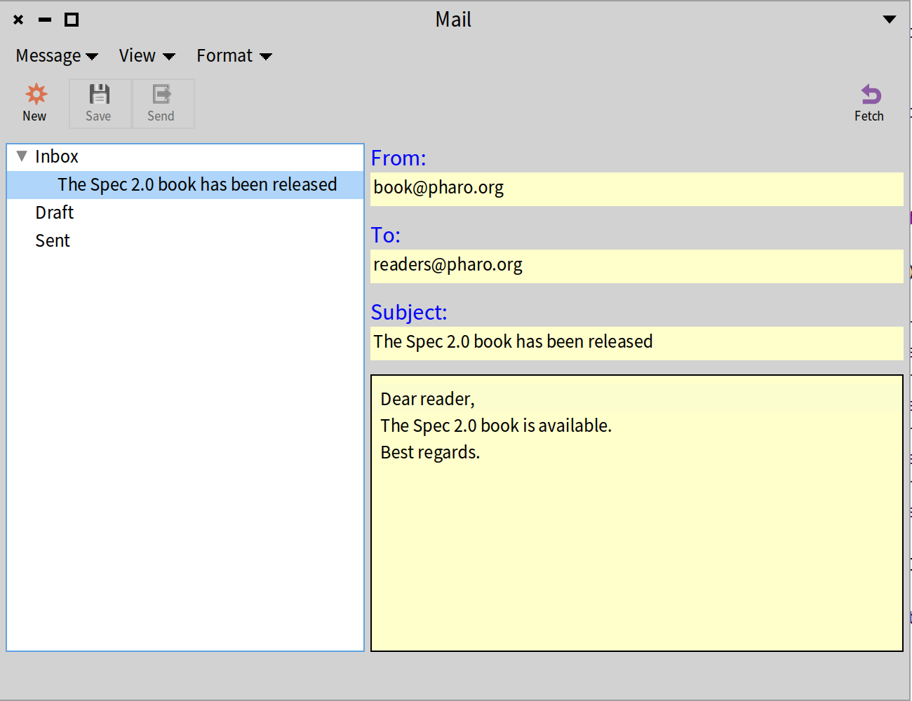
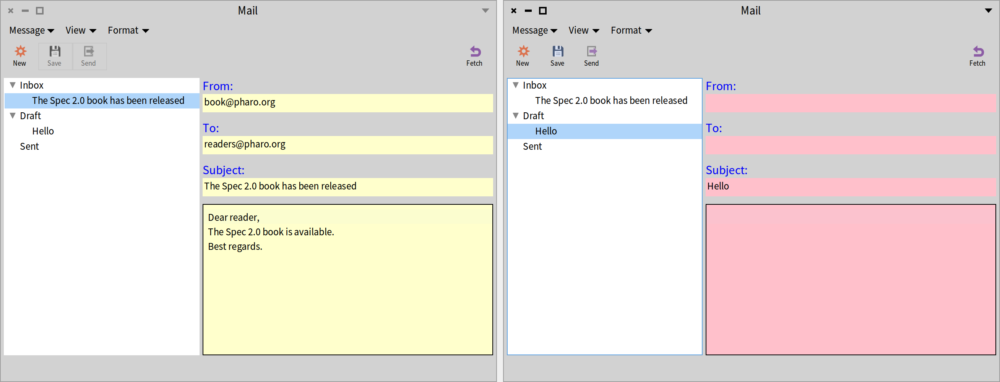

## Styling applications
@cha_style

In this chapter, we describe how to declare and use styles in Spec applications.

First, we present stylesheets and styles and then we apply styles to the Mail Application we introduced in Chapter *@cha_mailapp@*. We will illustrate how Spec manages styles and how you can adapt the look of a presenter.

There are two ways to express stylesheets: one for Morphic expressed using an extended version of STON, and CSS for GTK. In this chapter, we focus on the Morphic stylesheets for Pharo 12. We give some basis before showing how to effectively use styles to enhance the look and feel of an application.


### In a nutshell


#### An application stylesheet

In Spec, an application has a stylesheet that can be set using the message `styleSheet:`. Each application can then refine its stylesheet.

```
app styleSheet: styleSheet.
```

#### Declaring styles

For the Morphic backend (as opposed to the GTK one), a stylesheet is defined as a special version of a STON string that is parsed and turned into style elements. The following snippet creates a stylesheet where all the fonts are bold, and three drawing styles `red`, `bgGray`, and `blue` are defined.

```
(SpStyleVariableSTONReader fromString:
	'.application [
		Font { #bold: true },
		.red [ Draw { #color: #red } ],
		.bgGray [ Draw { #backgroundColor: #E2E2E2 } ],
		.blue [ Draw { #color: #blue } ]
	]')
```

#### Applying styles

Each presenter can apply a stylesheet using the messages `addStyle:` and `removeStyle:`. The following example changes the color of the text of a label presenter by applying the `red` style.

```
label := presenter newLabel.
label label: 'I am a label'.
label addStyle: 'red'
```


### How do styles work?

Styles in Spec work like CSS. They are stylesheets in which the properties for displaying a presenter are defined. Examples of properties are colors, width, height, and font. As a general principle, it is better to use styles instead of fixed constraints, because your application will be more responsive.

Note, however, that a stylesheet does not cover all aspects of a widget and you may need properties that are not covered in the current version of Spec. When moving to Toplo widgets in the future, Spec will revisit its style support and it will improve the coverage.


### Stylesheets

Spec collects the style for a presenter, then collects the styles for its subpresenters.

#### Root level

A stylesheet always has a root element and this root element has to be called `.application`. The following stylesheet declares that the font for the application (i.e., for all the presenters if not redefined in another style) is 10 pixels and Source Sans Pro.

```
.application [
	Font { #name: "Source Sans Pro", #size: 10 },
	...
```

#### Subpresenter

Each style follows a cascading style, starting from `.application`. Here are three styles:

```
.application.label.header
.application.link
.application.checkBox
```


### Style declaration

Morphic styles are declared using STON. STON is a textual object notation. It is described in a dedicated chapter in the _Enterprise Pharo_ book available at [https://books.pharo.org](https://books.pharo.org).

Spec styles support five properties: Geometry, Draw, Font, Container, and Text,  as shown by the following example.

```
Geometry { #hResizing: true }
Draw { #color:  Color { #red: 1, #green: 0, #blue: 0, #alpha: 1}}
Draw { #color: #blue}
Font { #name: "Lucida Grande", #size: 10, #bold: true }
Container { #borderColor: Color { #rgb: 0, #alpha: 0 }, 
		#borderWidth: 2, 
		#padding: 5 }
```

You can define your style globally at the level of your application, and apply it to a specific presenter with the message `addStyle:`.
For example `aPresenter addStyle: 'section'` selects the `.section` style and assigns it to the receiver.

### Stylesheet examples

Here are two examples of stylesheets.

```
styleSheet

 ^ SpStyleVariableSTONReader fromString: '
	.application [
		Font { #name: "Source Sans Pro", #size: 10 },
		Geometry { #height: 25 },
		.label [
			Geometry { #hResizing: true },
		.headerError [Draw { #color:  Color{ #red: 1, #green: 0, #blue: 0, #alpha: 1}}  ],
		.headerSuccess [Draw { #color: Color{ #red: 0, #green: 1, #blue: 0, #alpha: 1}}  ],
		.header [
			Draw { #color: Color{ #rgb: 622413393 }},
			Font { #name: "Lucida Grande", #size: 10, #bold: true } ],
		.shortcut [
			Draw { #color: Color{ #rgb: 622413393 } },
			Font { #name: "Lucida Grande", #size: 10 } ],
		.fixed [
			Geometry { #hResizing: false, #width: 100 } ],
		.dim [
			Draw { #color : Color{ #rgb: 708480675 } } ]
	]'
```

The next one extends the default stylesheet that is returned by the expression `SpStyle defaultStyleSheet`.

```
styleSheet

	^ SpStyle defaultStyleSheet, (SpStyleVariableSTONReader fromString: '
	.application [
		Draw { #backgroundColor: #lightRed},
		.section [
			Draw { #color: #green, #backgroundColor: #lightYellow},
			Font {  #name: "Verdana", #size: 12, #italic: true, #bold: true}],
		.disabled [ Draw { #backgroundColor: #lightGreen} ],
		.textInputField [ Draw { #backgroundColor: #blue} ],
		.label [
			Font {  #name: "Verdana", #size: 10, #italic: false, #bold: true},
			Draw { #color: #red, #backgroundColor: #lightBlue} ]
	]')
```

### Anatomy of a style

Each style element kind uses specific properties defined by its associated classes which subclass `SpPropertyStyle`. `SpPropertyStyle` has 5 subclasses: `SpContainerStyle`, `SpDrawStyle`, `SpFontStyle`, `SpTextStyle`, and `SpGeometryStyle`.

These subclasses define the 5 types of properties that exist.

- Container: `SpContainerStyle` - It manages the alignment of the presenters. Usually the style is set by the parent presenter, which is the one that contains and arranges the subpresenters.
- Draw: `SpDrawStyle` - It modifies the properties related to the drawing of the presenter, such as the color and the background color.
- Font: `SpFontStyle` - It defines properties related to fonts.
- Text: `SpTextStyle` - It controls the properties of the `SpTextInputFieldPresenter`.
- Geometry: `SpGeometryStyle` - It defines sizes, like width, height, minimum height, etc.

If you want to be sure that you browse the adequate class, just send the message `stonName` to the class. It will return the string used in the STON notation. For example, `SpDrawStyle stonName` returns `Draw`.

#### Example

If we want to change the color of a presenter, we need to create a string and use the `SpDrawStyle` property. For setting the color, we can use either the hexadecimal code of the color, or a method selector of the `Color` class.


Here we define two styles: `lightGreen` and `lightBlue` that can be applied to any presenter.

```
'.application [
	.lightGreen [ Draw { #color: #B3E6B5 } ],
	.lightBlue [ Draw { #color: #lightBlue } ] ]'
```


### Environment variables

We can also use environment variables to get the values of the predefined colors and fonts of the current UI theme. For example, we can create two styles for changing the font of the text and one for the background color of a presenter:

```
'.application [
	.codeFont [ Font { #name: EnvironmentFont(#code) } ],
	.textFont [ Font { #name: EnvironmentFont(#default) } ],
	.bg [ Draw { #color: EnvironmentColor(#background) } ]'
]'
```

Check the subclasses of `SpStyleEnvironmentVariable`.


### Top-level changes

We can change the styles for all the presenters. For instance, we can display all the text in bold by default with this style:

```
'.application [
	Font { #bold: true }
]'
```


### Defining an application and its style

Suppose we like to style the Mail Application we introduced in Chapter *@cha_mailapp@* and extend in Chapter *@cha_menus@*. 
Let's say that we like the labels in the mail editing part of the UI to use a bigger font and a blue color. Furthermore, let's say that we like to use a light yellow background for fields and that we want a black border around the field to edit the body of a mail. That brings us to this stylesheet:

```
'.application [
		.fieldLabel [ Font { #size: 12 }, Draw { #color: #blue } ],
		.field [ Draw { #backgroundColor: #lightYellow } ],
		.bodyField [ Container { #borderWidth: 1, #borderColor: #black} ]
	]'
```

The style `.fieldLabel` defines a 12-pixel blue font. The style `.field` defines a light yellow background color. The style `.bodyField` defines a black 1-pixel border.

To use styles, we need to associate the main presenter with an application. 
One way of achieving that would be this way:

```
| mailClient application styleSheet |
mailClient := MailClientPresenter on: MailAccount new.
application := SpApplication new.
mailClient application: application.

styleSheet := SpStyle defaultStyleSheet,
	(SpStyleVariableSTONReader fromString:
	'.application [
		.fieldLabel [ Font { #size: 12 }, Draw { #color: #blue } ],
		.field [ Draw { #backgroundColor: #lightYellow } ],
		.bodyField [ Container { #borderWidth: 1, #borderColor: #black } ]
	]').

app styleSheet: SpStyle defaultStyleSheet , styleSheet.
```

But this way of working requires creating the stylesheet outside the context of the Mail Application. Instead, we will introduce a new application class and we override the method `styleSheet`.

```
SpApplication << #MailClientApplication
	slots: {};
	package: 'CodeOfSpec20Book'
```

```
MailClientApplication >> styleSheet

	| customStyleSheet |
	customStyleSheet := SpStyleVariableSTONReader fromString:
		'.application [
			.fieldLabel [ Font { #size: 12 }, Draw { #color: #blue } ],
			.field [ Draw { #backgroundColor: #lightYellow } ],
			.bodyField [ Container { #borderWidth: 1, #borderColor: #black } ]
		]'.
	^ super styleSheet , customStyleSheet
```

Note that this method includes a super send. `SpApplication >> styleSheet` answers the default stylesheet, which is the same as `SpStyle defaultStyleSheet` that we saw before. By combining the default stylesheet and our own stylesheet with the `,` message, we ensure that all the default styles for all presenters are still applied, and our styles are applied on top of the default styles.

To open the Mail Application easily, we define the `start` method:

```
MailClientApplication >> start

	(MailClientPresenter on: MailAccount new)
		application: self;
		open
```

With this code in place, we can open the Mail Application with:

```
MailClientApplication new start
```

Of course, that would not have much effect. After all, we did not apply the styles yet.


### Applying styles

The styles we defined in the previous section were intended for the `EmailPresenter` class, which defines a form-like UI to edit a mail. The original implementation of `defaultLayout` was:

```
EmailPresenter >> defaultLayout

	| toLine subjectLine fromLine |
	fromLine := SpBoxLayout newTopToBottom
		add: 'From:' expand: false;
		add: from expand: false;
		yourself.
	toLine := SpBoxLayout newTopToBottom
		add: 'To:' expand: false;
		add: to expand: false;
		yourself.
	subjectLine := SpBoxLayout newTopToBottom
		add: 'Subject:' expand: false;
		add: subject expand: false;
		yourself.
	^ SpBoxLayout newTopToBottom
		spacing: 10;
		add: fromLine expand: false;
		add: toLine expand: false;
		add: subjectLine expand: false;
		add: body;
		yourself
```

To style the fields, we have to make some changes. The implementation above is based on the method `add:expand:` which, out of convenience, allows the first argument to be a string, e.g. `add: 'From:' expand: false`. We cannot style a string. We can only style presenters, so we have to create the label presenters ourselves. Then we can add the required styles to the three label presenters by sending `addStyle: 'fieldLabel'`. Note that the definition of the style uses `.fieldLabel`. When sending the message `addStyle:`, the leading period is omitted in the argument string representing the style.

```
EmailPresenter >> defaultLayout

	| toLine subjectLine fromLine fromLabel toLabel subjectLabel |
	fromLabel := self newLabel
		label: 'From:';
		addStyle: 'fieldLabel';
		yourself.
	fromLine := SpBoxLayout newTopToBottom
		add: fromLabel expand: false;
		add: from expand: false;
		yourself.
	toLabel := self newLabel
		label: 'To:';
		addStyle: 'fieldLabel';
		yourself.
	toLine := SpBoxLayout newTopToBottom
		add: toLabel expand: false;
		add: to expand: false;
		yourself.
	subjectLabel := self newLabel
		label: 'Subject:';
		addStyle: 'fieldLabel';
		yourself.
	subjectLine := SpBoxLayout newTopToBottom
		add: subjectLabel expand: false;
		add: subject expand: false;
		yourself.
	^ SpBoxLayout newTopToBottom
			spacing: 10;
			add: fromLine expand: false;
			add: toLine expand: false;
			add: subjectLine expand: false;
			add: body;
			yourself
```

Now that the labels are styled, the next step is to style the fields. We adapt the method `initializePresenters`, where they are initialized. Originally, the method included the first four statements. We add four more to add the styles.

```
EmailPresenter >> initializePresenters

	from := self newTextInput.
	to := self newTextInput.
	subject := self newTextInput.
	body := self newText.
	from addStyle: 'field'.
	to addStyle: 'field'.
	subject addStyle: 'field'.
	body addStyle: 'field'; addStyle: 'bodyField'
```

While we add one style for the `from`, `to`, and `subject` presenters, we add two styles to the `body` presenter. The `field` style will apply the background color. The `bodyField` style will apply the black border.

With `MailClientApplication new start` we can open the Mail Application and see styling in action. Figure *@StyledMailApplication@* shows the window.





### Dynamically applying styles

Suppose that we like to see a different background color for the fields if the edited mail is a draft mail. That is where dynamic styling comes in.

We can add and remove styles at runtime when the state of the application changes. Let's do that for the styles of the fields.

First, we adapt the method `styleSheet` of our application class to add new styles. We add the style `.draftMail`  with a nested style `.field` that specifies a pink background color. The nesting expresses that the `.field` style applies in the context of the `.draftMail` style.

```
MailClientApplication >> styleSheet

	| customStyleSheet |
	customStyleSheet := SpStyleVariableSTONReader fromString:
		'.application [
			.fieldLabel [ Font { #size: 12 }, Draw { #color: #blue } ],
			.field [ Draw { #backgroundColor: #lightYellow } ],
			.draftMail [
				.field [ Draw { #backgroundColor: #pink } ]
				],
			.bodyField [ Container { #borderWidth: 1, #borderColor: #black } ]
		]'.
	^ super styleSheet , customStyleSheet
```

The next step is to apply the new style. `EmailPresenter` instances have a `model`. When it changes, the presenter is notified via the `modelChanged` method. The original implementation was:

```
EmailPresenter >> modelChanged

	from text: (self model from ifNil: [ '' ]).
	to text: (self model to ifNil: [ '' ]).
	subject text: (self model subject ifNil: [ '' ]).
	body text: (self model body ifNil: [ '' ])
```

We can easily extend it to apply different styles depending on the kind of model, which holds an instance of the `Email` class.

```
EmailPresenter >> modelChanged

	from text: (self model from ifNil: [ '' ]).
	to text: (self model to ifNil: [ '' ]).
	subject text: (self model subject ifNil: [ '' ]).
	body text: (self model body ifNil: [ '' ]).
	self model isDraft
		ifTrue: [
			from addStyle: 'draftMail.field'.
			to addStyle: 'draftMail.field'.
			subject addStyle: 'draftMail.field'.
			body addStyle: 'draftMail.field' ]
		ifFalse: [
			from removeStyle: 'draftMail.field'.
			to removeStyle: 'draftMail.field'.
			subject removeStyle: 'draftMail.field'.
			body removeStyle: 'draftMail.field' ]
```

Let's open the Mail Application again and select different kinds of mail. Figure *@DynamicStyling@* shows the two styles.





### Conclusion

Using styles in Spec is a nice feature. It makes it easier to have a consistent design as we can add the same style to several presenters. If we want to change some style, we only edit the stylesheet. We can dynamically change how a presenter looks.
