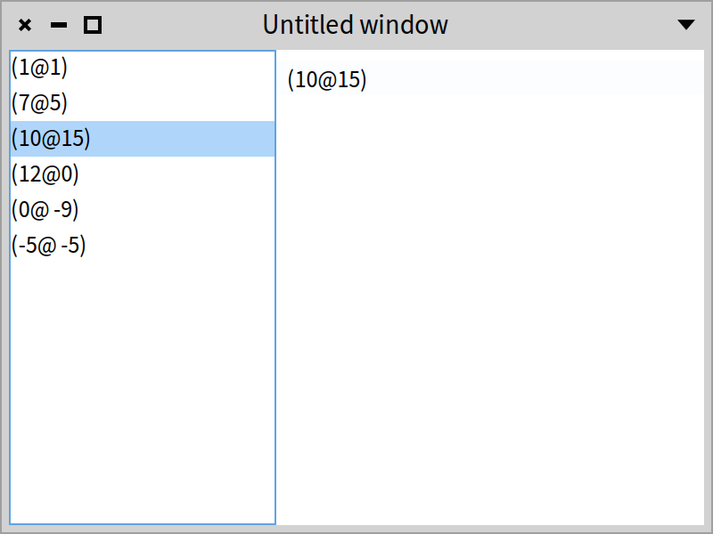
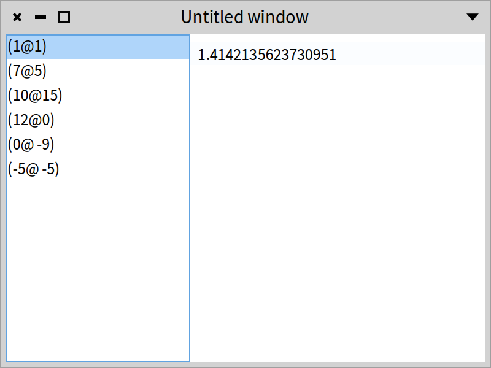
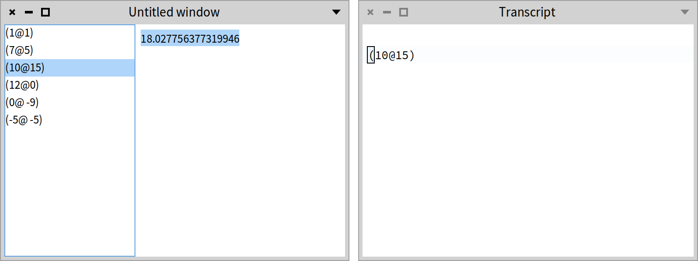

## Using transmissions and ports

Transmissions are a more compact way to connect presenters than events as shown in earlier chapters.

### What are transmissions?

Transmissions are a uniform way to connect presenters, thinking about the “flow” of data more than the way data is displayed.

Each presenter defines **output ports** (ports to send data) and **input ports** (ports to receive data). Each presenter has at least one default input port and one default output port.

A transmission connects a presenter’s output port with a presenter’s input port.

### Simple example

Let's take a look at a very simple example. Consider a presenter that shows an overview–detail relationship. We define a class `OverviewDetailPresenter` with two instance variables to hold a `SpListPresenter` and a `SpTextPresenter`.

```
SpPresenter << #OverviewDetailPresenter
	slots: { #overview . #detail };
	package: 'CodeOfSpec20Book'
```

To keep the example simple, we polulate the list with some `Point` instances.

```
OverviewDetailPresenter >> initializePresenters

	overview := self newList
		items: { 1@1 . 7@5 . 10@15 . 12@0 . 0@ -9 . -5@ -5 };
		yourself.
	detail := self newText
```

The `defaultLayout` method is straightforward. It defined a horizontal box layout.

```
OverviewDetailPresenter >> defaultLayout

	^ SpBoxLayout newLeftToRight
      add: overview expand: false;
      add: detail;
      yourself
```



Here comes the most interesting method. `connectPresenters` connects the list to the text. We start simple. When a point is selected in the list, we simply show it in the text.

```
OverviewDetailPresenter >> connectPresenters

	overview whenSelectedItemChangedDo: [ :selectedPoint |
		detail text: selectedPoint asString ]
```

When we open the presenter with the snippet below, the window looks like the one shown in Figure *@OverviewDetail-base@*.

```
OverviewDetailPresenter new open
```

### Basic transmission

The method `connectPresenters` above uses the traditional way of connecting presenters. Let's use a transmission instead.

```
OverviewDetailPresenter >> connectPresenters

	overview transmitTo: detail
```

The method `transmitTo:` is the most basic way to set up a transmission. It is implemented as follows:

```
SpAbstractPresenter >> transmitTo: aPresenter

	^ self defaultOutputPort transmitTo: aPresenter defaultInputPort
```

In our example, the method above connects the list presenter's default output port with the detail presenter's default input port. `SpAbstractPresenter >> defaultOutputPort` and `SpAbstractPresenter >> defaultInputPort` define that any presenter can have a default output and a default input port. Browse the implementors of the two methods to learn how different presenter classes use output and input ports.

Presenters can have multiple output and input ports. They can be connected by sending the message `transmitTo:` to an output port, similar to what `SpAbstractPresenter >> transmitTo:` does with the default output and input ports.

When we open the presenter again, and we select a point in the list, an exception is raised. That is because the `Point` instance transmitted from the list presenter's default output port is not compatible with the kind of object expected by the text presenter's default input port. The latter expects a `String`, not a `Point`. This is a common situation. Only in simple use cases will the transmitted object be adequate for the input port. In many cases, the transmitted object needs to be transformed to transmit an adequate object to the input port. That is where transformations come in.

### Transforming a transmitted object

The object transmitted from a presenter's output port can be inadequate for the input port of another presenter. There are two reasons why a transmitted object may be inadequate:

* The kind of object coming from an output port may not be acceptable for an input port. In our simple example, that is the case. The input port expects a `String`, not a `Point`.
* The object itself coming from an output port may not be what you like to send to the input port.

Let's give examples of both reasons.

To fix the exception raised when selecting a point in the list, we adapt the method `connectPresenters` to answer a `String` instead of a `Point`:

```
OverviewDetailPresenter >> connectPresenters

	overview
		transmitTo: detail
		transform: [ :selectedPoint | selectedPoint asString ]
```

Now the behavour of the presenter is error-free.

Suppose that we do not like to merely show the selected point in the text, but that we like to show the distance of the selected point to the origin of the coordinate system. In the traditional way, the method `connectPresenters` would look like this:

```
OverviewDetailPresenter >> connectPresenters

	overview whenSelectedItemChangedDo: [ :selectedPoint |
		| distanceToOrigin |
		distanceToOrigin := selectedPoint
			ifNil: [ '' ]
			ifNotNil: [ (selectedPoint distanceTo: 0@0) asString ].
		detail text: distanceToOrigin ]
```

When using a transmission, it is reduced to:

```
OverviewDetailPresenter >> connectPresenters

	overview
		transmitTo: detail
		transform: [ :selectedPoint |
			selectedPoint
				ifNil: [ '' ]
				ifNotNil: [ (selectedPoint distanceTo: 0@0) asString ] ]
```

After opening, we see the window as shown in Figure *@OverviewDetail-transformed@*.



### Acting on a transmission without input port

Sometimes it is not necessary to send a transmitted object to the input port of a subpresenter. If your presenter has to do something when an object is being transmitted through an output port, it can use the message `transmitDo:`. The message takes a block that will be evaluated when there is a transmission.

Let's extend the simple example to show that. Suppose that for debugging purposes, we like to log the selected point to the `Transcript`. In the traditional way, we would implement `connectPresenters` like this:

```
OverviewDetailPresenter >> connectPresenters

	overview whenSelectedItemChangedDo: [ :selectedPoint |
		| distanceToOrigin |
		distanceToOrigin := selectedPoint
			ifNil: [ '' ]
			ifNotNil: [ (selectedPoint distanceTo: 0@0) asString ].
		detail text: distanceToOrigin.
		selectedPoint crTrace ]
```

With transmissions, we can achieve the same behaviour as follows:

```
OverviewDetailPresenter >> connectPresenters

	overview
		transmitTo: detail
		transform: [ :selectedPoint |
			selectedPoint
				ifNil: [ '' ]
				ifNotNil: [ (selectedPoint distanceTo: 0@0) asString ] ].
	overview transmitDo: [ :selectedPoint | selectedPoint crTrace ]
```

### Acting after a transmission

Sometimes, after a transmission happens, a presenter needs to modify something given the new status of a subpresenter. Example are preselecting something, or updating the state of toolbar buttons. That is where post transmission actions come in. The messages that we have seen so far, have variations with an extra keyword argument `postTransmission:`.

Let's elaborate the simple example for the last time. Suppose we like to select the text after it has been set. In the traditional way, in the method `connectPresenters`, we would send `selectAll` to the text presenter:

```
OverviewDetailPresenter >> connectPresenters

	overview whenSelectedItemChangedDo: [ :selectedPoint |
		| distanceToOrigin |
		distanceToOrigin := selectedPoint
			ifNil: [ '' ]
			ifNotNil: [ (selectedPoint distanceTo: 0@0) asString ].
		detail text: distanceToOrigin.
		detail selectAll.
		selectedPoint crTrace ]
```

With transmissions, we would add an extra `postTransmission:` keyword to the message that we used before. The extra argument is a block that takes upto three arguments. The first argument, often called `destination`, is the presenter of the input port. The second argument, often called `origin`, is the presenter of the output port. The third argument is the transmitted object, without transformation applied to it. In our example, we only need access to the destination argument. That is why there is only one argument in the `postTransmission:` block.

```
OverviewDetailPresenter >> connectPresenters

	overview
		transmitTo: detail
		transform: [ :selectedPoint |
			selectedPoint
				ifNil: [ '' ]
				ifNotNil: [ (selectedPoint distanceTo: 0@0) asString ] ]
		postTransmission: [ :destination | destination selectAll ].
	overview transmitDo: [ :selectedPoint | selectedPoint crTrace ]
```

Let's open the presenter again to test the presenter with the transmissions.

```
OverviewDetailPresenter new open
```

After selecting a point, we see the window as shown in Figure *@OverviewDetail1-final@*. The distance to the origin of the coordinate system is selected in the text, and the selected point is logged in the transcript.



### Available ports

TODO: we only described a very simple, albeit often used, use case with 2 kinds of ports. There are more ports. Briefly describe them here.

### A complex example

TODO: transmissions in the Mail application.

### Conclusion

TODO: this is some text from the original chapter.

Input ports define the transmission destination points of a presenter. They handle an incoming transmission and transmit them properly to the target presenter.

An output port defines origin actions \(and the possible data associated to such action\) to transmit to a destination \(input\) port. It also defines the transformations to apply to the output data before giving them to the input port. 